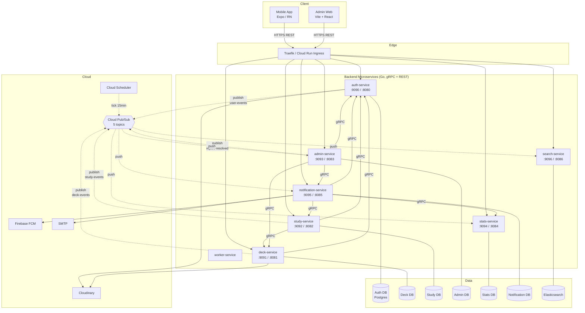
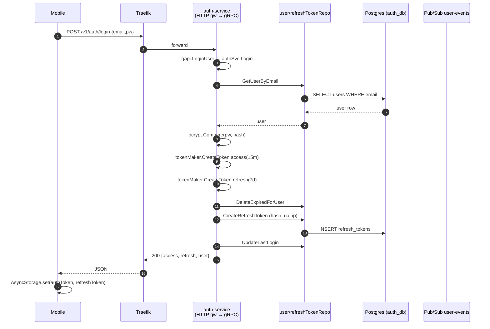
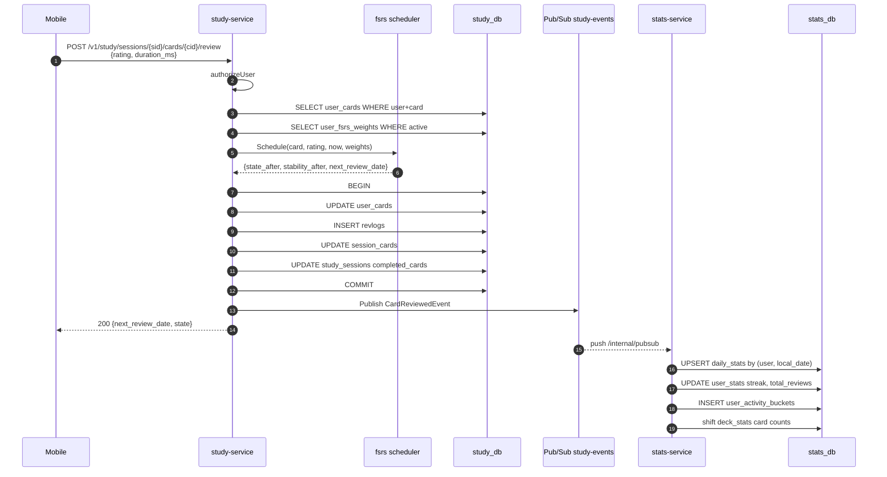
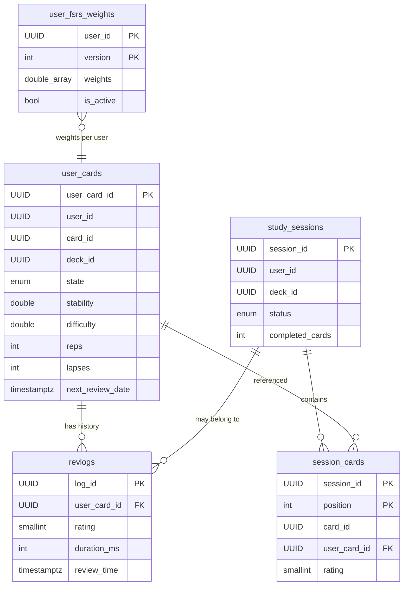
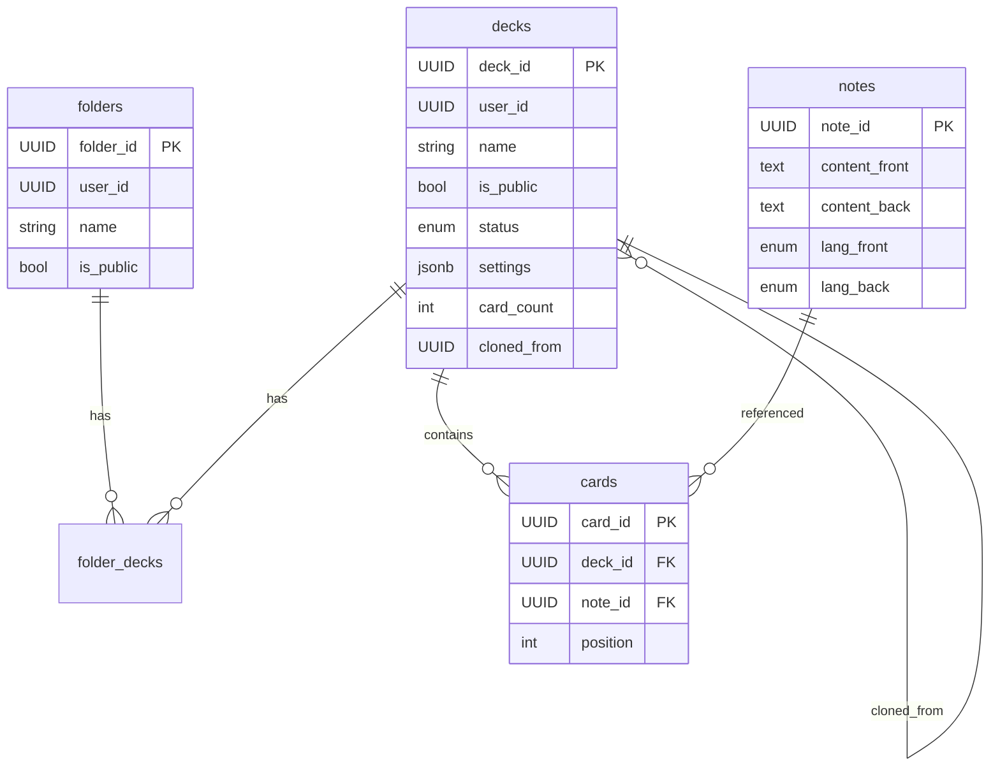
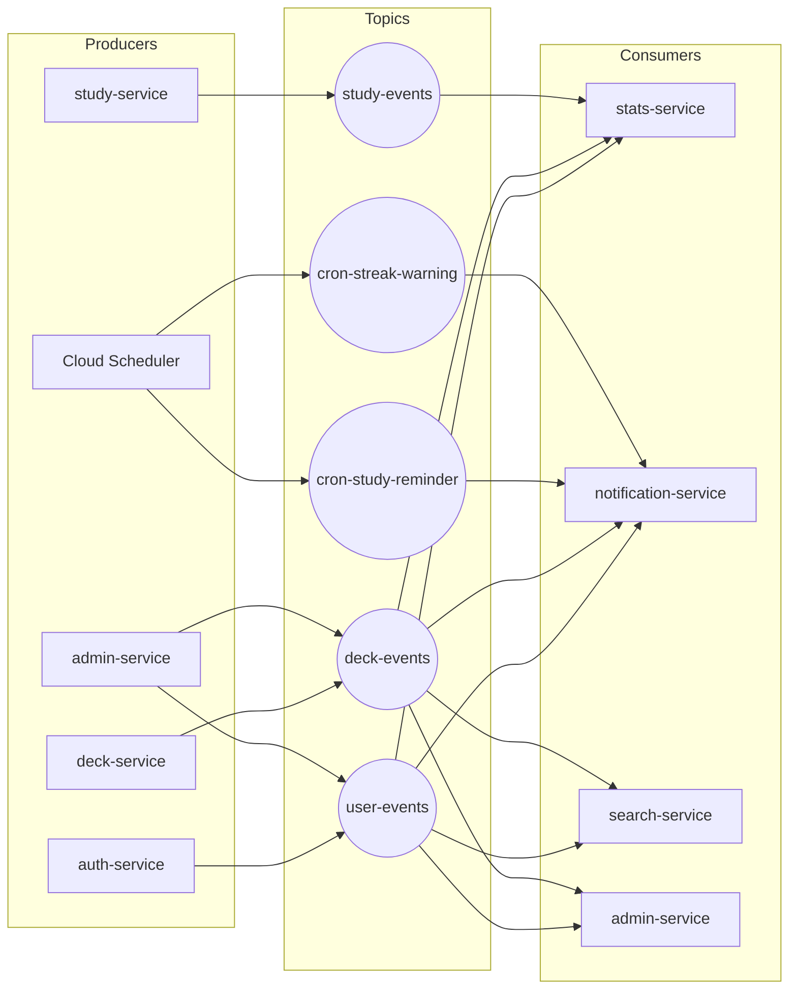

# MEM_PAN — Tài liệu Onboarding chi tiết (Tiếng Việt)

> Tài liệu này dành cho dev mới vào dự án, đi phỏng vấn, hoặc cần một bản đồ tổng thể để tự thêm tính năng / sửa bug.
> Repo backend: `/Users/annghiavo/Documents/mem_pan` — Repo frontend: `/Users/annghiavo/Documents/mem_pan_app`.

---

## Mục lục

1. [Tổng quan dự án](#1-tổng-quan-dự-án)
2. [Công nghệ sử dụng](#2-công-nghệ-sử-dụng)
3. [Phân tích cấu trúc source code](#3-phân-tích-cấu-trúc-source-code)
4. [Flow request thực tế](#4-flow-request-thực-tế)
5. [Database](#5-database)
6. [Authentication + Authorization](#6-authentication--authorization)
7. [Những phần khó / phức tạp](#7-những-phần-khó--phức-tạp)
8. [Thêm chức năng mới](#8-thêm-chức-năng-mới)
9. [Phỏng vấn — câu hỏi & cách trả lời](#9-phỏng-vấn--câu-hỏi--cách-trả-lời)
10. [Sơ đồ (Mermaid)](#10-sơ-đồ-mermaid)
11. [Cheat sheet 5 phút trước phỏng vấn](#11-cheat-sheet-5-phút-trước-phỏng-vấn)

---

## 1. Tổng quan dự án

### 1.1. Dự án này làm gì?

`mem_pan` là một **nền tảng học flashcard kiểu Quizlet/Anki**, bao gồm:

- **Mobile app** (React Native/Expo) cho người học cuối: tạo deck, học flashcard, làm quiz, theo dõi tiến độ (streak, heatmap).
- **Admin web** (Vite + React) cho moderator/admin: xem report, ban user, ẩn deck, quản lý email template.
- **Backend microservices** (Go) gồm 8 service độc lập, giao tiếp nội bộ qua gRPC, truyền sự kiện qua Google Cloud Pub/Sub.

Điểm "đặc biệt" về nghiệp vụ:
- Dùng thuật toán **FSRS (Free Spaced Repetition Scheduler)** để lên lịch ôn tập tối ưu cho từng user.
- Hỗ trợ **import deck từ CSV/TSV/PDF** (parse Quizlet-style two-column).
- Có hệ thống **report content** (deck/user) → moderator xử lý → notification cho người report.
- **Push notification reminder** chạy mỗi 15 phút qua Cloud Scheduler, tự chọn user "đến giờ học" theo hành vi quá khứ.

### 1.2. Các actor trong hệ thống

| Actor | Mô tả | Quyền |
|-------|------|------|
| **User** | Người học bình thường | CRUD deck/card của mình, học, report content |
| **Moderator** | Người duyệt nội dung | Xử lý report cấp thấp |
| **Admin** | Quản trị tối cao | Ban user, sửa email template, quản lý moderator |
| **Cloud Scheduler** | Cron của GCP | Bắn tick reminder vào Pub/Sub |
| **Service nội bộ** | Service-to-service gRPC | Gọi qua interceptor nội bộ |

### 1.3. User flow chính

```
Đăng ký → Verify email → Đăng nhập → Tạo folder/deck → Thêm card (CRUD hoặc import CSV/PDF)
       → Bắt đầu study session → Review từng card (rating 1-4)
       → FSRS tính next_review_date → Stats cập nhật streak/heatmap
       → Đến giờ học → FCM push reminder → Quay lại học
```

Phụ:
- Public deck → user khác clone về kho riêng.
- Bị spam → Report → admin xử lý → email "đã xử lý" về reporter.
- Quên password → Forgot → email link → Reset.

### 1.4. Kiến trúc tổng thể

**Microservices event-driven**, mỗi service có DB Postgres riêng (database-per-service), giao tiếp:

- **Synchronous**: gRPC (service-to-service) hoặc HTTP/JSON (REST do `grpc-gateway` tự sinh, phục vụ client mobile/web).
- **Asynchronous**: Google Cloud Pub/Sub với 5 topic chính. Subscription dạng **push** vào endpoint `/internal/pubsub?token=<secret>` của từng service.

8 service:
1. **auth-service** — user/login/token/avatar/report user
2. **deck-service** — folder/deck/card/note, import CSV/PDF, Cloudinary upload
3. **study-service** — study session, FSRS scheduler, grading, deck settings
4. **stats-service** — streak, heatmap, deck progress, optimal hour
5. **search-service** — Elasticsearch, full-text search
6. **notification-service** — FCM push, SMTP email, scheduler reminder
7. **admin-service** — report queue, moderation log, ban/hide
8. **worker-service** — async batch jobs, FSRS optimize (placeholder)

Routing tổng (local dev): **Traefik** đứng trước, route theo path prefix (`/v1/auth` → auth-service, `/v1/decks` → deck-service, …).

### 1.5. Vì sao chọn stack này?

| Quyết định | Lý do |
|-----------|------|
| **Go + gRPC** | Compile nhanh, footprint nhỏ, gRPC + protobuf cho contract rõ ràng giữa các service; `grpc-gateway` tự sinh REST → 1 lần định nghĩa proto, có cả 2 giao thức. |
| **Microservices** | Mỗi domain (user/deck/study/…) có lifecycle khác nhau, scale độc lập (search ngốn CPU/RAM nhiều, auth ít hơn). |
| **Pub/Sub** | Decouple producer-consumer, dễ thêm subscriber mới (vd: thêm analytics service chỉ cần đăng ký subscription, không sửa auth-service). |
| **PASETO thay JWT** | PASETO khắc phục lỗ hổng `alg=none` của JWT, chỉ có một thuật toán symmetric/asymmetric — ít bug hơn. |
| **PostgreSQL (Neon)** | ACID, hỗ trợ JSONB (cho `decks.settings`), array (cho `user_fsrs_weights.weights`), enum (card_state, role…). Neon là serverless Postgres → trả tiền theo dùng, scale to zero. |
| **Elasticsearch** | Full-text search tiếng Việt + nhiều ngôn ngữ tốt hơn Postgres FTS, hỗ trợ fuzzy. |
| **Cloudinary** | Upload, resize, CDN avatar/ảnh card mà không phải tự code. |
| **FCM** | Push notification cross-platform iOS/Android free tier. |
| **Expo Router** | File-based routing cho React Native, deep link sẵn, không phải tự config React Navigation. |

---

## 2. Công nghệ sử dụng (giải thích cho intern)

> Mục này được viết với giả định bạn **chưa biết** bất kỳ công nghệ nào. Mỗi công nghệ đều giải thích: (1) nó là gì, (2) trong project mình nó làm chuyện gì, (3) so với cách khác thì sao, (4) ví dụ code thật, (5) bẫy thường gặp.

### 2.1. Go (ngôn ngữ backend)

**Go là gì?** — Ngôn ngữ lập trình do Google làm, compile ra file thực thi tĩnh (chạy không cần JVM/runtime), syntax đơn giản, hỗ trợ concurrency bằng từ khoá `go func()` (gọi là **goroutine** — như "luồng nhẹ", 1 process có thể tạo 100k goroutine không tốn RAM).

**Trong project:**
- Toàn bộ 8 microservice viết bằng Go 1.26.
- Mỗi service là **một module Go riêng** (có `go.mod` riêng). File `go.work` ở root link 8 module này lại để IDE và lệnh `go build` hiểu nhau.
- Code chuẩn folder: `cmd/server/` chứa `main.go`, `internal/` chứa code nội bộ (Go quy ước: tên thư mục `internal` thì code ngoài module không import được — chống lạm dụng).

**So sánh:**

| Ngôn ngữ | Ưu | Nhược | Vì sao mem_pan chọn Go |
|---------|----|-------|-----------------------|
| Java/Spring | Mature, nhiều thư viện | JVM ngốn RAM, startup chậm | Cloud Run tính tiền theo memory + cold-start → không hợp |
| Node.js | Quen với JS developer | Single-thread, event-loop dễ block | Backend nhiều CPU work (FSRS) → không tối ưu |
| Python | Code nhanh | Chậm, GIL, deploy nặng | Production rủi ro hiệu năng |
| **Go** | Compile binary nhỏ ~20MB, startup <100ms, concurrency rẻ | Generics non-tuần | **Phù hợp microservice trên Cloud Run** |

**Ví dụ code Go cơ bản trong project** (`auth-service/cmd/server/main.go`):

```go
// 1. main là entry point — Go tự gọi khi chạy `go run`
func main() {
    _ = godotenv.Load("app.env")           // Đọc file .env vào os.Environ
    cfg, err := config.Load()              // Parse env thành struct
    if err != nil { log.Fatal(err) }       // Lỗi → in + exit code 1

    db, _ := sql.Open("postgres", cfg.DBUrl)
    db.SetMaxOpenConns(25)                 // Connection pool

    // 2. go runGRPCServer = chạy hàm này trong goroutine mới
    //    Main thread không bị chặn → có thể chạy song song HTTP server
    go runGRPCServer(cfg, gapiServer)
    go runHTTPGateway(cfg, gapiServer)

    // 3. Block main goroutine để chương trình không thoát
    <-quit                                  // Đợi tín hiệu SIGINT/SIGTERM
}
```

**Bẫy thường gặp:**
- Quên handle `err` ⇒ Go yêu cầu `if err != nil` mỗi lần gọi hàm trả lỗi.
- Goroutine leak: `go func()` chạy mãi không có context.Done() → tốn RAM. **Luôn truyền `ctx`**.
- Slice share underlying array: `a := s[1:3]` thay đổi `a` sẽ thay đổi `s`. Cần `append` cẩn thận.

---

### 2.2. gRPC + Protocol Buffers

**gRPC là gì?** — Giao thức gọi hàm từ xa (Remote Procedure Call) do Google làm, dùng **HTTP/2** + **Protocol Buffers** (proto/protobuf) thay vì JSON. Bạn định nghĩa "hợp đồng" service trong file `.proto`, sau đó dùng tool `protoc` để generate code Go/Java/Swift/... tự động.

**Tại sao tốt hơn REST + JSON?**
- Binary nhỏ hơn 5-10 lần so với JSON.
- Có **schema chặt**: bạn không thể gửi nhầm field, vì compiler báo lỗi.
- Tự sinh code client + server → không phải tự viết "fetch from URL, parse JSON, validate".
- Streaming (server stream / bidirectional) sẵn có.

**Trong project:**
- Mỗi service có thư mục `proto/` chứa file `.proto` định nghĩa service + message.
- Lệnh `make proto` chạy `protoc` để sinh code Go vào `pb/*.pb.go` (sinh **tự động**, không sửa tay).
- Service-to-service: ví dụ study-service gọi auth-service `VerifyToken` qua gRPC.

**Ví dụ thật** — file `services/auth-service/proto/rpc_login_user.proto`:

```protobuf
syntax = "proto3";                         // Phiên bản proto

package pb;                                // Namespace

import "google/protobuf/timestamp.proto";  // Reuse type có sẵn
import "user.proto";

option go_package = "mem_pan/services/auth-service/pb";

// Message = struct gửi/nhận. Số 1,2,... là "field number" — protobuf
// dùng để encode/decode, KHÔNG được đổi sau khi đã deploy (sẽ break client cũ).
message LoginUserRequest {
    string email    = 1;
    string password = 2;
}

message LoginUserResponse {
    string token_id                                  = 1;
    string access_token                              = 2;
    google.protobuf.Timestamp access_token_expires_at = 3;
    string refresh_token                             = 4;
    google.protobuf.Timestamp refresh_token_expires_at = 5;
    User   user                                      = 6;
}
```

**File service** (`auth_service.proto`) — annotation `google.api.http` báo grpc-gateway expose ra REST:

```protobuf
service AuthService {
    rpc LoginUser (LoginUserRequest) returns (LoginUserResponse) {
        option (google.api.http) = {
            post: "/v1/auth/login"     // HTTP route
            body: "*"                   // Body JSON map thẳng vào LoginUserRequest
        };
    }
}
```

**Sau khi chạy `make proto`**, có code Go:

```go
// pb/rpc_login_user.pb.go — TỰ SINH, không sửa
type LoginUserRequest struct {
    Email    string `protobuf:"bytes,1,opt,name=email,proto3"`
    Password string `protobuf:"bytes,2,opt,name=password,proto3"`
}

// Interface server phải implement
type AuthServiceServer interface {
    LoginUser(context.Context, *LoginUserRequest) (*LoginUserResponse, error)
    // ...
}
```

**Bẫy thường gặp:**
- **Không bao giờ đổi số field** (`= 1`, `= 2`...) — client cũ sẽ decode sai.
- **Không bao giờ xoá field** — đổi thành `reserved 3;` để giữ chỗ.
- Đổi tên proto thì cũng phải nhớ `make proto` rồi commit cả file `.pb.go` (hoặc gitignore tuỳ team).

---

### 2.3. grpc-gateway — biến gRPC thành REST tự động

**Vấn đề**: gRPC client phải có gRPC library (mobile/web không tiện) → mobile/web vẫn cần REST JSON.

**grpc-gateway** đọc annotation `google.api.http` trong proto và sinh code Go đóng vai **reverse proxy**: HTTP/JSON đến → convert thành gRPC call nội bộ → trả JSON.

**Trong project** (`auth-service/cmd/server/main.go`):

```go
func runHTTPGateway(cfg config.Config, gapiServer *gapi.Server) {
    grpcMux := runtime.NewServeMux()  // grpc-gateway mux
    opts := []grpc.DialOption{grpc.WithTransportCredentials(insecure.NewCredentials())}

    // Đăng ký handler: HTTP gateway sẽ dial về chính gRPC server đang chạy
    pb.RegisterAuthServiceHandlerFromEndpoint(ctx, grpcMux, cfg.GRPCServerAddress, opts)

    httpMux := http.NewServeMux()
    httpMux.Handle("/swagger/", ...)  // Swagger UI
    httpMux.HandleFunc("/v1/users/me/avatar", gapiServer.UploadAvatarHTTP)  // route custom
    httpMux.Handle("/", grpcMux)       // còn lại để gateway xử

    srv := &http.Server{Addr: cfg.HTTPServerAddress, Handler: withCORS(httpMux)}
    srv.ListenAndServe()
}
```

**Kết quả**: cùng 1 method LoginUser xài được qua:
- gRPC: `localhost:9090` (service-to-service).
- REST: `POST http://localhost:8080/v1/auth/login` body JSON `{"email":"...","password":"..."}`.

---

### 2.4. PostgreSQL (qua Neon Serverless)

**PostgreSQL là gì?** — Database quan hệ, open source, ACID, hỗ trợ:
- **JSONB**: lưu JSON nhưng có index, query được — dùng cho `decks.settings`.
- **ARRAY**: `DOUBLE PRECISION[]` — dùng cho `user_fsrs_weights.weights` (21 phần tử).
- **ENUM**: kiểu liệt kê — `card_state`, `user_role`.
- **Partial index**: index có `WHERE` — `idx_user_cards_due WHERE state != 'new'`.

**Neon là gì?** — Postgres serverless trên cloud (ap-southeast-1 = Singapore). Khác Postgres tự host:
- Auto-pause khi không có request → trả tiền theo dùng.
- **Connection pooler** sẵn (URL có `-pooler.`) → tránh "too many connections" trên serverless.
- Branching: tạo nhánh DB như Git (chưa dùng trong project).

**Database-per-service**: mỗi service connect vào **Neon database khác nhau**:

```bash
auth_db          → ep-spring-union-...      (DATABASE_URL trong auth-service/app.env)
deck_db          → ep-rough-...
study_db         → ep-flat-cloud-...
...
```

**Vì sao mỗi service một DB?**
- Service A không thể `JOIN` table service B → bắt buộc đi qua API → giảm coupling.
- Schema thay đổi không ảnh hưởng service khác.
- Scale riêng (search-service có thể chuyển sang DB khác mà không động đến auth).

**Bẫy:**
- Connection pool nhỏ trên Cloud Run (mỗi instance có 25 conn × N instance — có thể vượt limit Neon). Cần dùng pooler URL.

---

### 2.5. sqlc — sinh Go code từ SQL

**Vấn đề**: viết SQL "dán string" như `db.Query("SELECT ... WHERE id = $1", id)` dễ sai chính tả, không có IDE hint, không có type-check.

**ORM (vd GORM)** giải quyết bằng abstraction nhưng:
- Khó tối ưu query phức tạp (JOIN, window function).
- N+1 query bí ẩn.
- Debug câu SQL thật ra khó.

**sqlc** = giải pháp giữa: bạn vẫn viết SQL tay, nhưng sqlc **parse SQL → sinh code Go type-safe**.

**Workflow trong project:**

```
1. Viết SQL trong db/query/user.sql:
   -- name: GetUserByEmail :one
   SELECT * FROM users WHERE email = $1 LIMIT 1;

2. Chạy `make sqlc` (= `cd db && sqlc generate`)

3. sqlc sinh ra internal/db/user.sql.go:
   func (q *Queries) GetUserByEmail(ctx context.Context, email string) (User, error)
```

**Code thật** (`auth-service/db/query/user.sql`):

```sql
-- name: CreateUser :one
INSERT INTO users (username, email, password_hash, full_name, role)
VALUES ($1, $2, $3, $4, $5)
RETURNING *;

-- name: UpdateUser :one
UPDATE users
SET full_name  = COALESCE(sqlc.narg('full_name'), full_name),
    avatar_url = COALESCE(sqlc.narg('avatar_url'), avatar_url),
    timezone   = COALESCE(sqlc.narg('timezone'), timezone),
    updated_at = now()
WHERE user_id = sqlc.arg('user_id')
RETURNING *;
```

**Annotation đặc biệt:**
- `-- name: GetUser :one` → return 1 row (`(User, error)`).
- `:many` → return slice (`([]User, error)`).
- `:exec` → không return (`error`).
- `sqlc.arg('x')` → bắt buộc.
- `sqlc.narg('x')` → nullable.

**Code Go sinh ra**:

```go
// TỰ SINH — không sửa
type UpdateUserParams struct {
    FullName  sql.NullString `json:"full_name"`
    AvatarUrl sql.NullString `json:"avatar_url"`
    Timezone  sql.NullString `json:"timezone"`
    UserID    uuid.UUID      `json:"user_id"`
}

func (q *Queries) UpdateUser(ctx context.Context, arg UpdateUserParams) (User, error) {
    // SQL được paste vào const, dùng QueryRowContext
}
```

**Config** (`sqlc.yaml` — root project, có thể override per service):

```yaml
version: "2"
sql:
  - engine: "postgresql"
    queries: "db/query"
    schema: "db/migration"
    gen:
      go:
        package: "sqlc"
        out: "db/sqlc"
        emit_json_tags: true
        emit_interface: true       # sinh interface Queries để mock test
        emit_empty_slices: true
```

**Bẫy:**
- Khi đổi schema (migrate), phải chạy lại `make sqlc` để type của `User` được cập nhật.
- `:one` mà query không trả row → `sql.ErrNoRows`. Phải `errors.Is(err, sql.ErrNoRows)` check.

---

### 2.6. golang-migrate — quản lý migration DB

**Vấn đề**: schema DB thay đổi theo thời gian, làm sao mọi môi trường (dev/staging/prod) đều cùng version?

**golang-migrate** = CLI quản lý migration đánh số:

```
db/migration/
├── 000001_init.up.sql           # Forward: tạo bảng
├── 000001_init.down.sql         # Rollback: drop bảng
├── 000002_user_timezone.up.sql  # Forward: ALTER TABLE thêm column
└── 000002_user_timezone.down.sql # Rollback: ALTER TABLE drop column
```

**Lệnh thường dùng** (`Makefile` đã có sẵn):

```bash
make migrateup      # Chạy tất cả .up.sql chưa apply
make migrateup1     # Chạy 1 migration kế tiếp
make migratedown1   # Rollback 1 step
```

Lib tự tạo table `schema_migrations(version, dirty)` trong DB để biết đã chạy tới đâu.

**Bẫy:**
- **Dirty state**: migration chạy nửa chừng fail → cờ `dirty=true` → phải fix tay rồi `migrate force <version>`.
- Đừng đổi nội dung file `.up.sql` đã commit — phải tạo migration mới.

---

### 2.7. PASETO (Platform-Agnostic Security Tokens)

**JWT có vấn đề gì?**
- Header chứa `alg=<thuật toán>` → có lỗi nổi tiếng `alg=none` (server không check → accept token không sign).
- Quá nhiều thuật toán → developer dễ chọn sai (HS256 với key yếu).
- Spec dài, nhiều "optional" → implement không nhất quán.

**PASETO** = JWT phiên bản "an toàn theo thiết kế":
- Mỗi version chỉ có 1 thuật toán bắt buộc. v2.local = ChaCha20-Poly1305 (symmetric). v2.public = Ed25519 (asymmetric).
- Header không có `alg` → không có downgrade attack.

**Trong project** dùng v2 local (symmetric) — vì chỉ auth-service ký token, không có third-party verify:

```go
// services/auth-service/internal/token/paseto_maker.go (giản lược)
type PasetoMaker struct {
    paseto       *paseto.V2
    symmetricKey []byte  // 32 bytes, từ env PASETO_SYMMETRIC_KEY
}

func (m *PasetoMaker) CreateToken(
    userID uuid.UUID, username, role string,
    duration time.Duration, tokenType TokenType,
) (string, *Payload, error) {
    payload := &Payload{
        ID:        uuid.New(),                // jti — để revoke
        UserID:    userID,
        Username:  username,
        Role:      role,
        TokenType: tokenType,                 // access | refresh
        IssuedAt:  time.Now(),
        ExpiredAt: time.Now().Add(duration),
    }
    token, err := m.paseto.Encrypt(m.symmetricKey, payload, nil)
    return token, payload, err
}

func (m *PasetoMaker) VerifyToken(token string, expectedType TokenType) (*Payload, error) {
    payload := &Payload{}
    if err := m.paseto.Decrypt(token, m.symmetricKey, payload, nil); err != nil {
        return nil, ErrInvalidToken
    }
    if time.Now().After(payload.ExpiredAt) { return nil, ErrExpiredToken }
    if payload.TokenType != expectedType    { return nil, ErrInvalidTokenType }
    return payload, nil
}
```

**Token được dùng như nào:**

```
1. Login → server trả access (15p) + refresh (7d).
2. Mobile gắn header: Authorization: Bearer <access_token>
3. Service nhận → metadata.go đọc header → tokenMaker.VerifyToken
4. Get payload.UserID + payload.Role → cho phép/không cho phép
```

**Bẫy:**
- Key PASETO **phải đủ 32 bytes**. Sai length → panic.
- PASETO không stateless 100%: refresh token được hash SHA-256 lưu DB để có thể revoke (logout, ban) — token local chỉ đảm bảo "chưa hết hạn", không thay được DB check.

---

### 2.8. bcrypt — hash password

**Tại sao không lưu plaintext password?** — Vì khi DB leak, hacker có ngay password.

**Tại sao không dùng SHA-256?** — SHA quá nhanh, hacker brute-force triệu password/giây trên GPU.

**bcrypt = "slow hash"**: được thiết kế chậm, dùng tham số `cost` (default 10 = 1024 vòng), kèm `salt` ngẫu nhiên trong mỗi hash.

```go
// Đăng ký:
hashed, _ := bcrypt.GenerateFromPassword([]byte(pw), bcrypt.DefaultCost)
// → "$2a$10$N9qo8uLOickgx2ZMRZoMye..."  (gồm cost + salt + hash)

// Đăng nhập:
err := bcrypt.CompareHashAndPassword(storedHash, []byte(pw))
// err == nil → đúng password
```

**Lưu ý**:
- Mỗi lần `GenerateFromPassword` cho ra hash khác (vì salt random) → đừng so sánh bằng `==`.
- Tăng cost → an toàn hơn nhưng tốn CPU. Cost 10 ≈ 60ms trên server hiện đại.

---

### 2.9. Google Cloud Pub/Sub — event bus

**Bài toán**: auth-service vừa tạo user, nó cần thông báo cho stats-service (tạo user_stats row), search-service (index), notification-service (gửi welcome email). Nếu auth gọi trực tiếp 3 service → coupling, fail 1 cái fail cả flow.

**Pub/Sub** = "hộp thư đám mây" của Google Cloud:
- **Topic**: 1 kênh (vd `user-events`).
- **Publisher**: đẩy message vào topic.
- **Subscription**: ai muốn nhận thì tạo subscription gắn vào topic.
- **At-least-once**: đảm bảo message tới ≥ 1 lần (có thể nhiều lần → phải code idempotent).

**Có 2 mode delivery:**

| Mode | Cách dùng | Ai dùng |
|------|----------|---------|
| **Pull** | Subscriber gọi `Pull()` lấy message | Khi muốn control rate |
| **Push** | Pub/Sub tự `POST` message vào URL của subscriber | mem_pan dùng cách này — đơn giản hơn cho HTTP service |

**Trong project — push setup** (`deploy/pubsub-setup/init.sh`):

```bash
curl -X PUT "$EMULATOR/v1/projects/$PROJECT/subscriptions/stats-user-events-sub" \
  -d '{
    "topic": "projects/local-dev/topics/user-events",
    "pushConfig": { "pushEndpoint": "http://stats-service:8084/internal/pubsub?token=dev-secret" },
    "ackDeadlineSeconds": 60
  }'
```

→ Khi auth-service publish vào `user-events`, Pub/Sub sẽ HTTP POST tới `stats-service /internal/pubsub`.

**Publisher code** (`auth-service/internal/publisher/pubsub.go`):

```go
func (p *pubsubPublisher) PublishUserRegistered(ctx context.Context, event UserRegisteredEvent) error {
    data, _ := json.Marshal(event)
    msg := &pubsub.Message{
        Data: data,
        Attributes: map[string]string{
            "event_type": "user.registered",
        },
    }
    result := p.topic.Publish(ctx, msg)
    _, err := result.Get(ctx)   // chờ ack
    return err
}
```

**Subscriber code** (vd `stats-service`):

```go
// Endpoint /internal/pubsub nhận push từ Pub/Sub
func (h *Handler) HandlePush(w http.ResponseWriter, r *http.Request) {
    // 1. Check secret query param
    if r.URL.Query().Get("token") != h.pushSecret { http.Error(w, "forbidden", 403); return }

    // 2. Decode envelope Pub/Sub
    var env struct {
        Message struct {
            Data       []byte            `json:"data"`        // base64 đã decode
            Attributes map[string]string `json:"attributes"`
        } `json:"message"`
    }
    json.NewDecoder(r.Body).Decode(&env)

    // 3. Switch theo event_type
    switch env.Message.Attributes["event_type"] {
    case "user.registered":
        var ev UserRegisteredEvent
        json.Unmarshal(env.Message.Data, &ev)
        h.svc.CreateUserStats(r.Context(), ev)   // idempotent (UPSERT)
    }

    // 4. Trả 200 → Pub/Sub coi đã ack
    //    Trả 4xx/5xx → Pub/Sub redeliver sau backoff
    w.WriteHeader(http.StatusOK)
}
```

**Quan trọng:**
- **Idempotent**: vì có thể nhận lặp, dùng `INSERT … ON CONFLICT DO NOTHING` hoặc UPSERT.
- **Ack deadline 60s**: handler chạy quá 60s → Pub/Sub coi như fail, gửi lại.
- **Local dev**: dùng **emulator** thay vì Pub/Sub thật — `pubsub-emulator` container trong docker-compose, biến `PUBSUB_EMULATOR_HOST=pubsub-emulator:8085`.

---

### 2.10. Elasticsearch — full-text search

**Postgres có FTS sao không dùng?**
- Postgres FTS tốt cho tiếng Anh, nhưng tiếng Việt (có dấu) yếu.
- Không có fuzzy "did you mean" mạnh.
- Mỗi lần search lock bảng → ảnh hưởng write.

**Elasticsearch** = search engine riêng, lưu data trong **index** (như "bảng" của ES), mỗi document JSON:

```json
PUT /decks/_doc/<deck_id>
{
  "deck_id": "...",
  "name": "Tiếng Anh giao tiếp",
  "description": "...",
  "user_id": "...",
  "card_count": 50,
  "is_public": true
}
```

**Trong project:**
- `search-service` subscribe `deck-events`, `user-events`, `card-events` → mỗi event index/update/delete doc trong ES.
- Khi user gõ search box, mobile gọi `GET /v1/search/decks?q=tieng%20anh`, search-service query ES `multi_match` trên field `name + description`.

**Code mẫu (`search-service/internal/es/client.go`)**:

```go
res, _ := es.Search(es.Search.WithIndex("decks"),
    es.Search.WithBody(strings.NewReader(`{
        "query": {
            "multi_match": {
                "query": "tieng anh",
                "fields": ["name^3", "description"],
                "fuzziness": "AUTO"
            }
        }
    }`)))
```

**Trade-off:**
- ES tốn RAM (mỗi node ≥ 1GB).
- Eventually consistent: deck mới tạo có thể search chưa thấy ngay → UI cần báo.

---

### 2.11. Cloudinary — CDN ảnh

**Vấn đề tự host ảnh:** lưu trên disk → không scale; upload thẳng vào DB → DB nặng; lưu S3 → vẫn tự code resize/optimize/CDN.

**Cloudinary** = SaaS chuyên xử lý ảnh:
- Upload qua API → trả URL.
- Transform on-the-fly: `cloudinary.com/.../w_200,h_200,c_fill/avatars/abc.jpg` → trả ảnh 200×200 đã crop.
- CDN edge tự sẵn.
- Free tier 25GB storage + 25GB bandwidth/tháng.

**Trong project** (`auth-service/internal/gapi/rpc_upload_avatar.go`):

```go
result, err := s.cloudinary.Upload.Upload(ctx, file, uploader.UploadParams{
    PublicID:  fmt.Sprintf("avatars/%s", userID),  // id cố định → upload mới đè cũ
    Overwrite: api.Bool(true),
    Folder:    "avatars",
})
// result.SecureURL → "https://res.cloudinary.com/.../avatars/<userID>.jpg"
// Lưu vào users.avatar_url
```

**Config**: 1 URL gói gọn `cloudinary://<api_key>:<api_secret>@<cloud_name>` trong env.

---

### 2.12. Firebase Cloud Messaging (FCM) — push notification

**Push notification trên iOS/Android cần native cert (APNs key của Apple, OAuth Google).** FCM của Google là wrapper free:
- Mobile: cài SDK Firebase → gọi `getToken()` → token chuỗi dài duy nhất cho thiết bị.
- Mobile gửi token lên server → server lưu vào bảng `fcm_tokens(user_id, token)`.
- Server muốn push: gọi FCM REST API với token + payload `{notification:{title,body}, data:{...}}`.
- FCM chuyển tiếp tới iOS APNs hoặc Android cho user.

**Trong project:**

```go
// notification-service/internal/fcm/sender.go (giản lược)
client, _ := app.Messaging(ctx)
msg := &messaging.Message{
    Token: fcmToken,
    Notification: &messaging.Notification{
        Title: "Đến giờ học!",
        Body:  fmt.Sprintf("Bạn có %d card đến hạn ôn", dueCount),
    },
    Data: map[string]string{
        "type":      "study_reminder",
        "due_count": strconv.Itoa(dueCount),
    },
}
_, err := client.Send(ctx, msg)
```

Mobile (`mem_pan_mb/services/notifications.ts`):

```ts
import messaging from '@react-native-firebase/messaging';

const token = await messaging().getToken();
await fetch(`${API}/notifications/devices`, { method:'POST', body: JSON.stringify({token}) });

messaging().setBackgroundMessageHandler(async (msg) => {
  console.log('Background:', msg.data);
});
```

---

### 2.13. Traefik — reverse proxy local

**Vấn đề**: 8 service mỗi cái 1 port. Mobile không muốn nhớ `auth:8080`, `deck:8081`,...

**Traefik** = reverse proxy auto discovery từ Docker labels. Trong `docker-compose.yml`:

```yaml
deck-service:
  labels:
    - "traefik.http.routers.deck.rule=PathPrefix(`/v1/decks`) || PathPrefix(`/v1/folders`)"
    - "traefik.http.services.deck.loadbalancer.server.port=8081"
```

Traefik thấy label → tự thiết lập route. Mobile chỉ cần `http://localhost:8000/v1/decks/...` → Traefik route về `deck-service:8081`.

**Production** dùng Cloud Run + Cloud Load Balancer thay Traefik. Nhưng local dev Traefik **không cần code**, chỉ label → tiện.

---

### 2.14. Docker + Docker Compose

**Docker** = đóng gói app + dependency thành "container" — chạy giống nhau trên mọi máy.

Mỗi service có `Dockerfile`:

```dockerfile
# Multi-stage để image nhỏ
FROM golang:1.26 AS builder
WORKDIR /src
COPY . .
RUN cd services/auth-service && go build -o /out/server ./cmd/server/

FROM gcr.io/distroless/base-debian12  # base ~20MB
COPY --from=builder /out/server /server
COPY services/auth-service/app.env /app.env
ENTRYPOINT ["/server"]
```

**Docker Compose** = chạy nhiều container cùng lúc + network giữa chúng. File `deploy/docker-compose.yml` startup toàn stack:

```bash
cd deploy && docker compose up -d
# Có: traefik, pubsub-emulator, pubsub-setup,
#     auth, deck, study, admin, stats, notification, search
```

**Bẫy**: rebuild image khi đổi code: `docker compose up --build`.

---

### 2.15. Terraform — Infrastructure as Code

**Terraform** = config GCP/AWS/Azure bằng file `.tf`, chạy `terraform apply` → tạo/sửa resource thật.

Trong project, `deploy/terraform/modules/cloud-run-service/` chứa template Cloud Run, `environments/dev/` gọi module với biến cụ thể. Lý do: deploy production lặp lại được, code review được, không click thủ công.

---

### 2.16. Frontend Mobile — Expo SDK 54

**Expo là gì?** — Framework xây trên React Native, giải quyết:
- **Build native**: không cần Xcode/Android Studio, build trên cloud (EAS Build).
- **OTA update**: push code JS mới mà không qua App Store.
- **Pre-bundled API**: camera, location, notifications, secure storage có sẵn.

**Expo Router** = file-based routing như Next.js. Cấu trúc:

```
app/
├── _layout.tsx          # Layout root
├── index.tsx            # Route /
├── (auth)/              # Group (không hiện trong URL)
│   └── login.tsx        # Route /login
├── (tabs)/
│   ├── _layout.tsx      # Tab navigator
│   └── index.tsx        # Route /(tabs)/ (default tab)
└── module/[id].tsx      # Route /module/:id — dynamic
```

Navigate:

```tsx
import { useRouter } from 'expo-router';
const router = useRouter();
router.push('/module/abc123');
```

**Vì sao chọn Expo:**
- Setup nhanh (`npx create-expo-app`).
- OTA update không qua app store khó.
- Cộng đồng lớn, tutorial nhiều.

**Trade-off**: nếu cần lib native chưa được Expo support, phải "eject" → mất tiện. Project hiện không gặp.

---

### 2.17. AsyncStorage

Key-value storage trên device (như localStorage browser):

```ts
import AsyncStorage from '@react-native-async-storage/async-storage';

await AsyncStorage.setItem('authToken', token);
const tok = await AsyncStorage.getItem('authToken');
await AsyncStorage.removeItem('authToken');
```

**Lưu ý**: KHÔNG mã hoá → không lưu password/credit card. Token thì OK vì có thể revoke server-side.

---

### 2.18. Frontend Admin — Vite + React 19

**Vite** = bundler thay webpack:
- Dev server dùng **ES module native** → hot reload tức thì.
- Build production dùng Rollup → output nhỏ gọn.

**Zustand** = state management nhẹ (~1KB):

```ts
// store/authStore.ts
export const useAuthStore = create(persist(
  (set) => ({
    token: null,
    role: null,
    setToken: (token) => set({ token }),
    logout: () => set({ token: null, role: null }),
  }),
  { name: 'admin-auth' }  // persist vào localStorage["admin-auth"]
));

// Component dùng:
const token = useAuthStore((s) => s.token);
const logout = useAuthStore((s) => s.logout);
```

So với Redux:
- Không cần action/reducer.
- Không cần Provider.
- Trade-off: không có time-travel debug đẹp như Redux DevTools.

**TanStack React Query** = cache + sync data từ API:

```tsx
const { data, isLoading } = useQuery({
  queryKey: ['users', page],
  queryFn: () => fetchUsers(page),
});

const mutation = useMutation({
  mutationFn: banUser,
  onSuccess: () => queryClient.invalidateQueries(['users']),
});
```

Tự cache theo `queryKey`, refetch khi window focus, retry khi fail.

---

### 2.19. CI/CD

- `.github/workflows/` chứa GitHub Actions: build & test trên push.
- Cloud Run deploy: thay vì kéo Git, dùng `terraform apply` với image tag mới.

---

### 2.20. Tóm tắt vì sao chọn stack này

| Quyết định | Đối thủ | Lý do thắng |
|-----------|--------|------------|
| **Go** | Node, Java | Binary nhỏ, startup nhanh, hợp Cloud Run |
| **gRPC** | REST tay | Schema chặt, auto-gen client |
| **grpc-gateway** | Tự viết REST riêng | 1 proto → 2 protocol |
| **PostgreSQL** | MySQL, MongoDB | JSONB + array + enum + ACID đủ dùng |
| **sqlc** | GORM, ent | Type-safe + SQL gốc |
| **PASETO** | JWT | An toàn theo thiết kế |
| **Pub/Sub** | Kafka, RabbitMQ | Managed, không cần ops |
| **Elasticsearch** | Postgres FTS, Algolia | Tiếng Việt + fuzzy + tự host được |
| **Cloudinary** | S3 + tự code | Resize on-the-fly free |
| **FCM** | OneSignal | Free, native Google |
| **Expo** | React Native CLI | OTA, build cloud |
| **Vite** | webpack | HMR nhanh |
| **Zustand** | Redux | Đơn giản, persist sẵn |

---

## 3. Phân tích cấu trúc source code

### 3.1. Folder structure top-level (backend)

```
mem_pan/
├── go.work                  # Multi-module workspace
├── go.mod                   # Root module (chỉ chứa lib chung như paseto, uuid, jwt)
├── Makefile                 # migrateup, sqlc-all, test, run, mock
├── sqlc.yaml                # config sqlc
├── README.md
├── proto/                   # Proto chung (admin, auth, deck, event, stats, study) — chỉ đóng vai trò versioning
│   ├── auth/v1/
│   ├── deck/v1/
│   └── ...
├── pkg/                     # Shared libraries
│   ├── auth/token/          # PASETO maker (dùng được trong nhiều service)
│   ├── cache/               # In-memory blacklist + rate limiter
│   ├── config/              # Load env
│   ├── errors/
│   ├── grpcclient/          # Factory cho gRPC client (DialContext)
│   ├── logger/
│   ├── middleware/          # gRPC + HTTP interceptors (auth, log, CORS)
│   ├── pubsub/              # Publisher + push handler base
│   └── storage/             # Cloudinary wrapper
├── gateway/                 # API gateway placeholder (hiện chưa dùng, Traefik thay)
├── scripts/                 # Helper scripts
├── doc/                     # Docs
├── deploy/
│   ├── docker-compose.yml   # Full stack local
│   ├── docker-compose.infra.yml
│   ├── pubsub-setup/init.sh # Tạo topic & subscription
│   └── terraform/
└── services/                # 8 microservices, mỗi cái 1 module Go
    ├── auth-service/
    ├── deck-service/
    ├── study-service/
    ├── stats-service/
    ├── search-service/
    ├── notification-service/
    ├── admin-service/
    └── worker-service/
```

### 3.2. Cấu trúc chuẩn của mỗi service

Lấy `auth-service` làm mẫu — mọi service đều theo skeleton này:

```
services/auth-service/
├── Dockerfile
├── Makefile               # migrate, sqlc, proto gen
├── app.env                # DB_URL, GRPC port, secret, durations
├── cloudrun.yaml          # Deploy spec
├── go.mod
├── cmd/server/
│   ├── main.go            # Entry point: load config → init DB/Cloudinary/tokenMaker
│   │                      # → wire repository → service → gapi.Server
│   │                      # → spawn 2 goroutine: runGRPCServer + runHTTPGateway
│   └── cors.go            # withCORS middleware cho HTTP
├── config/                # config.Load() đọc env
├── db/
│   ├── migration/         # *.up.sql / *.down.sql cho golang-migrate
│   └── query/             # *.sql cho sqlc generate
├── doc/swagger/           # Swagger UI assets sinh tự động
├── internal/
│   ├── db/                # CODE TỰ SINH bởi sqlc — KHÔNG sửa tay
│   │   ├── db.go
│   │   ├── models.go
│   │   └── *.sql.go
│   ├── domain/            # Error types, enum string, helper convert
│   ├── repository/        # Wrap sqlc.Queries → đổi tên gọi semantic
│   ├── service/           # Business logic — KHÔNG đụng gRPC hay HTTP
│   ├── token/             # PASETO maker (auth riêng vì dùng nhiều)
│   ├── publisher/         # Pub/Sub publisher + event struct
│   ├── cache/             # Token blacklist, rate limit
│   ├── gapi/              # gRPC handler — chỉ map proto ↔ service params
│   │   ├── server.go
│   │   ├── metadata.go    # authorizeUser(ctx) → token.Payload
│   │   └── rpc_*.go       # Mỗi RPC 1 file
│   └── mock/              # Generated mocks cho test
├── pb/                    # CODE TỰ SINH từ proto (protoc)
└── proto/                 # *.proto của service
```

**Quy tắc dependency** (rất quan trọng để follow khi thêm code):

```
gapi (gRPC handler)
   └── service (business logic, không biết gRPC)
         └── repository (wrap sqlc)
               └── db (sqlc generated)
         └── publisher (publish event)
         └── token (PASETO)
```

`gapi` chỉ làm 3 việc: (1) authorize, (2) validate input, (3) gọi `service` và map kết quả. Không có business logic.

### 3.3. Entry point & startup flow

Ví dụ `services/auth-service/cmd/server/main.go`:

```
1. godotenv.Load("app.env")                          → load biến môi trường
2. config.Load()                                     → struct Config
3. sql.Open("postgres", cfg.DBUrl) + Ping            → connection pool 25 conn, 5 phút
4. token.NewPasetoMaker(cfg.PasetoSymmetricKey)      → token maker
5. cloudinary.NewFromURL(cfg.CloudinaryURL)          → CDN client
6. Wire 3 repository (user, refreshToken, verifyToken)
7. Nếu cfg.PubSubProjectID != "" → real publisher; else NoopPublisher (log)
8. Tạo authSvc, userSvc (service layer)
9. gapi.NewServer(...) (handler layer)
10. go runGRPCServer(cfg, gapiServer)                → port 9090
11. go runHTTPGateway(cfg, gapiServer)               → port 8080 (REST + Swagger + custom multipart route)
12. Block ở <-quit (SIGINT/SIGTERM)
```

Các service khác giống y hệt khung này, chỉ thay đổi list repository/service/publisher.

### 3.4. Dependency giữa các service (synchronous gRPC)

```
study-service     → deck-service (lấy danh sách card khi start session)
study-service     → auth-service (verify token)
deck-service      → auth-service (verify token)
notification-service → auth-service (GetUserByID), stats-service (eligible users), study-service (due cards)
admin-service     → auth-service (ban user), deck-service (hide deck), notification-service (gửi mail report-resolved)
search-service    → auth-service (verify token)
stats-service     → auth-service (verify token)
```

### 3.5. Frontend folder (mem_pan_mb)

```
mem_pan_mb/
├── package.json
├── app/                       # Expo Router file-based routes
│   ├── _layout.tsx            # Root layout + bootstrap FCM
│   ├── index.tsx              # Splash check auth → redirect
│   ├── (auth)/                # Group: login, register, reset-password
│   ├── (tabs)/                # Bottom-tab: Home, Create, Library
│   ├── (profile)/             # Profile, achievements, settings
│   ├── module/[id].tsx        # Deck detail
│   ├── flashcard/[id].tsx
│   ├── folder/[id].tsx
│   ├── practice/[id].tsx      # Study session
│   ├── quiz/[id].tsx
│   ├── search.tsx
│   └── modal.tsx
├── services/
│   ├── api.ts                 # Fetch wrapper, ~550 dòng (auth, deck, card, study, stats, notif, import, search, report)
│   └── notifications.ts       # FCM permission, getToken, register, onTokenRefresh, syncTimezone
├── components/                # themed-text, ParallaxScrollView, SearchBar, ReportSheet, …
├── utils/learningLogic.ts     # Sinh câu hỏi, check đáp án phía client
├── hooks/                     # useColorScheme, useThemeColor
├── types/studySettings.ts
└── constants/theme.ts
```

### 3.6. Frontend folder (mem_pan_admin)

```
mem_pan_admin/
├── package.json
├── vite.config.ts
└── src/
    ├── App.tsx                # BrowserRouter + Routes + QueryClientProvider
    ├── main.tsx
    ├── api/                   # client.ts (2 axios instance), auth.ts, users.ts, decks.ts, reports.ts, moderator.ts, emailTemplates.ts
    ├── pages/                 # LoginPage, UsersPage, UserDetailPage, DecksPage, ReportsPage, EmailTemplatesPage, ModeratorsPage
    ├── components/
    │   ├── layout/            # Sidebar, TopBar
    │   ├── common/            # StatusBadge, ComingSoonPanel
    │   ├── users/             # UserTable, BanUserModal
    │   ├── decks/             # DeckTable
    │   ├── reports/           # ReportTable, ProcessReportModal
    │   └── email/             # TemplateList, TemplateEditor, SendTestEmailModal, VariablesInput
    ├── store/authStore.ts     # Zustand persist localStorage
    └── types/admin.ts
```

---

## 4. Flow request thực tế

### 4.1. Flow Login (mobile → backend)

```
1. User nhập email + password trong app/(auth)/login.tsx
2. Gọi services/api.ts → loginUser({ email, password })
3. fetch POST {API_BASE}/v1/auth/login
   ↓
4. Traefik match prefix /v1/auth → auth-service:8080
5. auth-service HTTP gateway (grpc-gateway) chuyển sang gRPC nội bộ:
   pb.LoginUserRequest → rpc_login_user.go : LoginUser(ctx, req)
   ↓
6. gapi.LoginUser validate input → đọc user-agent từ md, IP từ peer
7. Gọi authSvc.Login(ctx, LoginParams{...})  ← internal/service/auth_service.go
   a. userRepo.GetUserByEmail → SELECT users WHERE email = $1
   b. Nếu user.IsBanned → ErrUserBanned
   c. bcrypt.CompareHashAndPassword
   d. tokenMaker.CreateToken (access, 15m, TokenTypeAccess)
   e. tokenMaker.CreateToken (refresh, 168h, TokenTypeRefresh)
   f. refreshTokenRepo.DeleteExpiredForUser
   g. refreshTokenRepo.CreateRefreshToken(hashToken(refresh), userAgent, ip, expiresAt)
   h. userRepo.UpdateLastLogin
8. Trả AuthResponse → gapi map sang LoginUserResponse (access, refresh, user)
9. grpc-gateway encode JSON → HTTP 200
10. Mobile lưu vào AsyncStorage: setAuthToken, setRefreshToken
11. Redirect /(tabs)/ → load home screen
```

### 4.2. Flow Tạo Deck + Card từ import CSV

```
Mobile → upload file CSV/PDF → POST /v1/import/parse (deck-service custom HTTP route)
   ↓
deck-service/cmd/server/main.go đăng ký HTTP override → gapi.ParseImportFile
   ↓ parser/csv_parser.go: detectSeparator, skipBOM, []ParsedCard{Front, Back}
   ↓ Trả về preview JSON (chưa lưu DB)

User confirm → mobile gọi:
   POST /v1/decks         (CreateDeck)
   POST /v1/decks/{id}/cards (BulkCreateCards với danh sách)
   ↓
deck-service:
   1. authorizeUser(ctx) → token.Payload
   2. service.CreateDeck → repo.CreateDeck → INSERT decks
                       → publisher.PublishDeckCreated (topic: deck-events)
   3. service.BulkCreateCards (transaction):
      - Tạo notes
      - Tạo cards
      - UPDATE decks SET card_count = card_count + N
      - Publish CardCreated cho từng card

Pub/Sub deck-events đẩy push vào:
   • stats-service /internal/pubsub
        → tăng deck_stats.total_cards, deck_stats.new_cards
   • search-service /internal/pubsub
        → ES index deck + cards
   • notification-service /internal/pubsub (lọc theo event_type, đa số bỏ qua)
   • admin-service /internal/pubsub (chỉ chú ý report.submitted)
```

### 4.3. Flow Review một card (mấu chốt FSRS)

```
1. Mobile: practice/[id].tsx
   User chọn rating Again(1) / Hard(2) / Good(3) / Easy(4)
2. POST /v1/study/sessions/{session_id}/cards/{card_id}/review
   body: { rating, duration_ms, user_answer? }
   ↓
3. study-service rpc_review_card.go
4. service.ReviewCard:
   a. user_cards_repo.GetByUserAndCard → trạng thái hiện tại (state, stability, difficulty…)
   b. fsrs/weights.go: lấy weights active của user (mặc định 21 phần tử)
   c. fsrs/scheduler.go: Schedule(card, rating, now)
      - DBStateToFSRS map state DB → enum go-fsrs
      - go-fsrs.FSRS.Next(card, now, rating)
      - Tính scheduled_days, stability_after, difficulty_after, next_review_date
   d. transaction:
      - UPDATE user_cards
      - INSERT revlogs (state_before, _after, rating, duration_ms, …)
      - UPDATE session_cards SET reviewed_at, rating
      - UPDATE study_sessions completed_cards, last_completed_index
   e. Publish CardReviewedEvent (study-events) — kèm timezone
5. Trả về { next_review_date, state_after, …}
6. Mobile cập nhật progress bar.

Stats-service nhận event:
   - upsertDailyStats (theo timezone user)
   - updateStreak (current/longest, đếm theo ngày local)
   - bumpActivityBucket (hour_of_day, day_type=weekday/weekend)
   - shiftDeckCardStates (new→learning→review→mastered nếu stability ≥ 21)
   - snapshotDeckProgress
```

### 4.4. Flow Realtime sync — Reminder push

```
Cloud Scheduler tick mỗi 15 phút → publish vào topic cron-study-reminder
   ↓ Pub/Sub push → notification-service /internal/pubsub
   ↓
notification-service subscriber:
   1. Decode envelope { event_type: "cron.study_reminder", data: { now } }
   2. Gọi stats-service.GetEligibleUsers(now) → list user_id "đã tới optimal_hour local"
   3. Loop user:
      a. study-service.CountDueForUser(user_id) → due_count
      b. Nếu due_count > 0:
         - fcm_tokens_repo.ListByUser(user_id)
         - fcm.Send(token, "Đến giờ học!", { due_count })
         - notification_logs INSERT (status: sent/failed)
```

### 4.5. Flow Search

```
Mobile: /v1/search/decks?q=java&page=1
   ↓ Traefik → search-service:8086
   ↓ authorizeUser
   ↓ service.SearchDecks: gọi es Client.Search index="decks", multi_match
   ↓ Trả results

Đồng thời, mọi event deck.* / card.* / user.* đều đẩy vào search-service:
   - DeckCreated → Index doc id=deck_id
   - DeckUpdated → Update
   - DeckDeleted → Delete
   - CardCreated → tăng deck.card_count (script update) + index card
```

---

## 5. Database

### 5.1. Triết lý

**Database-per-service**. Mỗi service có 1 Postgres riêng (Neon), không có FK ngang giữa các service — chỉ giữ UUID. Lý do: tránh coupling, dễ scale, dễ migrate.

Code SQL được generate qua **sqlc**: viết query trong `db/query/*.sql`, chạy `make sqlc-all` → ra Go code type-safe trong `internal/db/`.

### 5.2. Auth DB (auth-service)

| Bảng | Ý nghĩa nghiệp vụ | Cột chính | Index quan trọng |
|------|------------------|-----------|------------------|
| `users` | Profile + auth user | user_id (UUID), username UNIQUE, email UNIQUE, password_hash (bcrypt), full_name, avatar_url, **role** (enum: user/admin/moderator), is_banned, banned_at, banned_reason, email_verified, last_login_at, **timezone** | unique(username), unique(email) |
| `refresh_tokens` | Lưu refresh token đã issue | token_id, user_id (FK), **token_hash** (SHA-256, không lưu raw), user_agent, ip_address (INET), expires_at, revoked_at | idx user_id, idx token_hash |
| `verification_tokens` | Token email verify & password reset | token_id, user_id, token_hash, **type** (email_verification / password_reset), expires_at, used_at | idx user_id |

### 5.3. Deck DB (deck-service)

| Bảng | Ý nghĩa | Cột chính |
|------|--------|-----------|
| `folders` | Nhóm decks | folder_id, user_id, name, description, **is_public** |
| `decks` | 1 bộ flashcard | deck_id, user_id, name, description, is_public, **status** (active/hidden/deleted), **settings JSONB**, card_count, **cloned_from** (UUID) |
| `notes` | Nội dung 2 mặt thẻ | note_id, user_id, content_front, content_back, image_url, **lang_front/lang_back** (enum 13 ngôn ngữ) |
| `cards` | 1 thẻ thuộc 1 deck | card_id, user_id, deck_id (FK CASCADE), note_id (FK CASCADE), position |
| `folder_decks` | M:N folder ↔ deck | folder_id, deck_id |

**Quan trọng**: `decks.settings` là JSONB có default:
```json
{
  "quiz_type": "multiple_choice",
  "answer_side": "back",
  "strict_typing": false,
  "partial_correct": true,
  "new_cards_per_day": 20,
  "reviews_per_day": 200
}
```
→ Có thể thêm field mới mà không cần migrate (nếu chỉ extend object).

### 5.4. Study DB (study-service)

| Bảng | Ý nghĩa | Cột chính |
|------|--------|-----------|
| `user_cards` | Tiến độ học 1 card của 1 user | user_card_id, user_id, card_id, deck_id, **state** (new/learning/review/relearning), **stability**, **difficulty**, reps, lapses, scheduled_days, t_avg, next_review_date, last_review_date — UNIQUE(user_id, card_id, deck_id) |
| `study_sessions` | 1 lần học | session_id, user_id, deck_id, **status** (ongoing/completed/abandoned), total_cards, completed_cards, last_completed_index, started_at, finished_at |
| `session_cards` | Card trong session theo thứ tự | (session_id, position) PK, card_id, user_card_id, reviewed_at, rating |
| `revlogs` | Lịch sử mọi lần review (audit) | log_id, user_id, card_id, user_card_id, session_id, **rating 1-4**, duration_ms, state_before/after, stability_before/after, difficulty_before/after, elapsed_days, scheduled_days, review_time |
| `user_fsrs_weights` | Trọng số FSRS personalized | (user_id, version) PK, **weights DOUBLE PRECISION[]** (21 phần tử, có default), is_active, trained_on_reviews, training_loss |
| `deck_study_settings` | Settings học per deck per user | (user_id, deck_id) PK, shuffle_terms, text_to_speech, answer_with_term/definition, question_type_*, strictness_level (flexible/strict), require_retyping_correct_answer |

**Note**: idx_user_cards_due có `WHERE state != 'new'` — partial index để query "due today" rất nhanh.

### 5.5. Stats DB (stats-service)

`user_stats`, `deck_stats`, `daily_stats`, `deck_progress_snapshots`, `user_activity_buckets` — đã liệt kê trong agent report.

### 5.6. Notification DB

`fcm_tokens`, `notification_logs`, `email_templates`, `email_template_versions`.

### 5.7. Admin DB

`reports`, `moderation_logs`.

### 5.8. Transaction & Consistency

- **ACID trong cùng service**: dùng `db.BeginTx` (sqlc generated) — vd `BulkCreateCards` (tạo notes + cards + update card_count) chạy trong 1 transaction.
- **Cross-service**: KHÔNG dùng distributed transaction. Đảm bảo **eventual consistency** qua Pub/Sub. Hệ quả: stats-service có thể trễ vài giây so với study-service — chấp nhận được cho usecase này.
- **Idempotency**: subscriber được thiết kế để xử lý event nhiều lần (vd CardCreated → INSERT … ON CONFLICT DO NOTHING).

### 5.9. Migration

```bash
make migrateup        # chạy tất cả migration .up.sql
make migrateup1       # chạy 1 step
make migratedown      # rollback
```
Mỗi service có thư mục `db/migration/` riêng, file đánh số `000001_*.up.sql / .down.sql`.

---

## 6. Authentication + Authorization

### 6.1. Token: PASETO v2 symmetric

- Lib: `github.com/o1egl/paseto`
- Key: 32 bytes chacha20poly1305 (env `PASETO_SYMMETRIC_KEY`)
- Payload: `{ id (uuid), user_id, username, role, token_type (access/refresh), issued_at, expired_at }`
- File: `services/auth-service/internal/token/paseto_maker.go` (và bản dùng chung tại `pkg/auth/token/`).

### 6.2. Login flow chi tiết

(xem mục 4.1)

### 6.3. Refresh token flow

```
Mobile: gọi POST /v1/auth/refresh với refresh_token cũ
   ↓
authSvc.RefreshToken:
  1. tokenMaker.VerifyToken(refresh, TokenTypeRefresh) → payload (chưa expire)
  2. refreshTokenRepo.GetRefreshTokenByHash(SHA256(refresh)) → record
  3. Nếu revoked_at != null → ErrTokenRevoked
  4. userRepo.GetUserByID(payload.UserID) — re-check ban
  5. Tạo ACCESS token mới (giữ nguyên refresh token cũ — không rotate)
```

Lưu ý: Hệ thống hiện **không rotate refresh token**. Đây là trade-off — đơn giản hơn nhưng nếu refresh leak có thể bị abuse cho tới khi user đăng xuất hoặc đổi password.

### 6.4. Authorization middleware

Mỗi RPC bắt đầu bằng:
```go
payload, err := s.authorizeUser(ctx)
if err != nil { return nil, err }
// payload.UserID, payload.Role
```

`gapi/metadata.go` đọc header `authorization: Bearer <token>` từ gRPC metadata, verify PASETO. Nếu hết hạn → `codes.Unauthenticated`.

### 6.5. Role / Permission

- 3 role: `user`, `moderator`, `admin`.
- Service-to-service không cần token (Cloud Run private hoặc Pub/Sub push secret).
- Admin endpoint (`/v1/admin/*`) extra-check: payload.Role phải là `admin` hoặc `moderator` tùy RPC.
- Push endpoint `/internal/pubsub` được bảo vệ bằng query param `?token=<PUBSUB_PUSH_SECRET>`.

### 6.6. Email verification + Reset password

- Token raw 32 bytes random → hash SHA-256 lưu DB.
- Gửi raw token qua email (notification-service nhận event `email.verification_requested`).
- User click link → mobile gọi `VerifyEmail(rawToken)` → hash lại để lookup → mark used + email_verified=true.

---

## 7. Những phần khó / phức tạp

> Phần này dạy lại như cho junior — giải thích **vì sao** chứ không chỉ **làm sao**.

### 7.1. FSRS algorithm (study-service)

**Vấn đề**: Cách Anki cũ dùng SM-2 (interval = ease_factor × interval), nhưng SM-2 đoán "khi nào sẽ quên" rất kém vì giả định memory linear. FSRS dùng mô hình **DSR** (Difficulty, Stability, Retrievability) với 21 tham số có thể train từ revlog.

**Cốt lõi**:
- **Stability (S)**: số ngày để xác suất nhớ tụt xuống 90%. S lớn = nhớ lâu.
- **Difficulty (D)**: 0-10, khó nhớ thì D cao.
- **Retrievability (R) = exp(-elapsed/S × ln(0.9))**: xác suất nhớ tại thời điểm review.
- Mỗi lần review, dựa vào rating (Again/Hard/Good/Easy), state hiện tại, thời gian đã trôi → FSRS tính `state_after`, `stability_after`, `difficulty_after`, `scheduled_days` (= bao giờ review tiếp).

**Trong code**: 
- `internal/fsrs/scheduler.go`: dùng thư viện `open-spaced-repetition/go-fsrs/v4`.
- `weights.go`: load 21 weights từ DB hoặc dùng default.
- `optimizer.go`: train weights từ revlog (chạy bởi worker-service).

**Bug dễ gặp**: timezone. Khi mark "due today", phải tính theo local của user, không UTC. → Đó là vì sao `users.timezone` và event `card.reviewed` đều chở theo timezone.

### 7.2. Eventual consistency Pub/Sub

**Vấn đề**: User vừa tạo deck → mobile gọi /v1/decks/{id} ngay → có thể search-service chưa index xong → search không thấy. Stats vừa increment → user refresh → có thể chưa kịp update.

**Cách xử lý hiện tại**:
- Phần "owned data" (deck của chính user) đọc trực tiếp từ deck-service → không bị trễ.
- Search/stats có thể trễ vài giây — UI hiển thị "đang đồng bộ" hoặc refetch.

### 7.3. Retry & dedup Pub/Sub

**Vấn đề**: Pub/Sub là **at-least-once**, không phải exactly-once. Một event có thể đến 2-3 lần.

**Cách xử lý**:
- Mọi handler dùng SQL `ON CONFLICT DO NOTHING` hoặc `UPSERT`.
- Stats handler tính delta ngu ngốc kiểu `total_reviews = total_reviews + 1` → sai khi duplicate. Để chống, có thể dùng `review_id` làm idempotency key. (TODO: kiểm tra trong stats subscriber — hiện đang dựa vào upsert daily_stats theo (user_id, date)).
- Ack deadline 60s — nếu handler chạy quá 60s, Pub/Sub redeliver.

### 7.4. Streak calculation theo timezone

**Vấn đề**: User ở Việt Nam (UTC+7) học lúc 23:00 local = 16:00 UTC. Nếu tính streak theo UTC, "ngày" sẽ lệch.

**Cách xử lý**:
- Event `card.reviewed` gửi kèm `timezone` (vd "Asia/Ho_Chi_Minh") và `review_time` UTC.
- Stats-service convert: `localDate = review_time.In(tz).Format("2006-01-02")`.
- Streak = count consecutive `localDate` không gap.

### 7.5. Cache token blacklist (auth-service)

**Vấn đề**: Logout = revoke refresh token (DB), nhưng access token chưa hết hạn vẫn dùng được tới 15p.

**Cách xử lý**:
- `internal/cache/blacklist.go`: in-memory map `tokenID → expiry`. Mỗi request authorizeUser check map.
- Khi ban user → đẩy tất cả tokenID của user vào blacklist.
- Hạn chế: in-memory, không share giữa replica → trong production cần Redis.

### 7.6. Bulk import + transaction lớn

**Vấn đề**: Import 5000 cards từ CSV → 1 transaction lớn lock bảng lâu.

**Cách xử lý hiện tại**: `BulkCreateCards` chia batch (chưa rõ size), trong cùng transaction nhưng dùng `INSERT … VALUES (…), (…), …`. Nếu fail nửa chừng → rollback.

### 7.7. Race condition: clone deck đồng thời

**Vấn đề**: 2 device cùng clone 1 deck → có thể tạo 2 record con.

**Cách xử lý**: idempotency key (clone_request_id) — hiện chưa làm. Cần để ý khi mở rộng.

### 7.8. Realtime sync giữa device

Hệ thống **không có WebSocket / GraphQL subscription**. Sync gián tiếp qua:
- Refetch khi `useFocusEffect` (mobile).
- FCM push để báo "có cái gì mới" → app refetch.

### 7.9. Avatar upload concurrency

Upload qua HTTP multipart đường `/v1/users/me/avatar` (custom route, không qua grpc-gateway). Public_id Cloudinary cố định `avatars/{user_id}` + `overwrite=true` → idempotent.

### 7.10. State management mobile

Mobile **không có Redux/Zustand**. State giữ trong:
- `AsyncStorage` (token, theme, notif flag).
- `useState` local trong screen.
- Refetch khi navigate.

Hạn chế: 2 screen cùng hiển thị stat → có thể không sync. Lý do thiết kế: app đơn giản, không cần. Trade-off chấp nhận được.

---

## 8. Thêm chức năng mới (hướng dẫn từng bước cho intern)

> Mục này hướng dẫn **từ A đến Z**, có code đầy đủ copy-paste được. Mỗi step giải thích **tại sao** chứ không chỉ **làm sao**.
>
> Ví dụ chính: thêm chức năng **"Yêu thích deck"** (user nhấn ⭐ vào deck → lưu vào favorites → có tab "Yêu thích" trong mobile).

### 8.1. Tổng quan các bước (mental model)

Mỗi tính năng mới ở backend thường đi qua **8 layer**:

```
1. Proto       → định nghĩa "contract" RPC + REST route
2. Migration   → thêm/sửa bảng DB
3. SQL query   → viết câu SQL cần dùng
4. sqlc gen    → sinh code Go type-safe
5. Repository  → wrap query (đổi tên semantic)
6. Service     → business logic (validation, gọi nhiều repo, publish event)
7. gapi (RPC)  → handler gRPC + authorize
8. main.go     → wire repository vào service vào gapi
```

Sau đó frontend:

```
9. api.ts      → function gọi HTTP
10. screen     → UI + state
```

Nhớ thứ tự này — gặp bug ở layer nào fix layer đó. **Đừng nhảy cóc**.

---

### 8.2. Bước 1 — Định nghĩa proto

Tạo `services/deck-service/proto/rpc_favorite_deck.proto`:

```protobuf
syntax = "proto3";

package pb;

import "google/protobuf/timestamp.proto";

option go_package = "mem_pan/services/deck-service/pb";

// Request body khi user POST /v1/decks/{deck_id}/favorite
// deck_id lấy từ URL path → field này chỉ là backup nếu gọi qua gRPC trực tiếp
message FavoriteDeckRequest {
    string deck_id = 1;
}

message FavoriteDeckResponse {
    string deck_id    = 1;
    string user_id    = 2;
    google.protobuf.Timestamp favorited_at = 3;
}

// Endpoint bỏ favorite
message UnfavoriteDeckRequest {
    string deck_id = 1;
}

message UnfavoriteDeckResponse {
    bool success = 1;
}

// Endpoint list favorite của user hiện tại
message ListFavoriteDecksRequest {
    int32 page      = 1;
    int32 page_size = 2;
}

message ListFavoriteDecksResponse {
    repeated FavoriteDeckItem decks = 1;  // repeated = array trong Go
    int64 total = 2;
}

message FavoriteDeckItem {
    string deck_id     = 1;
    string name        = 2;
    string description = 3;
    int32  card_count  = 4;
    google.protobuf.Timestamp favorited_at = 5;
}
```

**Mở** `services/deck-service/proto/deck_service.proto` và thêm:

```protobuf
import "rpc_favorite_deck.proto";   // ← thêm import lên đầu

service DeckService {
    // ... các RPC cũ ...

    // ← thêm 3 RPC mới
    rpc FavoriteDeck (FavoriteDeckRequest) returns (FavoriteDeckResponse) {
        option (google.api.http) = {
            post: "/v1/decks/{deck_id}/favorite"
            // body: "*" sẽ map JSON body vào request; ở đây path đã có deck_id
            // nên có thể body rỗng. Vẫn dùng "*" để body optional.
            body: "*"
        };
    }

    rpc UnfavoriteDeck (UnfavoriteDeckRequest) returns (UnfavoriteDeckResponse) {
        option (google.api.http) = {
            delete: "/v1/decks/{deck_id}/favorite"
        };
    }

    rpc ListFavoriteDecks (ListFavoriteDecksRequest) returns (ListFavoriteDecksResponse) {
        option (google.api.http) = {
            get: "/v1/decks/favorites"
        };
    }
}
```

**Chạy generate:**

```bash
cd services/deck-service
make proto    # sinh pb/rpc_favorite_deck.pb.go, *.pb.gw.go
```

**Vì sao thứ tự field quan trọng?** — Số `= 1` `= 2` là **wire format ID**. Đổi sau khi deploy = client cũ decode sai. Khi xoá field, dùng `reserved 3;` để giữ chỗ.

---

### 8.3. Bước 2 — Migration DB

Tạo 2 file trong `services/deck-service/db/migration/`:

**File `000005_deck_favorites.up.sql`** (số `000005` = số kế tiếp, xem thư mục để biết):

```sql
CREATE TABLE deck_favorites (
    user_id      UUID NOT NULL,
    deck_id      UUID NOT NULL REFERENCES decks(deck_id) ON DELETE CASCADE,
    favorited_at TIMESTAMPTZ NOT NULL DEFAULT CURRENT_TIMESTAMP,

    -- Composite PK: 1 user chỉ favorite 1 deck 1 lần
    PRIMARY KEY (user_id, deck_id)
);

-- Index để query "deck nào được nhiều người favorite" — public ranking sau này
CREATE INDEX idx_deck_favorites_deck_id ON deck_favorites(deck_id);

-- Index để query "user X favorite những deck nào" — query thường xuyên nhất
CREATE INDEX idx_deck_favorites_user_id_favorited_at
    ON deck_favorites(user_id, favorited_at DESC);
```

**Giải thích:**
- `REFERENCES decks(deck_id) ON DELETE CASCADE` → khi deck bị xoá, các record favorite cũng tự xoá. Tránh "dangling row".
- KHÔNG `REFERENCES users(user_id)` vì `users` table thuộc auth-service — **database-per-service**, không cross-DB FK.
- Index `(user_id, favorited_at DESC)` để list favorite mới nhất nhanh.

**File `000005_deck_favorites.down.sql`** (rollback):

```sql
DROP INDEX IF EXISTS idx_deck_favorites_user_id_favorited_at;
DROP INDEX IF EXISTS idx_deck_favorites_deck_id;
DROP TABLE IF EXISTS deck_favorites;
```

**Chạy migration:**

```bash
cd services/deck-service
make migrateup       # apply tất cả migration chưa chạy
# Output mong đợi: "5/u deck_favorites (1.2s)"
```

**Bẫy**: nếu lỡ chạy mà SQL sai, golang-migrate đánh dấu `dirty=true`. Fix:

```bash
# Sửa file SQL, rồi force về version trước
migrate -path db/migration -database "$DB_URL" force 4
make migrateup
```

---

### 8.4. Bước 3 — Viết SQL query cho sqlc

Tạo `services/deck-service/db/query/favorite.sql`:

```sql
-- name: AddFavorite :one
-- ON CONFLICT để idempotent: gọi 2 lần không lỗi
INSERT INTO deck_favorites (user_id, deck_id)
VALUES ($1, $2)
ON CONFLICT (user_id, deck_id) DO UPDATE
    SET favorited_at = deck_favorites.favorited_at  -- no-op, chỉ để được RETURNING
RETURNING *;

-- name: RemoveFavorite :exec
DELETE FROM deck_favorites WHERE user_id = $1 AND deck_id = $2;

-- name: IsFavorited :one
SELECT EXISTS(
    SELECT 1 FROM deck_favorites WHERE user_id = $1 AND deck_id = $2
) AS is_favorited;

-- name: ListFavoritesByUser :many
-- JOIN với decks để lấy thông tin deck — cùng DB nên JOIN được
SELECT
    d.deck_id,
    d.name,
    d.description,
    d.card_count,
    f.favorited_at
FROM deck_favorites f
JOIN decks d ON d.deck_id = f.deck_id
WHERE f.user_id = sqlc.arg('user_id')
  AND d.status = 'active'                      -- bỏ qua deck đã ẩn/xoá
ORDER BY f.favorited_at DESC
LIMIT sqlc.arg('limit') OFFSET sqlc.arg('offset');

-- name: CountFavoritesByUser :one
SELECT COUNT(*) FROM deck_favorites f
JOIN decks d ON d.deck_id = f.deck_id
WHERE f.user_id = $1 AND d.status = 'active';
```

**Chú thích `:one` `:many` `:exec`:**
- `:one` → query trả đúng 1 row (`(Row, error)`).
- `:many` → trả slice (`([]Row, error)`).
- `:exec` → không trả (`error`). Dùng cho UPDATE/DELETE không cần kết quả.

**Chạy sqlc:**

```bash
cd services/deck-service
make sqlc       # hoặc `cd db && sqlc generate`
```

Kết quả: sinh `internal/db/favorite.sql.go` với các function `AddFavorite`, `RemoveFavorite`, `IsFavorited`, `ListFavoritesByUser`, `CountFavoritesByUser` cùng struct params/result tương ứng.

---

### 8.5. Bước 4 — Repository layer

Tạo `services/deck-service/internal/repository/favorite_repo.go`:

```go
package repository

import (
    "context"
    "database/sql"

    "github.com/google/uuid"

    "mem_pan/services/deck-service/internal/db"
)

// Interface trước, struct sau — giúp test dễ mock
type FavoriteRepository interface {
    Add(ctx context.Context, userID, deckID uuid.UUID) (db.DeckFavorite, error)
    Remove(ctx context.Context, userID, deckID uuid.UUID) error
    IsFavorited(ctx context.Context, userID, deckID uuid.UUID) (bool, error)
    List(ctx context.Context, userID uuid.UUID, limit, offset int32) ([]db.ListFavoritesByUserRow, error)
    Count(ctx context.Context, userID uuid.UUID) (int64, error)
}

type favoriteRepository struct {
    q *db.Queries
}

func NewFavoriteRepository(database *sql.DB) FavoriteRepository {
    return &favoriteRepository{q: db.New(database)}
}

func (r *favoriteRepository) Add(ctx context.Context, userID, deckID uuid.UUID) (db.DeckFavorite, error) {
    return r.q.AddFavorite(ctx, db.AddFavoriteParams{
        UserID: userID,
        DeckID: deckID,
    })
}

func (r *favoriteRepository) Remove(ctx context.Context, userID, deckID uuid.UUID) error {
    return r.q.RemoveFavorite(ctx, db.RemoveFavoriteParams{
        UserID: userID,
        DeckID: deckID,
    })
}

func (r *favoriteRepository) IsFavorited(ctx context.Context, userID, deckID uuid.UUID) (bool, error) {
    return r.q.IsFavorited(ctx, db.IsFavoritedParams{
        UserID: userID,
        DeckID: deckID,
    })
}

func (r *favoriteRepository) List(ctx context.Context, userID uuid.UUID, limit, offset int32) ([]db.ListFavoritesByUserRow, error) {
    return r.q.ListFavoritesByUser(ctx, db.ListFavoritesByUserParams{
        UserID: userID,
        Limit:  limit,
        Offset: offset,
    })
}

func (r *favoriteRepository) Count(ctx context.Context, userID uuid.UUID) (int64, error) {
    return r.q.CountFavoritesByUser(ctx, userID)
}
```

**Vì sao có layer này thay vì gọi `q.AddFavorite` thẳng?**
- Test dễ: mock `FavoriteRepository` interface thay vì cả `db.Queries`.
- Đổi tên semantic: `q.AddFavorite` → `repo.Add` (rút gọn, dễ đọc).
- Có thể thêm logic kết hợp nhiều query trong cùng repo (vd cache lookup trước khi gọi DB).

---

### 8.6. Bước 5 — Service layer (business logic)

Tạo `services/deck-service/internal/service/favorite_service.go`:

```go
package service

import (
    "context"
    "errors"

    "github.com/google/uuid"

    "mem_pan/services/deck-service/internal/db"
    "mem_pan/services/deck-service/internal/domain"
    "mem_pan/services/deck-service/internal/publisher"
    "mem_pan/services/deck-service/internal/repository"
)

type FavoriteService interface {
    Favorite(ctx context.Context, userID, deckID uuid.UUID) (db.DeckFavorite, error)
    Unfavorite(ctx context.Context, userID, deckID uuid.UUID) error
    List(ctx context.Context, userID uuid.UUID, page, pageSize int32) ([]db.ListFavoritesByUserRow, int64, error)
}

type favoriteService struct {
    favRepo  repository.FavoriteRepository
    deckRepo repository.DeckRepository
    pub      publisher.EventPublisher
}

func NewFavoriteService(
    favRepo repository.FavoriteRepository,
    deckRepo repository.DeckRepository,
    pub publisher.EventPublisher,
) FavoriteService {
    return &favoriteService{favRepo: favRepo, deckRepo: deckRepo, pub: pub}
}

func (s *favoriteService) Favorite(ctx context.Context, userID, deckID uuid.UUID) (db.DeckFavorite, error) {
    // 1. Kiểm tra deck có tồn tại và visible
    deck, err := s.deckRepo.GetDeckByID(ctx, deckID)
    if err != nil {
        if errors.Is(err, domain.ErrDeckNotFound) {
            return db.DeckFavorite{}, domain.ErrDeckNotFound
        }
        return db.DeckFavorite{}, err
    }
    // 2. Business rule: chỉ favorite được deck public hoặc của mình
    if !deck.IsPublic && deck.UserID != userID {
        return db.DeckFavorite{}, domain.ErrForbidden
    }
    if deck.Status != "active" {
        return db.DeckFavorite{}, domain.ErrDeckNotFound
    }

    // 3. Insert (idempotent nhờ ON CONFLICT)
    fav, err := s.favRepo.Add(ctx, userID, deckID)
    if err != nil {
        return db.DeckFavorite{}, err
    }

    // 4. Publish event để stats/search/notification có thể react.
    //    Fire-and-forget: lỗi publish không nên fail request → _ =
    _ = s.pub.PublishDeckFavorited(ctx, publisher.DeckFavoritedEvent{
        UserID:      userID,
        DeckID:      deckID,
        DeckOwnerID: deck.UserID,
        FavoritedAt: fav.FavoritedAt,
    })

    return fav, nil
}

func (s *favoriteService) Unfavorite(ctx context.Context, userID, deckID uuid.UUID) error {
    if err := s.favRepo.Remove(ctx, userID, deckID); err != nil {
        return err
    }
    _ = s.pub.PublishDeckUnfavorited(ctx, publisher.DeckUnfavoritedEvent{
        UserID: userID,
        DeckID: deckID,
    })
    return nil
}

func (s *favoriteService) List(ctx context.Context, userID uuid.UUID, page, pageSize int32) ([]db.ListFavoritesByUserRow, int64, error) {
    // Default + clamp giá trị từ client (đừng tin client)
    if page < 1 { page = 1 }
    if pageSize < 1 || pageSize > 100 { pageSize = 20 }
    offset := (page - 1) * pageSize

    rows, err := s.favRepo.List(ctx, userID, pageSize, offset)
    if err != nil {
        return nil, 0, err
    }
    total, err := s.favRepo.Count(ctx, userID)
    if err != nil {
        return nil, 0, err
    }
    return rows, total, nil
}
```

**Quy tắc service layer:**
- KHÔNG biết gRPC (không import `pb`).
- KHÔNG biết HTTP.
- Trả lỗi `domain.Err*` (errors package custom), gapi convert sang gRPC code sau.

Thêm error type vào `services/deck-service/internal/domain/errors.go` (nếu chưa có):

```go
var (
    ErrDeckNotFound = errors.New("deck not found")
    ErrForbidden    = errors.New("forbidden")
)
```

---

### 8.7. Bước 6 — Publisher (event)

Thêm vào `services/deck-service/internal/publisher/events.go`:

```go
type DeckFavoritedEvent struct {
    UserID      uuid.UUID `json:"user_id"`
    DeckID      uuid.UUID `json:"deck_id"`
    DeckOwnerID uuid.UUID `json:"deck_owner_id"`
    FavoritedAt time.Time `json:"favorited_at"`
}

type DeckUnfavoritedEvent struct {
    UserID uuid.UUID `json:"user_id"`
    DeckID uuid.UUID `json:"deck_id"`
}
```

Thêm method vào interface `EventPublisher`:

```go
type EventPublisher interface {
    // ... methods cũ ...
    PublishDeckFavorited(ctx context.Context, ev DeckFavoritedEvent) error
    PublishDeckUnfavorited(ctx context.Context, ev DeckUnfavoritedEvent) error
}
```

Implement trong cả `noopPublisher` (log) và `pubsubPublisher` (gửi thật):

```go
func (p *pubsubPublisher) PublishDeckFavorited(ctx context.Context, ev DeckFavoritedEvent) error {
    data, _ := json.Marshal(ev)
    msg := &pubsub.Message{
        Data: data,
        Attributes: map[string]string{
            "event_type": "deck.favorited",   // ← key này subscriber switch theo
        },
    }
    _, err := p.topic.Publish(ctx, msg).Get(ctx)
    return err
}
// PublishDeckUnfavorited tương tự với event_type "deck.unfavorited"
```

---

### 8.8. Bước 7 — gRPC handler

Tạo `services/deck-service/internal/gapi/rpc_favorite_deck.go`:

```go
package gapi

import (
    "context"
    "errors"

    "github.com/google/uuid"
    "google.golang.org/grpc/codes"
    "google.golang.org/grpc/status"
    "google.golang.org/protobuf/types/known/timestamppb"

    "mem_pan/services/deck-service/internal/domain"
    "mem_pan/services/deck-service/pb"
)

func (s *Server) FavoriteDeck(ctx context.Context, req *pb.FavoriteDeckRequest) (*pb.FavoriteDeckResponse, error) {
    // 1. AUTHORIZE: lấy userID từ token PASETO
    payload, err := s.authorizeUser(ctx)
    if err != nil {
        return nil, err   // metadata.go trả status.Error sẵn
    }

    // 2. PARSE input
    deckID, err := uuid.Parse(req.GetDeckId())
    if err != nil {
        return nil, status.Errorf(codes.InvalidArgument, "invalid deck_id: %v", err)
    }

    // 3. GỌI service
    fav, err := s.favoriteSvc.Favorite(ctx, payload.UserID, deckID)
    if err != nil {
        // 4. CONVERT domain error → gRPC status code
        switch {
        case errors.Is(err, domain.ErrDeckNotFound):
            return nil, status.Error(codes.NotFound, "deck not found")
        case errors.Is(err, domain.ErrForbidden):
            return nil, status.Error(codes.PermissionDenied, "cannot favorite this deck")
        default:
            return nil, status.Errorf(codes.Internal, "favorite failed: %v", err)
        }
    }

    // 5. MAP result → proto response
    return &pb.FavoriteDeckResponse{
        DeckId:      fav.DeckID.String(),
        UserId:      fav.UserID.String(),
        FavoritedAt: timestamppb.New(fav.FavoritedAt),
    }, nil
}

func (s *Server) UnfavoriteDeck(ctx context.Context, req *pb.UnfavoriteDeckRequest) (*pb.UnfavoriteDeckResponse, error) {
    payload, err := s.authorizeUser(ctx)
    if err != nil { return nil, err }

    deckID, err := uuid.Parse(req.GetDeckId())
    if err != nil { return nil, status.Error(codes.InvalidArgument, "invalid deck_id") }

    if err := s.favoriteSvc.Unfavorite(ctx, payload.UserID, deckID); err != nil {
        return nil, status.Errorf(codes.Internal, "%v", err)
    }
    return &pb.UnfavoriteDeckResponse{Success: true}, nil
}

func (s *Server) ListFavoriteDecks(ctx context.Context, req *pb.ListFavoriteDecksRequest) (*pb.ListFavoriteDecksResponse, error) {
    payload, err := s.authorizeUser(ctx)
    if err != nil { return nil, err }

    rows, total, err := s.favoriteSvc.List(ctx, payload.UserID, req.GetPage(), req.GetPageSize())
    if err != nil {
        return nil, status.Errorf(codes.Internal, "%v", err)
    }

    items := make([]*pb.FavoriteDeckItem, len(rows))
    for i, r := range rows {
        items[i] = &pb.FavoriteDeckItem{
            DeckId:      r.DeckID.String(),
            Name:        r.Name,
            Description: r.Description.String,
            CardCount:   int32(r.CardCount),
            FavoritedAt: timestamppb.New(r.FavoritedAt),
        }
    }
    return &pb.ListFavoriteDecksResponse{Decks: items, Total: total}, nil
}
```

**Sửa `services/deck-service/internal/gapi/server.go`** — thêm `favoriteSvc` vào struct Server:

```go
type Server struct {
    pb.UnimplementedDeckServiceServer
    // ... field cũ ...
    favoriteSvc service.FavoriteService    // ← thêm
}

func NewServer(
    // ... params cũ ...
    favoriteSvc service.FavoriteService,
) *Server {
    return &Server{
        // ... gán cũ ...
        favoriteSvc: favoriteSvc,
    }
}
```

---

### 8.9. Bước 8 — Wire vào main.go

Mở `services/deck-service/cmd/server/main.go`:

```go
func main() {
    // ... code cũ ...

    // Repositories
    deckRepo := repository.NewDeckRepository(db)
    cardRepo := repository.NewCardRepository(db)
    favRepo  := repository.NewFavoriteRepository(db)   // ← thêm

    // Services
    deckSvc     := service.NewDeckService(deckRepo, pub)
    cardSvc     := service.NewCardService(cardRepo, deckRepo, pub)
    favoriteSvc := service.NewFavoriteService(favRepo, deckRepo, pub)   // ← thêm

    // gapi
    gapiServer := gapi.NewServer(
        // ... params cũ ...
        favoriteSvc,    // ← thêm
    )

    // ... còn lại giữ nguyên ...
}
```

---

### 8.10. Bước 9 — Test backend bằng curl

Restart service:

```bash
cd services/deck-service
make run     # hoặc docker compose restart deck-service
```

Test:

```bash
# 1. Login lấy token
TOKEN=$(curl -s -X POST http://localhost:8000/v1/auth/login \
  -H 'Content-Type: application/json' \
  -d '{"email":"test@example.com","password":"password123"}' \
  | jq -r .access_token)

# 2. Favorite một deck
curl -X POST http://localhost:8000/v1/decks/<DECK_ID>/favorite \
  -H "Authorization: Bearer $TOKEN" \
  -H 'Content-Type: application/json' \
  -d '{}'

# Expected: {"deck_id":"...","user_id":"...","favorited_at":"..."}

# 3. List favorites
curl -X GET 'http://localhost:8000/v1/decks/favorites?page=1&page_size=20' \
  -H "Authorization: Bearer $TOKEN"

# 4. Unfavorite
curl -X DELETE http://localhost:8000/v1/decks/<DECK_ID>/favorite \
  -H "Authorization: Bearer $TOKEN"
```

**Hoặc dùng Swagger UI**: `http://localhost:8081/swagger/` (mỗi service có UI riêng).

---

### 8.11. Bước 10 — Frontend Mobile

#### 8.11.1. Thêm function API client

Mở `mem_pan_mb/services/api.ts`, tìm khu vực decks, thêm:

```ts
// Favorite một deck
export async function favoriteDeck(deckId: string): Promise<FavoriteDeckResponse> {
  return request(`/decks/${deckId}/favorite`, {
    method: 'POST',
    body: JSON.stringify({}),
  });
}

// Bỏ favorite
export async function unfavoriteDeck(deckId: string): Promise<{ success: boolean }> {
  return request(`/decks/${deckId}/favorite`, {
    method: 'DELETE',
  });
}

// Lấy list favorite
export async function listFavoriteDecks(page = 1, pageSize = 20): Promise<{
  decks: FavoriteDeckItem[];
  total: number;
}> {
  return request(`/decks/favorites?page=${page}&page_size=${pageSize}`);
}

// Type definitions
export interface FavoriteDeckResponse {
  deck_id: string;
  user_id: string;
  favorited_at: string;
}

export interface FavoriteDeckItem {
  deck_id: string;
  name: string;
  description: string;
  card_count: number;
  favorited_at: string;
}
```

Lưu ý: hàm `request()` trong file này đã handle:
- Đọc token từ AsyncStorage.
- Gắn header `Authorization: Bearer <token>`.
- Parse JSON.
- Throw error nếu HTTP != 2xx.
- Redirect login nếu 401.

Bạn không cần viết lại — chỉ cần gọi `request(path, options)`.

#### 8.11.2. Thêm nút ⭐ vào màn chi tiết deck

Mở `mem_pan_mb/app/module/[id].tsx`, thêm:

```tsx
import { Heart } from 'lucide-react-native';  // hoặc icon RN bạn dùng
import { favoriteDeck, unfavoriteDeck } from '../../services/api';
import { useState, useEffect } from 'react';
import { Pressable, Alert } from 'react-native';

export default function ModuleDetailScreen() {
  const { id } = useLocalSearchParams<{ id: string }>();
  const [deck, setDeck] = useState<Deck | null>(null);
  const [isFav, setIsFav] = useState(false);
  const [loadingFav, setLoadingFav] = useState(false);

  // Nếu API trả deck đã có field is_favorited → set thẳng
  // Hoặc tách endpoint riêng /decks/{id}/favorited. Cách đơn giản: lưu local trước.
  useEffect(() => {
    // load deck info
    // ...
  }, [id]);

  async function toggleFavorite() {
    if (loadingFav) return;
    setLoadingFav(true);
    try {
      if (isFav) {
        await unfavoriteDeck(id);
        setIsFav(false);
      } else {
        await favoriteDeck(id);
        setIsFav(true);
      }
    } catch (e: any) {
      Alert.alert('Lỗi', e.message ?? 'Không thể cập nhật yêu thích');
    } finally {
      setLoadingFav(false);
    }
  }

  return (
    <ThemedView>
      {/* ... nội dung cũ ... */}

      <Pressable onPress={toggleFavorite} disabled={loadingFav}>
        <Heart
          size={28}
          color={isFav ? '#ef4444' : '#9ca3af'}
          fill={isFav ? '#ef4444' : 'transparent'}
        />
      </Pressable>
    </ThemedView>
  );
}
```

#### 8.11.3. Tạo tab "Yêu thích"

**Option 1 (đơn giản nhất)**: thêm filter vào tab Library hiện có:

```tsx
// app/(tabs)/library.tsx
const [tab, setTab] = useState<'my' | 'favorites'>('my');

// SegmentedControl 2 tab: "Của tôi" | "Yêu thích"
{tab === 'favorites' ? (
  <FavoriteList />     // gọi listFavoriteDecks
) : (
  <MyDeckList />
)}
```

**Option 2 (route riêng)**: tạo `app/favorites.tsx`:

```tsx
import { listFavoriteDecks, type FavoriteDeckItem } from '../services/api';

export default function FavoritesScreen() {
  const [items, setItems] = useState<FavoriteDeckItem[]>([]);
  const [loading, setLoading] = useState(true);

  useEffect(() => {
    listFavoriteDecks().then((res) => {
      setItems(res.decks);
      setLoading(false);
    });
  }, []);

  if (loading) return <ActivityIndicator />;

  return (
    <FlatList
      data={items}
      keyExtractor={(item) => item.deck_id}
      renderItem={({ item }) => (
        <Pressable onPress={() => router.push(`/module/${item.deck_id}`)}>
          <ThemedText>{item.name}</ThemedText>
          <ThemedText>{item.card_count} thẻ</ThemedText>
        </Pressable>
      )}
    />
  );
}
```

Expo Router tự detect → URL `/favorites`. Navigate: `router.push('/favorites')`.

---

### 8.12. Bước 11 — Subscriber (nếu cần stats/search/notification react)

Ví dụ muốn count "deck của bạn được X người yêu thích" trong stats-service.

**Thêm bảng** `stats-service/db/migration/000XXX_deck_popularity.up.sql`:

```sql
CREATE TABLE deck_popularity (
    deck_id        UUID PRIMARY KEY,
    favorite_count INTEGER NOT NULL DEFAULT 0,
    updated_at     TIMESTAMPTZ NOT NULL DEFAULT now()
);
```

**Subscriber** `stats-service/internal/subscriber/handler.go` thêm case:

```go
case "deck.favorited":
    var ev struct {
        DeckID uuid.UUID `json:"deck_id"`
    }
    if err := json.Unmarshal(env.Message.Data, &ev); err != nil {
        // log + 400 → Pub/Sub không retry message hỏng vĩnh viễn
        http.Error(w, "bad payload", 400)
        return
    }
    if err := h.svc.IncrementDeckPopularity(r.Context(), ev.DeckID); err != nil {
        // 500 → Pub/Sub retry
        http.Error(w, err.Error(), 500)
        return
    }
case "deck.unfavorited":
    // tương tự DecrementDeckPopularity
```

**Service** dùng UPSERT để idempotent:

```sql
-- name: IncrementDeckPopularity :exec
INSERT INTO deck_popularity (deck_id, favorite_count, updated_at)
VALUES ($1, 1, now())
ON CONFLICT (deck_id) DO UPDATE
    SET favorite_count = deck_popularity.favorite_count + 1,
        updated_at = now();
```

**Lưu ý**: chú ý duplicate event (Pub/Sub at-least-once). Nếu cần chính xác tuyệt đối, thêm bảng `processed_events(event_id PRIMARY KEY)` và check trước khi increment.

---

### 8.13. Bước 12 — Cập nhật pubsub-setup nếu cần subscription mới

Hiện 2 service stats và search đã subscribe `deck-events` rồi → KHÔNG cần sửa. Chỉ event mới sẽ tự đến.

Nhưng nếu bạn tạo topic MỚI (vd `favorite-events` riêng), sửa `deploy/pubsub-setup/init.sh`:

```bash
for TOPIC in user-events deck-events study-events cron-study-reminder cron-streak-warning favorite-events; do
    # ... create topic ...
done

declare_sub favorite-events stats-favorite-events-sub "${STATS_PUSH_URL}"
```

Sau đó rebuild:

```bash
cd deploy
docker compose down
docker compose up -d
```

---

### 8.14. Checklist hoàn chỉnh cho 1 tính năng mới

```
Backend (deck-service nếu thêm "favorite"):
[ ] proto/rpc_favorite_deck.proto (Request/Response)
[ ] proto/deck_service.proto (thêm 3 rpc + HTTP annotation)
[ ] make proto                              ✓ regen pb/*
[ ] db/migration/000005_deck_favorites.up.sql + .down.sql
[ ] make migrateup                          ✓ tạo bảng
[ ] db/query/favorite.sql                   ✓ viết SQL
[ ] make sqlc                               ✓ regen internal/db/favorite.sql.go
[ ] internal/repository/favorite_repo.go    ✓ interface + impl
[ ] internal/domain/errors.go               ✓ thêm error type
[ ] internal/publisher/events.go            ✓ Event struct
[ ] internal/publisher/noop.go + pubsub.go  ✓ implement publish
[ ] internal/service/favorite_service.go    ✓ business logic
[ ] internal/gapi/rpc_favorite_deck.go      ✓ handler gRPC
[ ] internal/gapi/server.go                 ✓ thêm favoriteSvc vào Server
[ ] cmd/server/main.go                      ✓ wire
[ ] go build ./...                          ✓ compile pass
[ ] make test                               ✓ test pass
[ ] curl test API                           ✓ smoke test

Frontend Mobile:
[ ] services/api.ts                         ✓ favoriteDeck/unfavoriteDeck/list
[ ] app/module/[id].tsx                     ✓ nút ⭐
[ ] app/favorites.tsx hoặc tab library      ✓ list UI

Frontend Admin (nếu cần):
[ ] api/decks.ts                            ✓ thêm API
[ ] pages/DeckDetailPage.tsx                ✓ hiển thị favorite_count

Optional subscriber:
[ ] stats-service/internal/subscriber/handler.go
[ ] stats-service/db/migration/...
[ ] stats-service/db/query/...
[ ] stats-service/internal/service/...
```

---

### 8.15. Các "công thức" khác

#### Công thức 1 — Thêm field DB đơn giản (vd `bio` vào users)

```
1. auth-service/db/migration/000003_user_bio.up.sql
   ALTER TABLE users ADD COLUMN bio TEXT;
2. auth-service/db/migration/000003_user_bio.down.sql
   ALTER TABLE users DROP COLUMN bio;
3. make migrateup
4. Sửa db/query/user.sql UpdateUser thêm bio = COALESCE(sqlc.narg('bio'), bio)
5. make sqlc
6. proto/user.proto thêm: string bio = N;  (N = số kế tiếp chưa dùng)
7. make proto
8. Service + gapi map field bio
9. Mobile: thêm field bio vào form profile
```

#### Công thức 2 — Thêm screen mới (mobile)

```
1. Tạo file app/<route>.tsx → Expo Router tự thấy URL /<route>
2. Hoặc trong group: app/(tabs)/<route>.tsx → trong tab
3. Tạo file app/<folder>/[param].tsx → URL /<folder>/:param (dynamic)
4. Navigate: useRouter().push('/<route>') hoặc <Link href="/...">
5. Đọc param: useLocalSearchParams<{ id: string }>()
```

#### Công thức 3 — Thêm hành động admin (vd "khoá deck 7 ngày")

```
1. admin-service/proto/rpc_lock_deck.proto
2. admin-service/internal/gapi/rpc_lock_deck.go
   → authorizeUser, check payload.Role == "admin"
   → gọi deck-service.AdminUpdateDeckStatus qua gRPC (đã có sẵn)
   → INSERT moderation_logs (audit)
3. mem_pan_admin/api/decks.ts thêm lockDeck()
4. mem_pan_admin/components/decks/LockDeckModal.tsx
```

#### Công thức 4 — Thêm subscriber mới (vd analytics)

```
1. Tạo service mới HOẶC thêm subscriber vào service hiện có
2. deploy/pubsub-setup/init.sh — thêm declare_sub
3. Bootstrap PUBSUB_PUSH_SECRET trong env
4. Tạo handler /internal/pubsub trong service
5. docker compose down && up -d
```

---

### 8.16. Bẫy intern hay mắc

| Bẫy | Hậu quả | Cách tránh |
|-----|---------|-----------|
| Quên `make proto` sau khi sửa `.proto` | Build fail vì pb cũ | Add `make proto` vào pre-commit hook |
| Quên `make sqlc` sau khi sửa query | `db.<NewFunc>` undefined | Như trên |
| Sửa file `pb/*.pb.go` hoặc `internal/db/*.sql.go` bằng tay | Bị overwrite lần gen tiếp | KHÔNG sửa file tự sinh |
| Thay đổi số field proto (`= 1` → `= 2`) | Client cũ break | Chỉ thêm số mới, không sửa số cũ |
| INSERT trong subscriber không idempotent | Duplicate row khi Pub/Sub retry | Dùng `ON CONFLICT DO NOTHING` / UPSERT |
| Migration `up` không có `down` | Không rollback được | Luôn viết cả 2 |
| Quên authorize trong gapi RPC mới | Endpoint public, ai cũng gọi được | `s.authorizeUser(ctx)` là dòng đầu tiên |
| Trả lỗi nội bộ ra client (`errors.New("postgres: connection refused")`) | Leak thông tin | Trả `status.Error(codes.Internal, "internal error")` + log chi tiết |
| Mobile: gọi API trong useEffect không cancel | Memory leak khi unmount | Dùng `AbortController` hoặc flag `mounted` |
| Mobile: lưu token vào AsyncStorage rồi quên `await` | Token chưa lưu xong đã redirect | Luôn `await AsyncStorage.setItem(...)` |

---

## 9. Phỏng vấn — câu hỏi & cách trả lời

### Q1. Giới thiệu dự án trong 2 phút.

> "Em xây nền tảng học flashcard kiểu Quizlet/Anki. Backend là 8 microservice Go giao tiếp gRPC + Pub/Sub, mỗi service có DB Postgres riêng. Frontend gồm app React Native (Expo) cho người học và admin web (Vite + React) cho moderator. Điểm thú vị nhất là dùng thuật toán FSRS để lên lịch ôn tập tối ưu — mỗi user có 21 trọng số riêng train từ lịch sử. Hệ thống event-driven nên thêm tính năng mới (vd analytics) chỉ cần subscribe topic mới, không sửa producer."

### Q2. Vì sao tách microservice mà không monolith?

> "Mỗi domain có pattern truy cập rất khác: search ngốn CPU/RAM (Elasticsearch + index thường xuyên), study ngốn DB write (revlog mỗi lần review), stats thì heavy aggregation. Tách ra để scale từng phần độc lập, đồng thời codebase nhỏ → dễ test. Trade-off là phải xử lý eventual consistency và operational overhead nhiều hơn — em accept vì team đã có sẵn infra GCP."

### Q3. Vì sao chọn PASETO thay JWT?

> "JWT có lịch sử bug nổi tiếng nhất là `alg=none` (server vẫn accept token không signature). PASETO chỉ có một thuật toán định sẵn trong header version → không có chỗ để 'downgrade attack'. Lib `o1egl/paseto` mature, payload nhỏ, parsing nhanh."

### Q4. Em xử lý refresh token thế nào? Có rotate không?

> "Em hash SHA-256 trước khi lưu DB (chống DB leak), kèm user_agent + IP để audit. Hiện không rotate refresh token mỗi lần dùng — chỉ rotate access. Trade-off: đơn giản, ít lỗi sync giữa nhiều device cùng login. Nếu nâng cấp em sẽ thêm rotation + reuse detection."

### Q5. Pub/Sub là at-least-once, làm sao tránh duplicate?

> "Em design handler idempotent: INSERT … ON CONFLICT DO NOTHING, UPSERT theo natural key. Vd `daily_stats` UPSERT theo (user_id, study_date). Còn `total_reviews` thì em xài primary key của revlog làm idempotency key — chỉ tăng counter khi revlog mới được insert (chạy trong transaction)."

### Q6. Vì sao FSRS thay vì SM-2?

> "SM-2 dùng công thức interval × ease_factor, không có nền tảng thống kê. FSRS dùng mô hình DSR — stability là số ngày để forgetting probability tụt xuống 90%, có thể train từ data thật. Mỗi user có 21 weights riêng (em lưu dạng PostgreSQL DOUBLE PRECISION[]) — sau nhiều review, worker-service train lại để personalize lịch ôn."

### Q7. Database per service phức tạp join thế nào?

> "Em không join SQL cross-service. Thay vào đó: (1) service A gọi gRPC service B nếu cần data realtime (vd notification gọi study-service đếm due cards); (2) duplicate data qua event nếu read-heavy (vd search-service index deck + user info từ event). Trade-off: storage nhân đôi, nhưng read latency thấp và service không bị ràng buộc nhau lúc deploy."

### Q8. Cache invalidate ra sao?

> "Em chưa có cache layer chính thức trong service code path — vì Postgres + Neon serverless + indices đã đủ nhanh cho scale hiện tại. Có in-memory token blacklist (cache pkg) để revoke access token. Khi scale lên cần Redis: pattern em hay dùng là cache-aside + TTL ngắn, và publish event invalidation khi update."

### Q9. Streak được tính như nào với multi-timezone?

> "Mỗi user có cột `timezone` (IANA name). Khi review, study-service publish event kèm timezone. Stats subscriber convert `review_time` UTC → local date → upsert vào `daily_stats`. Streak = count days liên tiếp tính từ ngày cuối. Có edge case 'qua nửa đêm local nhưng UTC chưa qua' — chính là lý do phải dùng timezone."

### Q10. Trade-off lớn nhất em từng quyết là gì?

> "Không dùng WebSocket/realtime. App không cần update push instant — chỉ cần refetch khi user mở. Đổi lại em tiết kiệm được rất nhiều: không phải maintain WS connection pool, không phải scale stateful service, FCM gửi notification là đủ cho usecase reminder. Nếu sau này có tính năng 'study together' với bạn, em sẽ thêm 1 collab-service riêng dùng WebSocket."

### Các câu hỏi follow-up có thể bị hỏi

- **Test strategy?** → Unit test service layer với mock (mockgen), integration test repo với testcontainers Postgres. Hiện coverage tập trung ở auth + study (file `*_test.go`).
- **Observability?** → log structured (pkg/logger), metrics chưa add (TODO Prometheus). Trace cross-service: thêm OpenTelemetry là step tiếp.
- **Security?** → Rate limit (pkg/cache RateLimiter), token blacklist, password reset không leak email enumeration (`ForgotPassword` luôn return success).
- **Migrate Cloud?** → Cloud Run + Neon + Cloud Pub/Sub + Cloudinary. Cloud Scheduler cron tick.
- **Deploy zero-downtime?** → Cloud Run revision rolling, DB migration tách riêng (golang-migrate chạy job trước khi rollout image mới — backward-compatible field).

---

## 10. Sơ đồ (Mermaid)

### 10.1. Architecture diagram



### 10.2. Request flow — Login + lưu Refresh token



### 10.3. Sequence — Review card (FSRS + event)



### 10.4. Database relation — Study DB



### 10.5. Database relation — Deck DB



### 10.6. Event flow — Pub/Sub topology



---

## 11. Cheat sheet 5 phút trước phỏng vấn

### One-liner pitch

> "Nền tảng học flashcard kiểu Quizlet với 8 microservices Go giao tiếp gRPC + Pub/Sub, mobile RN/Expo, admin Vite/React. Spaced repetition bằng FSRS personalized 21 weights mỗi user."

### Stack keywords cần thuộc

- **Go 1.26**, **gRPC + grpc-gateway** (REST tự sinh từ proto), **sqlc** (SQL → Go type-safe), **PASETO** (an toàn hơn JWT).
- **PostgreSQL Neon** (database-per-service, JSONB, enum, array), **Elasticsearch** (search).
- **Google Cloud Pub/Sub** (5 topic, push subscription), **Cloud Scheduler** (cron tick), **Cloud Run** (deploy), **Cloudinary** (image), **FCM** (push), **SMTP** (email).
- **Traefik** local, **Docker Compose**.
- **Expo Router 6** (file-based), **AsyncStorage**, **Firebase Messaging**.
- **Vite + React 19**, **Zustand (persist)**, **React Query**, **Axios**.

### Flow cốt lõi cần nhớ

| Flow | Đường đi nhanh |
|------|---------------|
| Login | Mobile → Traefik → auth-service → bcrypt → PASETO access(15m)+refresh(7d) → INSERT refresh_tokens (SHA-256 hash) |
| Refresh | VerifyToken → check revoked_at → tạo access mới (KHÔNG rotate refresh) |
| Tạo deck | deck-service CreateDeck → INSERT decks → publish deck.created → stats/search subscribe |
| Review card | study-service → load user_cards + weights → FSRS.Next() → UPDATE user_cards + INSERT revlogs (1 tx) → publish card.reviewed (+ timezone) → stats upsert daily/streak/heatmap |
| Reminder | Cloud Scheduler tick → cron-study-reminder topic → notification-service → stats GetEligibleUsers → study CountDue → FCM send |
| Report | User report → auth/deck publish report.submitted → admin-service consume → admin xử lý → publish report.resolved → notification gửi email |
| Search | Event → search-service subscriber → ES index/update/delete; query qua /v1/search |

### Trade-off ngắn gọn

| Quyết định | Trade-off |
|-----------|-----------|
| Microservice | Scale + isolation ↔ eventual consistency, ops phức tạp |
| Database-per-service | Không lock cross-service ↔ phải duplicate data + sync qua event |
| Pub/Sub at-least-once | Tin cậy ↔ phải code idempotent (UPSERT, ON CONFLICT) |
| Không rotate refresh | Đơn giản ↔ refresh leak xài được tới khi đổi pw |
| Không WebSocket | Đơn giản, scale dễ ↔ không có realtime thật |
| FSRS personalized | Lịch học chính xác ↔ phải train weights (worker-service) |
| Không cache Redis | Dev nhanh ↔ token blacklist không share giữa replica |

### File quan trọng phải biết vị trí

| File | Vai trò |
|------|--------|
| `services/<svc>/cmd/server/main.go` | Entry point service |
| `services/<svc>/internal/gapi/rpc_*.go` | gRPC handler |
| `services/<svc>/internal/service/*.go` | Business logic |
| `services/<svc>/internal/repository/*.go` | DB wrapper |
| `services/<svc>/db/migration/*.up.sql` | Schema |
| `services/<svc>/db/query/*.sql` | SQL → sqlc generate |
| `services/<svc>/internal/publisher/*.go` | Publish event |
| `services/<svc>/internal/subscriber/*.go` | Handle push event |
| `deploy/docker-compose.yml` | Wiring tất cả service local |
| `deploy/pubsub-setup/init.sh` | Tạo topic + subscription |
| `services/study-service/internal/fsrs/*.go` | FSRS scheduler + weights |
| `services/study-service/internal/grading/grading.go` | Check answer (strict/flexible Levenshtein) |
| `mem_pan_mb/services/api.ts` | Tất cả API call mobile |
| `mem_pan_mb/services/notifications.ts` | FCM setup |
| `mem_pan_admin/src/store/authStore.ts` | Auth state admin |

### Số phải nhớ (config defaults)

- Access token: **15 phút**
- Refresh token: **168h = 7 ngày**
- Verification token: **24h**
- Reset password token: **1h**
- DB connection pool: **25 / 25 / 5 phút**
- Pub/Sub ack deadline: **60 giây**
- Reminder cron: **mỗi 15 phút**
- Bcrypt cost: **DefaultCost (10)**
- FSRS weights: **21 phần tử**
- Mastered threshold (stats): **stability ≥ 21 ngày**
- Strictness Levenshtein: ≤4 char = 0 edit, 5-8 char = ≤1 edit, ≥9 char = ≤2 edits.

### Ports (local Docker)

```
auth          8080 / 9090
deck          8081 / 9091
study         8082 / 9092
admin         8083 / 9093
stats         8084 / 9094
notification  8085 / 9095
search        8086 / 9096
Traefik       :8000 (web), :8090 (dashboard)
pubsub-emu    :8085
```

### Khi bị hỏi "có gì em chưa làm xong / sẽ cải thiện?"

- Rotate refresh token + reuse detection.
- OpenTelemetry tracing cross-service.
- Prometheus metric + Grafana dashboard.
- Redis cache layer cho deck public + token blacklist share.
- FSRS optimizer chạy thật trong worker-service (hiện stub).
- WebSocket cho study-together tương lai.
- E2E test (Playwright cho admin, Detox cho mobile).

---

> Đọc đi đọc lại mục 11 trước phỏng vấn. Mục 4 + 10 là phần ấn tượng — nắm vững có thể giải thích trên giấy nháp tự tin.
