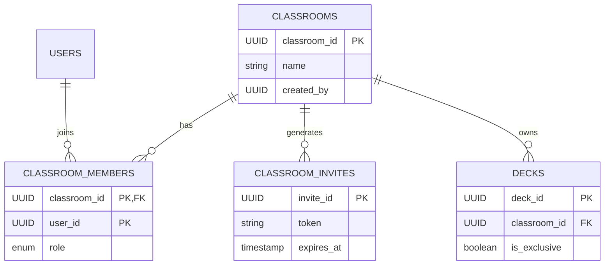

# Kế Hoạch Triển Khai Tính Năng "Lớp Học" (Classroom)

## 1. Thay đổi Kiến trúc hệ thống
Hệ thống hiện tại áp dụng kiến trúc Microservices. Để đáp ứng tính năng Lớp học với mức độ cô lập và dễ mở rộng, ta sẽ:
- **Tạo mới `classroom-service`**: Chịu trách nhiệm quản lý thông tin lớp học, thành viên, phân quyền role trong lớp và sinh token mời.
- **Giao tiếp liên dịch vụ (Inter-service Communication)**:
  - `deck-service` $\leftrightarrow$ `classroom-service` (gRPC): Kiểm tra quyền truy cập deck (người dùng có phải là thành viên lớp học sở hữu deck không).
  - `classroom-service` $\rightarrow$ `notification-service` (Pub/Sub hoặc gRPC): Gửi email chứa link mời học viên.
  - `classroom-service` $\leftrightarrow$ `stats-service` (gRPC): Lấy tiến độ học tập (streak, progress, time) theo danh sách thành viên trong lớp.

## 2. Thiết kế Database mới (`classroom_db`)
Service mới `classroom-service` sẽ sở hữu một database riêng `classroom_db` chứa các bảng sau:

```sql
CREATE TYPE classroom_role AS ENUM ('owner', 'teacher', 'student');

CREATE TABLE classrooms (
    classroom_id UUID PRIMARY KEY DEFAULT gen_random_uuid(),
    name VARCHAR(200) NOT NULL,
    description TEXT,
    created_by UUID NOT NULL, -- user_id người tạo
    created_at TIMESTAMPTZ DEFAULT CURRENT_TIMESTAMP,
    updated_at TIMESTAMPTZ DEFAULT CURRENT_TIMESTAMP
);

CREATE TABLE classroom_members (
    classroom_id UUID REFERENCES classrooms(classroom_id) ON DELETE CASCADE,
    user_id UUID NOT NULL,
    role classroom_role DEFAULT 'student',
    joined_at TIMESTAMPTZ DEFAULT CURRENT_TIMESTAMP,
    PRIMARY KEY (classroom_id, user_id)
);
CREATE INDEX idx_classroom_members_user ON classroom_members(user_id);

CREATE TABLE classroom_invites (
    invite_id UUID PRIMARY KEY DEFAULT gen_random_uuid(),
    classroom_id UUID REFERENCES classrooms(classroom_id) ON DELETE CASCADE,
    token VARCHAR(64) UNIQUE NOT NULL,
    expires_at TIMESTAMPTZ,
    max_uses INTEGER DEFAULT 1,
    uses_count INTEGER DEFAULT 0,
    created_by UUID NOT NULL,
    created_at TIMESTAMPTZ DEFAULT CURRENT_TIMESTAMP
);
CREATE INDEX idx_classroom_invites_token ON classroom_invites(token);
```

## 3. Các bảng hiện tại cần chỉnh sửa
- **Tại `deck_db` (deck-service)**: Bảng `decks` cần thêm 2 trường để phục vụ tính năng "Deck độc quyền":
  ```sql
  ALTER TABLE decks ADD COLUMN classroom_id UUID;
  ALTER TABLE decks ADD COLUMN is_exclusive BOOLEAN DEFAULT FALSE;
  CREATE INDEX idx_decks_classroom ON decks(classroom_id);
  ```
- **Tại `stats_db` (stats-service)**: Không cần đổi schema. Tuy nhiên cần thêm logic để query dữ liệu theo batch (nhiều `user_id` cùng lúc).
- **Tại `study_db` (study-service)**: Không cần thay đổi schema.

## 4. Mô hình quan hệ dữ liệu (ERD)


## 5. Các API mới cần bổ sung
### Classroom Service (`/v1/classrooms`)
- `POST /` : Tạo lớp học mới (Dành cho Teacher/Manager).
- `GET /` : Lấy danh sách các lớp học của User đang gọi API.
- `GET /{id}` : Lấy thông tin chi tiết lớp.
- `POST /{id}/invites` : Tạo link mời (Sinh token, tùy chọn cấu hình `expires_at`, `max_uses`, gọi gửi email).
- `POST /join` : Học viên nhập token (hoặc qua link URL) để join vào lớp.
- `GET /{id}/members` : Xem danh sách thành viên trong lớp.
- `DELETE /{id}/members/{user_id}` : Teacher kick học viên, hoặc tự học viên rời lớp.
- `GET /{id}/progress` : Lấy tiến độ học tập của toàn bộ thành viên.

### Deck Service (`/v1/decks` updates)
- `POST /` (API cũ): Cho phép nhận thêm body `classroom_id` và `is_exclusive = true`.
- `GET /classrooms/{classroom_id}/decks` : Lấy toàn bộ deck thuộc về một lớp học.

## 6. Phân quyền (Authorization)
- **Classroom Level**:
  - Chỉ `owner` và `teacher` mới được phép: Xoá/kick thành viên, tạo Deck độc quyền cho lớp, tạo Invite Token, Sửa/Xóa lớp học.
  - `student` có quyền: Xem danh sách thành viên, xem tiến độ (tuỳ policy), xem và học Deck của lớp.
- **Deck Level (Tại `deck-service`)**:
  - Bổ sung middleware kiểm tra đối với các deck có `classroom_id != NULL`.
  - `deck-service` sẽ gọi gRPC `classroom-service.CheckMember(classroom_id, user_id)`. Nếu trả về `false`, block request (`403 Forbidden`).
  - Nếu `is_exclusive = true`, các endpoint: `POST /decks/{id}/clone`, `POST /decks/{id}/export`, và public sharing sẽ tự động ném ra lỗi `403 Forbidden`.

## 7. Migration Database cần thực hiện
1. **Migration Classroom (Service mới)**: Init cấu trúc tạo 3 bảng như mục 2.
2. **Migration Deck Service**: Chạy script ALTER table:
   ```sql
   -- Up Migration
   ALTER TABLE decks ADD COLUMN classroom_id UUID NULL;
   ALTER TABLE decks ADD COLUMN is_exclusive BOOLEAN NOT NULL DEFAULT FALSE;
   CREATE INDEX idx_decks_classroom_id ON decks(classroom_id);
   -- Down Migration
   DROP INDEX idx_decks_classroom_id;
   ALTER TABLE decks DROP COLUMN is_exclusive;
   ALTER TABLE decks DROP COLUMN classroom_id;
   ```

## 8. Thay đổi Frontend (Web/Mobile)
- **Màn hình Danh sách lớp học**: Card view liệt kê các lớp đang tham gia/sở hữu.
- **Màn hình Chi tiết lớp**:
  - Tab "Decks": Liệt kê các deck độc quyền. Ẩn toàn bộ nút Clone, Share, Export trên các deck này.
  - Tab "Members": Danh sách thành viên + Role. UI kick/leave lớp.
  - Tab "Progress/Leaderboard": Bảng thống kê tiến độ các thành viên (Số thẻ, tỷ lệ hoàn thành, Streak, Last active).
- **Màn hình Quản lý Invite**: Nút "Tạo link mời", modal nhập số lượt dùng/ngày hết hạn, form nhập email học viên.

## 9. Thay đổi Backend (Chi tiết)
- Init service mới `classroom-service` (Dựa trên template chuẩn hiện có với go, sqlc).
- Định nghĩa Protobuf cho `classroom-service` (ví dụ `CheckMembershipRequest`, `CheckMembershipResponse`).
- Cập nhật các service khác (ví dụ: `deck-service`) tích hợp gRPC client kết nối đến `classroom-service`.
- Cập nhật `notification-service`: Thêm template email mới `CLASSROOM_INVITE`.
- Tối ưu API `/progress`: Tại `classroom-service`, khi client gọi API này, service sẽ lấy list `user_id` từ `classroom_members`, sau đó gọi sang `stats-service` qua một API batch (vd: `GetBatchUserStats`) để lấy thống kê, sau đó map lại trả về cho Frontend. Do yêu cầu near real-time, có thể áp dụng cơ chế caching ở Redis (TTL 1-2 phút) để giảm tải cho `stats-service`.

## 10. Các rủi ro bảo mật (Security Risks)
- **Brute-force/Guessing Invite Token**: Token cần sinh ngẫu nhiên đủ mạnh (cryptographically secure, độ dài > 32 ký tự alphanumeric). Áp dụng Rate Limit lên API `/join`.
- **Insecure Direct Object Reference (IDOR)**: Đảm bảo mọi API thao tác trên `classroom_id` hoặc lấy deck có `classroom_id` đều được check phân quyền người dùng có nằm trong `classroom_members` không.
- **Data Privacy Leaks**: Tiến độ học tập cá nhân bị lộ. Cần quy định rõ trong Policy là vào lớp sẽ bị public thông tin với thành viên. Chỉ theo dõi được tiến độ học của các deck trong lớp học được người quản lý lớp hoặc giao thêm vào./progress`.

## 11. Các Edge Case cần xử lý
- **Thành viên bị Kick (hoặc rời lớp)**: 
  - *Vấn đề*: Thành viên không còn quyền đọc Deck, nhưng lịch sử học (`user_cards`, `revlogs`) đã lưu ở `study-service` sẽ ra sao? 
  - *Xử lý*: Giữ nguyên `user_cards` để không mất data, nhưng ở màn hình "Tiếp tục học" (Study session), khi load deck, `study-service` gọi `deck-service` (và `deck-service` gọi `classroom-service`), phát hiện hết quyền $\rightarrow$ Chặn không cho học tiếp. Có cơ chế để không hiển thị nữa luôn.
- **Giáo viên xóa toàn bộ lớp học**: 
  - *Xử lý*: Phải xóa toàn bộ member, invite, và các deck thuộc lớp (`chuyển deck về quyền sở hữu cá nhân).
- **Race Condition Token Usage**: Nếu token `max_uses = 1`, mà 2 user bấm join cùng mili-giây. Cần dùng DB Transactions (`SELECT ... FOR UPDATE` khi update `uses_count`) để đảm bảo không bị quá giới hạn.`

## 12. Ước lượng độ phức tạp
- **Database**: `Trung bình`. Không phức tạp về schema, nhưng phải chú ý Join và Index, đặc biệt là quan hệ giữa Lớp và Deck.
- **Backend**: `Cao`. Cần tạo mới 1 microservice. Implement giao tiếp gRPC đồng bộ giữa 3 service (`deck`, `classroom`, `stats`), xử lý Transaction an toàn cho việc join lớp.
- **Frontend**: `Cao`. Cần build UI/UX cho cả một workflow mới, màn hình phân tích tiến độ, leaderboard và xử lý state management phức tạp.
- **Hạ tầng email**: `Thấp`. Chỉ cần thêm email template vào `notification-service`.

## 13. Đánh giá mức độ ảnh hưởng tới code hiện tại
- **Mức độ**: **Cao (High)**
- **Lý do**: Tính năng này can thiệp trực tiếp vào Core Object của hệ thống là `Decks`. Việc thêm `classroom_id` và cờ `is_exclusive` yêu cầu chỉnh sửa ở hầu hết các luồng truy xuất, học, copy, export Deck hiện tại để tránh việc lộ lọt dữ liệu.

## 14. Lộ trình triển khai (Roadmap)

### Phase 1: Core Foundation (Quản lý Lớp & Thành viên)
- Khởi tạo `classroom-service`, Database `classroom_db`.
- Xây dựng API CRUD lớp học, thêm/sửa/xoá/kick thành viên.
- Chức năng tạo Link mời & API Join.
- Tích hợp `notification-service` gửi email mời.
- **Frontend**: Màn hình danh sách lớp, chi tiết lớp (Tab Members), form tạo lớp/mời.

### Phase 2: Exclusive Decks & Security
- Migration Database `deck_db` thêm thôngquan classroom.
- Cập nhật logic `deck-service`, tích hợp gRPC gọi sang `classroom-service`.
- Xây dựng luồng tạo Deck độc quyền, block các luồng Clone/Export/Share.
- **Frontend**: Tab Decks trong Lớp học, hiển thị nhãn "Độc quyền", khóa UI tương tác đối với deck đặc biệt này.

### Phase 3: Analytics & Progress Tracking
- Thêm gRPC vào `stats-service` để hỗ trợ batch query theo list `user_id`.
- Xây dựng API `/progress` tại `classroom-service`.
- **Frontend**: Hoàn thiện Tab Leaderboard/Tiến độ. Tối ưu việc render danh sách theo thời gian thực (Polling hoặc Websocket nếu cần).
