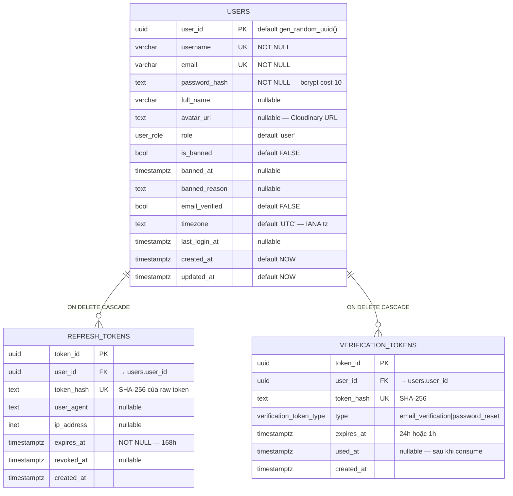
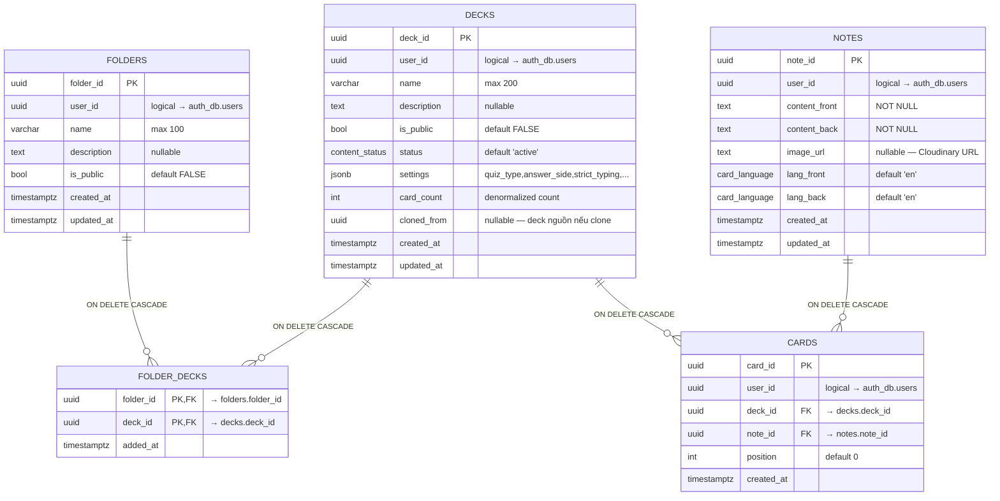
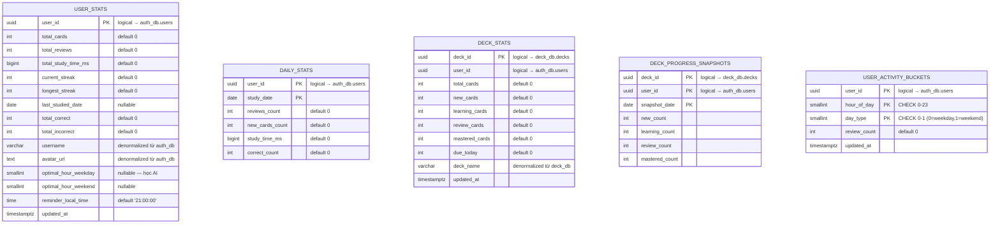
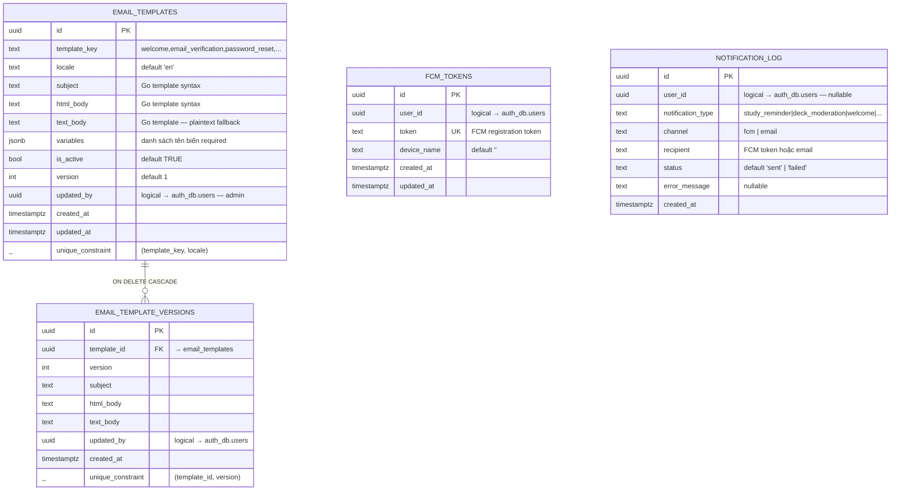
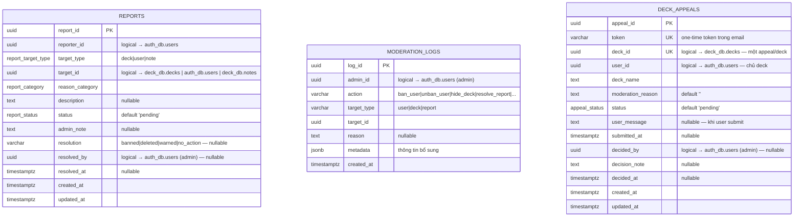

# Tài liệu Biểu đồ Quan hệ Thực thể (ERD / ERM) — Dự án mem_pan

> **Phạm vi tài liệu:** Tài liệu này mô tả mô hình dữ liệu vật lý (Physical Data Model) của hệ thống **mem_pan**. Vì dự án áp dụng kiến trúc microservice với mô hình **database-per-service**, tài liệu được tổ chức theo cả hai tầng:
>
> 1. **Một sơ đồ logical tổng quan** — cho thấy bức tranh toàn cảnh và các tham chiếu xuyên service.
> 2. **Sáu sơ đồ vật lý chi tiết** — mỗi sơ đồ đặc tả một cơ sở dữ liệu, đầy đủ kiểu dữ liệu, khoá chính, khoá ngoại, và ràng buộc.
>
> Mọi bảng, cột, ràng buộc và index trong tài liệu này đều được trích xuất nguyên văn từ các tệp migration `services/<svc>/db/migration/*.up.sql`.

---

## Mục lục

1. [Quyết định thiết kế: vẽ một ERD chung hay nhiều ERD theo từng database?](#1-quyết-định-thiết-kế-vẽ-một-erd-chung-hay-nhiều-erd-theo-từng-database)
2. [Quy ước trình bày](#2-quy-ước-trình-bày)
3. [Sơ đồ logical tổng quan](#3-sơ-đồ-logical-tổng-quan)
4. [ERD chi tiết theo từng database](#4-erd-chi-tiết-theo-từng-database)
   - 4.1. `auth_db` — auth-service
   - 4.2. `deck_db` — deck-service
   - 4.3. `study_db` — study-service
   - 4.4. `stats_db` — stats-service
   - 4.5. `notif_db` — notification-service
   - 4.6. `admin_db` — admin-service
5. [Bảng tổng hợp tham chiếu xuyên service](#5-bảng-tổng-hợp-tham-chiếu-xuyên-service)
6. [Quy ước đặt tên và các kiểu enum dùng chung](#6-quy-ước-đặt-tên-và-các-kiểu-enum-dùng-chung)

---

## 1. Quyết định thiết kế: vẽ một ERD chung hay nhiều ERD theo từng database?

Với mô hình **database-per-service**, đây là câu hỏi cần trả lời rõ trước khi vẽ. Trong dự án mem_pan, chúng tôi áp dụng **cả hai cách** cho hai mục đích khác nhau:

### Cách 1 — Một ERD vật lý chung (KHÔNG ÁP DỤNG)

> ❌ **Không khuyến nghị** vẽ một sơ đồ duy nhất với tất cả ~23 bảng nối nhau bằng khoá ngoại.

**Lý do:**

1. **Gây hiểu nhầm về ràng buộc vật lý.** Postgres **không hỗ trợ** khoá ngoại xuyên database. Nếu vẽ mũi tên FK liền nét từ `study_db.user_cards.user_id` sang `auth_db.users.user_id`, người đọc sẽ nghĩ có constraint `ON DELETE CASCADE` — điều không tồn tại. Khi xoá user trong `auth_db`, bản ghi mồ côi (orphan) vẫn ở lại các DB khác cho đến khi service tương ứng consume event `UserDeleted` để dọn dẹp.
2. **Vi phạm nguyên tắc bounded context.** Nếu trong sơ đồ thấy `user_cards.user_id` có FK trỏ tới `users`, lập trình viên có khuynh hướng viết câu `JOIN` xuyên DB — điều này không thể (và không nên) thực hiện trong kiến trúc microservice. Mọi truy vấn xuyên service phải đi qua gRPC.
3. **Mất khả năng truyền đạt.** Một sơ đồ có >20 bảng và >40 đường nối sẽ trở thành "mì spaghetti", không còn giá trị tài liệu.

### Cách 2 — ERD vật lý chi tiết PER database (✅ ÁP DỤNG — phần chính)

> ✅ **Khuyến nghị** mỗi service có một ERD riêng, chỉ thể hiện các bảng và FK **trong cùng database**.

**Lợi ích:**

- Phản ánh trung thực ràng buộc vật lý — chỉ vẽ mũi tên FK khi thực sự có `REFERENCES … ON DELETE CASCADE` trong migration.
- Dễ review khi viết migration mới (chỉ cần xem ERD của service đó).
- Tách bạch trách nhiệm — mỗi sơ đồ là tài liệu chính thức cho một service.

### Cách 3 — Một ERD logical tổng quan (✅ BỔ SUNG — đặt ở mục 3)

> ✅ **Khuyến nghị** bổ sung **một** sơ đồ tổng, dùng **mũi tên đứt nét** cho các tham chiếu xuyên DB (logical reference).

**Vai trò:**

- Cho thấy `user_id` xuất hiện ở cả 6 DB — đây là **logical FK** được duy trì bằng nghiệp vụ (event-driven), không phải constraint vật lý.
- Giúp lập trình viên mới hình dung data flow: khi `auth_db.users` thay đổi, các DB khác đồng bộ qua Pub/Sub event nào.
- Đặt ở **đầu tài liệu** trước các ERD chi tiết, đóng vai trò "table of contents trực quan".

### Kết luận

Tài liệu này được tổ chức theo thứ tự:

```
1. Một sơ đồ logical tổng (mục 3) — bird's-eye view, FK đứt nét
2. Sáu sơ đồ vật lý chi tiết (mục 4.1 – 4.6) — đặc tả chính thức
3. Một bảng tổng hợp các cross-DB reference (mục 5) — checklist cho dev
```

---

## 2. Quy ước trình bày

| Ký hiệu | Ý nghĩa |
|---|---|
| `||--o{` | Quan hệ 1-N (một bản ghi cha có nhiều con). |
| `||--||` | Quan hệ 1-1. |
| `}o--o{` | Quan hệ N-N (qua bảng liên kết). |
| Đường liền nét | Khoá ngoại vật lý trong cùng database (`REFERENCES … ON DELETE …`). |
| Đường đứt nét | **Logical reference xuyên database** — không có FK vật lý, ràng buộc duy trì bởi nghiệp vụ. |
| `PK` | Primary Key. |
| `FK` | Foreign Key vật lý. |
| `UK` | Unique Key. |
| `IDX` | Có index để tăng tốc truy vấn. |

**Lưu ý về kiểu dữ liệu:**
- Tất cả ID đều dùng `UUID` (kiểu `uuid` của Postgres, mặc định `gen_random_uuid()`).
- Tất cả timestamp đều dùng `TIMESTAMPTZ` (lưu kèm timezone, chuẩn UTC).
- `ENUM` là Postgres enum type (định nghĩa bằng `CREATE TYPE`).
- `JSONB` cho phép index và truy vấn theo trường JSON nội bộ.

---

## 3. Sơ đồ logical tổng quan

Sơ đồ này thể hiện **tất cả các thực thể chính** của 6 database, với:
- **Đường liền nét**: FK vật lý trong cùng DB.
- **Đường đứt nét**: logical reference xuyên DB — đồng bộ qua Pub/Sub event.

Mục đích: cho phép nhìn toàn cảnh data flow của hệ thống trong một slide. Để đặc tả vật lý chính xác, xem các sơ đồ chi tiết ở mục 4.

```mermaid
erDiagram
    %% ============== auth_db ==============
    USERS {
        UUID user_id PK
        varchar username UK
        varchar email UK
        text password_hash
        user_role role
        bool is_banned
        bool email_verified
        text timezone
        timestamptz last_login_at
        timestamptz created_at
    }
    REFRESH_TOKENS {
        UUID token_id PK
        UUID user_id FK
        text token_hash UK
        timestamptz expires_at
        timestamptz revoked_at
    }
    VERIFICATION_TOKENS {
        UUID token_id PK
        UUID user_id FK
        text token_hash UK
        verification_token_type type
        timestamptz expires_at
        timestamptz used_at
    }

    %% ============== deck_db ==============
    FOLDERS {
        UUID folder_id PK
        UUID user_id "logical→USERS"
        varchar name
        bool is_public
    }
    DECKS {
        UUID deck_id PK
        UUID user_id "logical→USERS"
        varchar name
        bool is_public
        content_status status
        jsonb settings
        int card_count
        UUID cloned_from
    }
    NOTES {
        UUID note_id PK
        UUID user_id "logical→USERS"
        text content_front
        text content_back
        card_language lang_front
        card_language lang_back
        text image_url
    }
    CARDS {
        UUID card_id PK
        UUID deck_id FK
        UUID note_id FK
        int position
    }
    FOLDER_DECKS {
        UUID folder_id PK,FK
        UUID deck_id PK,FK
    }

    %% ============== study_db ==============
    USER_CARDS {
        UUID user_card_id PK
        UUID user_id "logical→USERS"
        UUID card_id "logical→CARDS"
        UUID deck_id "logical→DECKS"
        card_state state
        float stability
        float difficulty
        int reps
        int lapses
        timestamptz next_review_date
    }
    STUDY_SESSIONS {
        UUID session_id PK
        UUID user_id "logical→USERS"
        UUID deck_id "logical→DECKS"
        session_status status
        int total_cards
        int completed_cards
    }
    SESSION_CARDS {
        UUID session_id PK,FK
        int position PK
        UUID card_id "logical→CARDS"
        UUID user_card_id FK
        smallint rating
    }
    REVLOGS {
        UUID log_id PK
        UUID user_card_id FK
        UUID session_id FK
        smallint rating
        int duration_ms
        card_state state_before
        card_state state_after
    }
    USER_FSRS_WEIGHTS {
        UUID user_id PK "logical→USERS"
        int version PK
        "float[]" weights
        bool is_active
    }
    DECK_STUDY_SETTINGS {
        UUID user_id PK "logical→USERS"
        UUID deck_id PK "logical→DECKS"
        bool shuffle_terms
        varchar strictness_level
    }

    %% ============== stats_db ==============
    USER_STATS {
        UUID user_id PK "logical→USERS"
        int total_reviews
        int current_streak
        int longest_streak
        date last_studied_date
        smallint optimal_hour_weekday
        smallint optimal_hour_weekend
        time reminder_local_time
    }
    DAILY_STATS {
        UUID user_id PK "logical→USERS"
        date study_date PK
        int reviews_count
        bigint study_time_ms
    }
    DECK_STATS {
        UUID deck_id PK "logical→DECKS"
        UUID user_id "logical→USERS"
        int total_cards
        int due_today
    }
    DECK_PROGRESS_SNAPSHOTS {
        UUID deck_id PK "logical→DECKS"
        UUID user_id PK "logical→USERS"
        date snapshot_date PK
        int new_count
        int mastered_count
    }
    USER_ACTIVITY_BUCKETS {
        UUID user_id PK "logical→USERS"
        smallint hour_of_day PK
        smallint day_type PK
        int review_count
    }

    %% ============== notif_db ==============
    FCM_TOKENS {
        UUID id PK
        UUID user_id "logical→USERS"
        text token UK
        text device_name
    }
    NOTIFICATION_LOG {
        UUID id PK
        UUID user_id "logical→USERS"
        text notification_type
        text channel
        text recipient
        text status
    }
    EMAIL_TEMPLATES {
        UUID id PK
        text template_key
        text locale
        text subject
        text html_body
        jsonb variables
    }
    EMAIL_TEMPLATE_VERSIONS {
        UUID id PK
        UUID template_id FK
        int version
    }

    %% ============== admin_db ==============
    REPORTS {
        UUID report_id PK
        UUID reporter_id "logical→USERS"
        report_target_type target_type
        UUID target_id "logical→DECKS/USERS"
        report_category reason_category
        report_status status
        varchar resolution
        UUID resolved_by "logical→USERS (admin)"
        timestamptz resolved_at
    }
    MODERATION_LOGS {
        UUID log_id PK
        UUID admin_id "logical→USERS (admin)"
        varchar action
        varchar target_type
        UUID target_id
        jsonb metadata
    }
    DECK_APPEALS {
        UUID appeal_id PK
        varchar token UK
        UUID deck_id UK "logical→DECKS"
        UUID user_id "logical→USERS"
        appeal_status status
        UUID decided_by "logical→USERS (admin)"
        timestamptz submitted_at
        timestamptz decided_at
    }

    %% ============== PHYSICAL FK (cùng DB) ==============
    USERS                ||--o{ REFRESH_TOKENS              : "ON DELETE CASCADE"
    USERS                ||--o{ VERIFICATION_TOKENS         : "ON DELETE CASCADE"
    DECKS                ||--o{ CARDS                       : "ON DELETE CASCADE"
    NOTES                ||--o{ CARDS                       : "ON DELETE CASCADE"
    FOLDERS              ||--o{ FOLDER_DECKS                : "ON DELETE CASCADE"
    DECKS                ||--o{ FOLDER_DECKS                : "ON DELETE CASCADE"
    USER_CARDS           ||--o{ SESSION_CARDS               : ""
    STUDY_SESSIONS       ||--o{ SESSION_CARDS               : "ON DELETE CASCADE"
    USER_CARDS           ||--o{ REVLOGS                     : ""
    STUDY_SESSIONS       ||--o{ REVLOGS                     : ""
    EMAIL_TEMPLATES      ||--o{ EMAIL_TEMPLATE_VERSIONS     : "ON DELETE CASCADE"

    %% ============== LOGICAL REFERENCES (xuyên DB) ==============
    USERS                ||..o{ FOLDERS                     : "logical"
    USERS                ||..o{ DECKS                       : "logical"
    USERS                ||..o{ NOTES                       : "logical"
    USERS                ||..o{ USER_CARDS                  : "logical"
    USERS                ||..o{ STUDY_SESSIONS              : "logical"
    USERS                ||..|| USER_STATS                  : "logical 1-1"
    USERS                ||..o{ DAILY_STATS                 : "logical"
    USERS                ||..o{ USER_ACTIVITY_BUCKETS       : "logical"
    USERS                ||..o{ FCM_TOKENS                  : "logical"
    USERS                ||..o{ NOTIFICATION_LOG            : "logical"
    USERS                ||..o{ REPORTS                     : "logical reporter"
    USERS                ||..o{ MODERATION_LOGS             : "logical admin"
    USERS                ||..o{ DECK_APPEALS                : "logical owner"
    USERS                ||..o{ USER_FSRS_WEIGHTS           : "logical"
    USERS                ||..o{ DECK_STUDY_SETTINGS         : "logical"
    DECKS                ||..o{ USER_CARDS                  : "logical"
    DECKS                ||..o{ STUDY_SESSIONS              : "logical"
    DECKS                ||..|| DECK_STATS                  : "logical 1-1"
    DECKS                ||..o{ DECK_PROGRESS_SNAPSHOTS     : "logical"
    DECKS                ||..o{ DECK_STUDY_SETTINGS         : "logical"
    DECKS                ||..|| DECK_APPEALS                : "logical 1-1"
    CARDS                ||..o{ USER_CARDS                  : "logical"
    CARDS                ||..o{ SESSION_CARDS               : "logical"
```

> ⚠ Lưu ý: Mermaid render các quan hệ `||..o{` (logical) bằng đường nét giống `||--o{` (vật lý) — không có cách phân biệt bằng nét vẽ ở phiên bản hiện tại. Phân biệt được thực hiện qua **chú thích chữ** (`"logical"`, `"ON DELETE CASCADE"`) ở cuối mỗi đường nối, và qua việc các trường tham chiếu được đánh dấu `"logical→USERS"` ngay trong định nghĩa cột thay vì `FK`.

---

## 4. ERD chi tiết theo từng database

### 4.1. `auth_db` — auth-service

**Trách nhiệm:** Quản lý người dùng, phiên đăng nhập, token xác minh.

**Custom types:**
```sql
CREATE TYPE user_role AS ENUM ('user', 'admin', 'moderator');
CREATE TYPE verification_token_type AS ENUM ('email_verification', 'password_reset');
```



**Bảng mô tả các trường:**

*Bảng `users`*

| Tên trường | Kiểu dữ liệu | Khoá | Mô tả |
|---|---|---|---|
| user_id | UUID | PK | Định danh người dùng, default `gen_random_uuid()`. |
| username | VARCHAR | UK | Tên đăng nhập, NOT NULL, duy nhất. |
| email | VARCHAR | UK | Địa chỉ email, NOT NULL, duy nhất. |
| password_hash | TEXT | | Mật khẩu đã băm (bcrypt cost 10), NOT NULL. |
| full_name | VARCHAR | | Họ tên đầy đủ, nullable. |
| avatar_url | TEXT | | URL ảnh đại diện (Cloudinary), nullable. |
| role | user_role | | Vai trò người dùng, default `'user'`. |
| is_banned | BOOLEAN | | Đã bị cấm hay chưa, default FALSE. |
| banned_at | TIMESTAMPTZ | | Thời điểm bị cấm, nullable. |
| banned_reason | TEXT | | Lý do bị cấm, nullable. |
| email_verified | BOOLEAN | | Email đã được xác minh chưa, default FALSE. |
| timezone | TEXT | | Múi giờ IANA (vd `Asia/Ho_Chi_Minh`), NOT NULL default `'UTC'`. |
| last_login_at | TIMESTAMPTZ | | Lần đăng nhập gần nhất, nullable. |
| created_at | TIMESTAMPTZ | | Thời điểm tạo, default `CURRENT_TIMESTAMP`. |
| updated_at | TIMESTAMPTZ | | Thời điểm cập nhật, default `CURRENT_TIMESTAMP`. |

*Bảng `refresh_tokens`*

| Tên trường | Kiểu dữ liệu | Khoá | Mô tả |
|---|---|---|---|
| token_id | UUID | PK | Định danh token, default `gen_random_uuid()`. |
| user_id | UUID | FK | Tham chiếu `users.user_id`, NOT NULL, `ON DELETE CASCADE`. |
| token_hash | TEXT | UK | SHA-256 của raw refresh token, NOT NULL, duy nhất. |
| user_agent | TEXT | | Thông tin trình duyệt/thiết bị, nullable. |
| ip_address | INET | | Địa chỉ IP của client, nullable. |
| expires_at | TIMESTAMPTZ | | Thời điểm hết hạn (168h), NOT NULL. |
| revoked_at | TIMESTAMPTZ | | Thời điểm thu hồi (khi logout), nullable. |
| created_at | TIMESTAMPTZ | | Thời điểm tạo, default `CURRENT_TIMESTAMP`. |

*Bảng `verification_tokens`*

| Tên trường | Kiểu dữ liệu | Khoá | Mô tả |
|---|---|---|---|
| token_id | UUID | PK | Định danh token, default `gen_random_uuid()`. |
| user_id | UUID | FK | Tham chiếu `users.user_id`, NOT NULL, `ON DELETE CASCADE`. |
| token_hash | TEXT | UK | SHA-256 của raw token, NOT NULL, duy nhất. |
| type | verification_token_type | | Loại token: `email_verification` \| `password_reset`. |
| expires_at | TIMESTAMPTZ | | Thời điểm hết hạn (24h hoặc 1h), NOT NULL. |
| used_at | TIMESTAMPTZ | | Thời điểm token được dùng, nullable. |
| created_at | TIMESTAMPTZ | | Thời điểm tạo, default `CURRENT_TIMESTAMP`. |

**Index đáng chú ý:**
- `idx_refresh_tokens_user_id` — phục vụ "danh sách thiết bị đang đăng nhập".
- `idx_refresh_tokens_token_hash` — lookup khi refresh.
- `idx_users_timezone` — phục vụ cron nhắc học tính giờ địa phương.

**Nguyên tắc bảo mật:**
- **Không lưu raw token** — chỉ lưu hash. Nếu DB bị rò rỉ, attacker không thể tái sử dụng token.
- Refresh token bị **revoke** khi user đăng xuất (`UPDATE … SET revoked_at = NOW()`) thay vì xoá, để giữ audit trail.

### 4.2. `deck_db` — deck-service

**Trách nhiệm:** Quản lý folder, deck, note, card, và quan hệ folder–deck.

**Custom types:**
```sql
CREATE TYPE content_status AS ENUM ('active', 'hidden', 'deleted');
CREATE TYPE card_language AS ENUM (
    'vi','en','es','fr','it','de','ru','ja','ja_romaji',
    'zh_hans','zh_hant','zh_pinyin','ko'
);
```



**Bảng mô tả các trường:**

*Bảng `folders`*

| Tên trường | Kiểu dữ liệu | Khoá | Mô tả |
|---|---|---|---|
| folder_id | UUID | PK | Định danh folder, default `gen_random_uuid()`. |
| user_id | UUID | | Chủ sở hữu — logical → `auth_db.users`, NOT NULL. |
| name | VARCHAR(100) | | Tên folder, NOT NULL. |
| description | TEXT | | Mô tả, nullable. |
| is_public | BOOLEAN | | Folder công khai hay không, NOT NULL default FALSE. |
| created_at | TIMESTAMPTZ | | Thời điểm tạo, default `CURRENT_TIMESTAMP`. |
| updated_at | TIMESTAMPTZ | | Thời điểm cập nhật, default `CURRENT_TIMESTAMP`. |

*Bảng `decks`*

| Tên trường | Kiểu dữ liệu | Khoá | Mô tả |
|---|---|---|---|
| deck_id | UUID | PK | Định danh deck, default `gen_random_uuid()`. |
| user_id | UUID | | Chủ sở hữu — logical → `auth_db.users`, NOT NULL. |
| name | VARCHAR(200) | | Tên deck, NOT NULL. |
| description | TEXT | | Mô tả, nullable. |
| is_public | BOOLEAN | | Deck công khai hay không, NOT NULL default FALSE. |
| status | content_status | | Trạng thái: `active` \| `hidden` \| `deleted`, default `'active'`. |
| settings | JSONB | | Cấu hình học (quiz_type, answer_side, …), NOT NULL có default. |
| card_count | INTEGER | | Số thẻ (denormalized), NOT NULL default 0. |
| cloned_from | UUID | | Deck nguồn nếu được clone, nullable. |
| created_at | TIMESTAMPTZ | | Thời điểm tạo, default `CURRENT_TIMESTAMP`. |
| updated_at | TIMESTAMPTZ | | Thời điểm cập nhật, default `CURRENT_TIMESTAMP`. |

*Bảng `notes`*

| Tên trường | Kiểu dữ liệu | Khoá | Mô tả |
|---|---|---|---|
| note_id | UUID | PK | Định danh note, default `gen_random_uuid()`. |
| user_id | UUID | | Tác giả — logical → `auth_db.users`, NOT NULL. |
| content_front | TEXT | | Nội dung mặt trước, NOT NULL. |
| content_back | TEXT | | Nội dung mặt sau, NOT NULL. |
| image_url | TEXT | | URL ảnh minh hoạ (Cloudinary), nullable. |
| lang_front | card_language | | Ngôn ngữ mặt trước, NOT NULL default `'en'`. |
| lang_back | card_language | | Ngôn ngữ mặt sau, NOT NULL default `'en'`. |
| created_at | TIMESTAMPTZ | | Thời điểm tạo, default `CURRENT_TIMESTAMP`. |
| updated_at | TIMESTAMPTZ | | Thời điểm cập nhật, default `CURRENT_TIMESTAMP`. |

*Bảng `cards`*

| Tên trường | Kiểu dữ liệu | Khoá | Mô tả |
|---|---|---|---|
| card_id | UUID | PK | Định danh card, default `gen_random_uuid()`. |
| user_id | UUID | | Tác giả — logical → `auth_db.users`, NOT NULL. |
| deck_id | UUID | FK | Tham chiếu `decks.deck_id`, NOT NULL, `ON DELETE CASCADE`. |
| note_id | UUID | FK | Tham chiếu `notes.note_id`, NOT NULL, `ON DELETE CASCADE`. |
| position | INTEGER | | Vị trí thẻ trong deck, NOT NULL default 0. |
| created_at | TIMESTAMPTZ | | Thời điểm tạo, default `CURRENT_TIMESTAMP`. |

> Ràng buộc: `UNIQUE (deck_id, note_id)` — một note không bị thêm trùng vào cùng một deck.

*Bảng `folder_decks` (bảng liên kết N-N)*

| Tên trường | Kiểu dữ liệu | Khoá | Mô tả |
|---|---|---|---|
| folder_id | UUID | PK, FK | Tham chiếu `folders.folder_id`, `ON DELETE CASCADE`. |
| deck_id | UUID | PK, FK | Tham chiếu `decks.deck_id`, `ON DELETE CASCADE`. |
| added_at | TIMESTAMPTZ | | Thời điểm thêm deck vào folder, default `CURRENT_TIMESTAMP`. |

**Index đáng chú ý:**
- `idx_decks_is_public` — **partial index** `WHERE is_public=TRUE AND status='active'`. Chỉ index các deck công khai → giảm dung lượng index, tăng tốc query "khám phá deck".
- `idx_decks_cloned_from` — partial index để truy vết các deck đã được clone.
- `idx_folders_is_public` — partial.
- `idx_cards_deck_note` — unique `(deck_id, note_id)` đảm bảo một note không bị thêm trùng vào cùng một deck.

**Quyết định thiết kế đáng chú ý:**
- **Tách `notes` khỏi `cards`.** Một `note` (cặp mặt trước/sau) có thể được tham chiếu bởi nhiều `card` ở các deck khác nhau khi user clone deck → tránh nhân bản nội dung.
- **`settings` là JSONB**, mặc định:
  ```json
  {
    "quiz_type": "multiple_choice",
    "answer_side": "back",
    "strict_typing": false,
    "partial_correct": true,
    "new_cards_per_day": 20,
    "reviews_per_day": 200
  }
  ```
  Cho phép thêm tuỳ chỉnh học bài mà không cần migration.
- **`card_count` denormalized** — tránh COUNT(*) đắt tiền mỗi lần list deck.

### 4.3. `study_db` — study-service

**Trách nhiệm:** Lưu trạng thái ôn tập của từng thẻ theo từng user (FSRS), phiên học, lịch sử review, trọng số FSRS cá nhân hoá.

**Custom types:**
```sql
CREATE TYPE card_state    AS ENUM ('new', 'learning', 'review', 'relearning');
CREATE TYPE session_status AS ENUM ('ongoing', 'completed', 'abandoned');
```

```mermaid
erDiagram
    USER_CARDS     ||--o{ SESSION_CARDS : ""
    USER_CARDS     ||--o{ REVLOGS       : ""
    STUDY_SESSIONS ||--o{ SESSION_CARDS : "ON DELETE CASCADE"
    STUDY_SESSIONS ||--o{ REVLOGS       : ""

    USER_CARDS {
        uuid user_card_id PK
        uuid user_id "logical → auth_db.users"
        uuid card_id "logical → deck_db.cards"
        uuid deck_id "logical → deck_db.decks"
        card_state state "default 'new'"
        float stability "default 0"
        float difficulty "default 0"
        int reps "default 0"
        int lapses "default 0"
        int scheduled_days "default 0"
        float t_avg "default 5.0 — avg thinking time"
        timestamptz next_review_date "default NOW"
        timestamptz last_review_date "nullable"
        timestamptz created_at
        timestamptz updated_at
        _ unique_constraint "(user_id, card_id, deck_id)"
    }

    STUDY_SESSIONS {
        uuid session_id PK
        uuid user_id "logical → auth_db.users"
        uuid deck_id "logical → deck_db.decks"
        session_status status "default 'ongoing'"
        int total_cards "default 0"
        int completed_cards "default 0"
        int last_completed_index "default -1"
        timestamptz started_at
        timestamptz finished_at "nullable"
        timestamptz last_accessed_at
    }

    SESSION_CARDS {
        uuid session_id PK,FK "→ study_sessions"
        int position PK
        uuid card_id "logical → deck_db.cards"
        uuid user_card_id FK "→ user_cards"
        timestamptz reviewed_at "nullable"
        smallint rating "nullable — 1-4"
    }

    REVLOGS {
        uuid log_id PK
        uuid user_id "logical → auth_db.users"
        uuid card_id "logical → deck_db.cards"
        uuid user_card_id FK "→ user_cards"
        uuid session_id FK "→ study_sessions nullable"
        smallint rating "CHECK BETWEEN 1 AND 4"
        int duration_ms "NOT NULL"
        card_state state_before "trước Schedule()"
        float stability_before
        float difficulty_before
        int elapsed_days
        int scheduled_days
        card_state state_after "sau Schedule()"
        float stability_after
        float difficulty_after
        timestamptz review_time "default NOW"
    }

    USER_FSRS_WEIGHTS {
        uuid user_id PK "logical → auth_db.users"
        int version PK "default 1"
        "float[]" weights "21 phần tử — default = community benchmark"
        bool is_active "default TRUE"
        int trained_on_reviews "nullable"
        float training_loss "nullable"
        timestamptz created_at
    }

    DECK_STUDY_SETTINGS {
        uuid user_id PK "logical → auth_db.users"
        uuid deck_id PK "logical → deck_db.decks"
        bool shuffle_terms "default FALSE"
        bool text_to_speech "default FALSE"
        bool answer_with_term "default TRUE"
        bool answer_with_definition "default TRUE"
        bool question_type_flashcards "default FALSE"
        bool question_type_multiple_choice "default TRUE"
        bool question_type_written "default TRUE"
        varchar strictness_level "default 'flexible' — CHECK in (flexible,strict)"
        bool require_retyping_correct_answer "default FALSE"
        timestamptz created_at
        timestamptz updated_at
    }
```

**Bảng mô tả các trường:**

*Bảng `user_cards`*

| Tên trường | Kiểu dữ liệu | Khoá | Mô tả |
|---|---|---|---|
| user_card_id | UUID | PK | Định danh, default `gen_random_uuid()`. |
| user_id | UUID | | Logical → `auth_db.users`, NOT NULL. |
| card_id | UUID | | Logical → `deck_db.cards`, NOT NULL. |
| deck_id | UUID | | Logical → `deck_db.decks`, NOT NULL. |
| state | card_state | | Trạng thái FSRS: `new`/`learning`/`review`/`relearning`, default `'new'`. |
| stability | DOUBLE PRECISION | | Độ ổn định FSRS, NOT NULL default 0. |
| difficulty | DOUBLE PRECISION | | Độ khó FSRS, NOT NULL default 0. |
| reps | INTEGER | | Số lần ôn, NOT NULL default 0. |
| lapses | INTEGER | | Số lần quên, NOT NULL default 0. |
| scheduled_days | INTEGER | | Số ngày lịch hẹn, NOT NULL default 0. |
| t_avg | DOUBLE PRECISION | | Thời gian suy nghĩ trung bình (s), NOT NULL default 5.0. |
| next_review_date | TIMESTAMPTZ | | Ngày ôn kế tiếp, NOT NULL default `CURRENT_TIMESTAMP`. |
| last_review_date | TIMESTAMPTZ | | Lần ôn gần nhất, nullable. |
| created_at | TIMESTAMPTZ | | Thời điểm tạo, default `CURRENT_TIMESTAMP`. |
| updated_at | TIMESTAMPTZ | | Thời điểm cập nhật, default `CURRENT_TIMESTAMP`. |

> Ràng buộc: `UNIQUE (user_id, card_id, deck_id)`.

*Bảng `study_sessions`*

| Tên trường | Kiểu dữ liệu | Khoá | Mô tả |
|---|---|---|---|
| session_id | UUID | PK | Định danh phiên học, default `gen_random_uuid()`. |
| user_id | UUID | | Logical → `auth_db.users`, NOT NULL. |
| deck_id | UUID | | Logical → `deck_db.decks`, NOT NULL. |
| status | session_status | | `ongoing` \| `completed` \| `abandoned`, default `'ongoing'`. |
| total_cards | INTEGER | | Tổng số thẻ trong phiên, NOT NULL default 0. |
| completed_cards | INTEGER | | Số thẻ đã hoàn thành, NOT NULL default 0. |
| last_completed_index | INTEGER | | Vị trí thẻ hoàn thành gần nhất, NOT NULL default -1. |
| started_at | TIMESTAMPTZ | | Thời điểm bắt đầu, default `CURRENT_TIMESTAMP`. |
| finished_at | TIMESTAMPTZ | | Thời điểm kết thúc, nullable. |
| last_accessed_at | TIMESTAMPTZ | | Lần truy cập gần nhất, default `CURRENT_TIMESTAMP`. |

*Bảng `session_cards`*

| Tên trường | Kiểu dữ liệu | Khoá | Mô tả |
|---|---|---|---|
| session_id | UUID | PK, FK | Tham chiếu `study_sessions.session_id`, `ON DELETE CASCADE`. |
| position | INTEGER | PK | Vị trí thẻ trong phiên, NOT NULL. |
| card_id | UUID | | Logical → `deck_db.cards`, NOT NULL. |
| user_card_id | UUID | FK | Tham chiếu `user_cards.user_card_id`, NOT NULL. |
| reviewed_at | TIMESTAMPTZ | | Thời điểm ôn thẻ này, nullable. |
| rating | SMALLINT | | Điểm đánh giá 1-4, nullable. |

*Bảng `revlogs`* (append-only — không bao giờ xoá)

| Tên trường | Kiểu dữ liệu | Khoá | Mô tả |
|---|---|---|---|
| log_id | UUID | PK | Định danh bản ghi log, default `gen_random_uuid()`. |
| user_id | UUID | | Logical → `auth_db.users`, NOT NULL. |
| card_id | UUID | | Logical → `deck_db.cards`, NOT NULL. |
| user_card_id | UUID | FK | Tham chiếu `user_cards.user_card_id`, NOT NULL. |
| session_id | UUID | FK | Tham chiếu `study_sessions.session_id`, nullable. |
| rating | SMALLINT | | Điểm đánh giá, NOT NULL, `CHECK BETWEEN 1 AND 4`. |
| duration_ms | INTEGER | | Thời gian trả lời (ms), NOT NULL. |
| state_before | card_state | | Trạng thái trước `Schedule()`, NOT NULL. |
| stability_before | DOUBLE PRECISION | | Độ ổn định trước, NOT NULL. |
| difficulty_before | DOUBLE PRECISION | | Độ khó trước, NOT NULL. |
| elapsed_days | INTEGER | | Số ngày đã trôi qua, NOT NULL. |
| scheduled_days | INTEGER | | Số ngày lịch hẹn, NOT NULL. |
| state_after | card_state | | Trạng thái sau `Schedule()`, NOT NULL. |
| stability_after | DOUBLE PRECISION | | Độ ổn định sau, NOT NULL. |
| difficulty_after | DOUBLE PRECISION | | Độ khó sau, NOT NULL. |
| review_time | TIMESTAMPTZ | | Thời điểm ôn, default `CURRENT_TIMESTAMP`. |

*Bảng `user_fsrs_weights`*

| Tên trường | Kiểu dữ liệu | Khoá | Mô tả |
|---|---|---|---|
| user_id | UUID | PK | Logical → `auth_db.users`, NOT NULL. |
| version | INTEGER | PK | Phiên bản trọng số, NOT NULL default 1. |
| weights | DOUBLE PRECISION[] | | Vector 21 trọng số FSRS, NOT NULL (default = community benchmark). |
| is_active | BOOLEAN | | Bản đang dùng hay không, NOT NULL default TRUE. |
| trained_on_reviews | INTEGER | | Số revlog dùng để train, nullable. |
| training_loss | DOUBLE PRECISION | | Loss khi train, nullable. |
| created_at | TIMESTAMPTZ | | Thời điểm tạo, default `CURRENT_TIMESTAMP`. |

*Bảng `deck_study_settings`*

| Tên trường | Kiểu dữ liệu | Khoá | Mô tả |
|---|---|---|---|
| user_id | UUID | PK | Logical → `auth_db.users`, NOT NULL. |
| deck_id | UUID | PK | Logical → `deck_db.decks`, NOT NULL. |
| shuffle_terms | BOOLEAN | | Xáo trộn thẻ, NOT NULL default FALSE. |
| text_to_speech | BOOLEAN | | Đọc to nội dung, NOT NULL default FALSE. |
| answer_with_term | BOOLEAN | | Trả lời bằng thuật ngữ, NOT NULL default TRUE. |
| answer_with_definition | BOOLEAN | | Trả lời bằng định nghĩa, NOT NULL default TRUE. |
| question_type_flashcards | BOOLEAN | | Bật dạng flashcard, NOT NULL default FALSE. |
| question_type_multiple_choice | BOOLEAN | | Bật dạng trắc nghiệm, NOT NULL default TRUE. |
| question_type_written | BOOLEAN | | Bật dạng tự luận, NOT NULL default TRUE. |
| strictness_level | VARCHAR(20) | | Độ nghiêm khắc, NOT NULL default `'flexible'`, `CHECK IN (flexible, strict)`. |
| require_retyping_correct_answer | BOOLEAN | | Bắt gõ lại đáp án đúng, NOT NULL default FALSE. |
| created_at | TIMESTAMPTZ | | Thời điểm tạo, default `CURRENT_TIMESTAMP`. |
| updated_at | TIMESTAMPTZ | | Thời điểm cập nhật, default `CURRENT_TIMESTAMP`. |

**Index đáng chú ý:**
- `idx_user_cards_due` — **partial index** `(user_id, next_review_date) WHERE state != 'new'`. Cực kỳ quan trọng — query "lấy thẻ đến hạn" chạy mỗi khi user mở deck, partial index loại trừ thẻ chưa từng học để giảm kích thước index 30–50%.
- `idx_user_cards_state` — phục vụ thống kê theo state.
- `idx_revlogs_user_time` — phục vụ huấn luyện FSRS optimizer (lấy revlog theo user, sắp theo thời gian).
- `idx_fsrs_weights_one_active` — **unique partial index** `WHERE is_active = TRUE` → đảm bảo mỗi user có **đúng một** bản trọng số đang dùng tại mọi thời điểm.

**Quyết định thiết kế:**
- **`unique (user_id, card_id, deck_id)`** chứ không phải `(user_id, card_id)` — vì một card có thể nằm trong nhiều deck (sau clone), tiến độ học của user trên mỗi deck độc lập.
- **`revlogs` lưu cả trạng thái trước và sau** — là nguồn dữ liệu duy nhất để huấn luyện lại trọng số FSRS. Không bao giờ xoá bản ghi của `revlogs`.
- **`user_fsrs_weights` lưu dạng `double precision[]`** thay vì 21 cột riêng — tận dụng kiểu array native của Postgres, dễ insert/select cả vector.

### 4.4. `stats_db` — stats-service

**Trách nhiệm:** Tổng hợp thống kê người dùng và deck (streak, heatmap, tiến độ) bằng cách consume Pub/Sub event từ các service khác.



**Bảng mô tả các trường:**

*Bảng `user_stats`*

| Tên trường | Kiểu dữ liệu | Khoá | Mô tả |
|---|---|---|---|
| user_id | UUID | PK | Logical → `auth_db.users`. |
| total_cards | INTEGER | | Tổng số thẻ, NOT NULL default 0. |
| total_reviews | INTEGER | | Tổng số lượt ôn, NOT NULL default 0. |
| total_study_time_ms | BIGINT | | Tổng thời gian học (ms), NOT NULL default 0. |
| current_streak | INTEGER | | Chuỗi ngày học hiện tại, NOT NULL default 0. |
| longest_streak | INTEGER | | Chuỗi ngày học dài nhất, NOT NULL default 0. |
| last_studied_date | DATE | | Ngày học gần nhất, nullable. |
| total_correct | INTEGER | | Tổng lượt trả lời đúng, NOT NULL default 0. |
| total_incorrect | INTEGER | | Tổng lượt trả lời sai, NOT NULL default 0. |
| username | VARCHAR(50) | | Tên người dùng (denormalized từ `auth_db`), nullable. |
| avatar_url | TEXT | | URL avatar (denormalized từ `auth_db`), nullable. |
| optimal_hour_weekday | SMALLINT | | Giờ học tối ưu ngày thường (học bằng AI), nullable. |
| optimal_hour_weekend | SMALLINT | | Giờ học tối ưu cuối tuần, nullable. |
| reminder_local_time | TIME | | Giờ địa phương gửi nhắc, NOT NULL default `'21:00:00'`. |
| updated_at | TIMESTAMPTZ | | Thời điểm cập nhật, default `CURRENT_TIMESTAMP`. |

*Bảng `daily_stats`*

| Tên trường | Kiểu dữ liệu | Khoá | Mô tả |
|---|---|---|---|
| user_id | UUID | PK | Logical → `auth_db.users`. |
| study_date | DATE | PK | Ngày học. |
| reviews_count | INTEGER | | Số lượt ôn trong ngày, NOT NULL default 0. |
| new_cards_count | INTEGER | | Số thẻ mới học trong ngày, NOT NULL default 0. |
| study_time_ms | BIGINT | | Thời gian học trong ngày (ms), NOT NULL default 0. |
| correct_count | INTEGER | | Số lượt đúng trong ngày, NOT NULL default 0. |

*Bảng `deck_stats`*

| Tên trường | Kiểu dữ liệu | Khoá | Mô tả |
|---|---|---|---|
| deck_id | UUID | PK | Logical → `deck_db.decks`. |
| user_id | UUID | | Logical → `auth_db.users`, NOT NULL. |
| total_cards | INTEGER | | Tổng số thẻ, NOT NULL default 0. |
| new_cards | INTEGER | | Số thẻ ở trạng thái new, NOT NULL default 0. |
| learning_cards | INTEGER | | Số thẻ đang học, NOT NULL default 0. |
| review_cards | INTEGER | | Số thẻ đang ôn, NOT NULL default 0. |
| mastered_cards | INTEGER | | Số thẻ đã thành thạo, NOT NULL default 0. |
| due_today | INTEGER | | Số thẻ đến hạn hôm nay, NOT NULL default 0. |
| deck_name | VARCHAR(200) | | Tên deck (denormalized từ `deck_db`), nullable. |
| updated_at | TIMESTAMPTZ | | Thời điểm cập nhật, default `CURRENT_TIMESTAMP`. |

*Bảng `deck_progress_snapshots`*

| Tên trường | Kiểu dữ liệu | Khoá | Mô tả |
|---|---|---|---|
| deck_id | UUID | PK | Logical → `deck_db.decks`. |
| user_id | UUID | PK | Logical → `auth_db.users`. |
| snapshot_date | DATE | PK | Ngày chụp snapshot. |
| new_count | INTEGER | | Số thẻ new tại thời điểm chụp, NOT NULL. |
| learning_count | INTEGER | | Số thẻ learning, NOT NULL. |
| review_count | INTEGER | | Số thẻ review, NOT NULL. |
| mastered_count | INTEGER | | Số thẻ đã thành thạo, NOT NULL. |

*Bảng `user_activity_buckets`*

| Tên trường | Kiểu dữ liệu | Khoá | Mô tả |
|---|---|---|---|
| user_id | UUID | PK | Logical → `auth_db.users`. |
| hour_of_day | SMALLINT | PK | Giờ trong ngày (giờ địa phương), `CHECK BETWEEN 0 AND 23`. |
| day_type | SMALLINT | PK | 0 = ngày thường, 1 = cuối tuần, `CHECK BETWEEN 0 AND 1`. |
| review_count | INTEGER | | Số lượt ôn trong bucket, NOT NULL default 0. |
| updated_at | TIMESTAMPTZ | | Thời điểm cập nhật, default `CURRENT_TIMESTAMP`. |

**Quyết định thiết kế:**
- **Denormalize `username`, `avatar_url`, `deck_name`** vào `user_stats` và `deck_stats`. Lý do: bảng xếp hạng và dashboard cần hiển thị tên ngay, không thể `JOIN` xuyên DB. Khi `auth_db.users` đổi username, sự kiện `UserUpdated` đồng bộ trường này.
- **`user_activity_buckets`** lưu histogram theo (giờ, kiểu ngày) — dùng để tính `optimal_hour_weekday/weekend` cho gợi ý giờ học cá nhân hoá (`optimal_hour = argmax(P(user_active | hour, day_type))`).
- **`reminder_local_time`** mặc định `21:00:00` — giờ địa phương để gửi cảnh báo streak.

**Không có FK vật lý nào trong DB này** — tất cả đều là logical reference, vì dữ liệu được derive từ event của các service khác.

### 4.5. `notif_db` — notification-service

**Trách nhiệm:** Lưu FCM token thiết bị, log mọi lần gửi notification, và quản lý template email.



**Bảng mô tả các trường:**

*Bảng `fcm_tokens`*

| Tên trường | Kiểu dữ liệu | Khoá | Mô tả |
|---|---|---|---|
| id | UUID | PK | Định danh, default `gen_random_uuid()`. |
| user_id | UUID | | Logical → `auth_db.users`, NOT NULL. |
| token | TEXT | UK | FCM registration token, NOT NULL, duy nhất. |
| device_name | TEXT | | Tên thiết bị, NOT NULL default `''`. |
| created_at | TIMESTAMPTZ | | Thời điểm tạo, default `NOW()`. |
| updated_at | TIMESTAMPTZ | | Thời điểm cập nhật, default `NOW()`. |

*Bảng `notification_log`*

| Tên trường | Kiểu dữ liệu | Khoá | Mô tả |
|---|---|---|---|
| id | UUID | PK | Định danh, default `gen_random_uuid()`. |
| user_id | UUID | | Logical → `auth_db.users`, nullable. |
| notification_type | TEXT | | Loại thông báo (`study_reminder`, `deck_moderation`, …), NOT NULL. |
| channel | TEXT | | Kênh gửi: `fcm` \| `email`, NOT NULL. |
| recipient | TEXT | | FCM token hoặc email người nhận, NOT NULL. |
| status | TEXT | | Trạng thái gửi, NOT NULL default `'sent'` (`sent`/`failed`). |
| error_message | TEXT | | Thông báo lỗi nếu fail, nullable. |
| created_at | TIMESTAMPTZ | | Thời điểm tạo, default `NOW()`. |

*Bảng `email_templates`*

| Tên trường | Kiểu dữ liệu | Khoá | Mô tả |
|---|---|---|---|
| id | UUID | PK | Định danh, default `gen_random_uuid()`. |
| template_key | TEXT | | Khoá template (`welcome`, `email_verification`, …), NOT NULL. |
| locale | TEXT | | Ngôn ngữ, NOT NULL default `'en'`. |
| subject | TEXT | | Tiêu đề email (Go template syntax), NOT NULL. |
| html_body | TEXT | | Nội dung HTML (Go template), NOT NULL. |
| text_body | TEXT | | Nội dung plaintext fallback (Go template), NOT NULL. |
| variables | JSONB | | Danh sách tên biến bắt buộc, NOT NULL default `'[]'`. |
| is_active | BOOLEAN | | Template đang dùng hay không, NOT NULL default TRUE. |
| version | INT | | Phiên bản hiện tại, NOT NULL default 1. |
| updated_by | UUID | | Admin chỉnh sửa — logical → `auth_db.users`, nullable. |
| created_at | TIMESTAMPTZ | | Thời điểm tạo, default `NOW()`. |
| updated_at | TIMESTAMPTZ | | Thời điểm cập nhật, default `NOW()`. |

> Ràng buộc: `UNIQUE (template_key, locale)`.

*Bảng `email_template_versions`*

| Tên trường | Kiểu dữ liệu | Khoá | Mô tả |
|---|---|---|---|
| id | UUID | PK | Định danh, default `gen_random_uuid()`. |
| template_id | UUID | FK | Tham chiếu `email_templates.id`, NOT NULL, `ON DELETE CASCADE`. |
| version | INT | | Số phiên bản, NOT NULL. |
| subject | TEXT | | Tiêu đề tại phiên bản này, NOT NULL. |
| html_body | TEXT | | Nội dung HTML tại phiên bản này, NOT NULL. |
| text_body | TEXT | | Nội dung plaintext tại phiên bản này, NOT NULL. |
| updated_by | UUID | | Admin chỉnh sửa — logical → `auth_db.users`, nullable. |
| created_at | TIMESTAMPTZ | | Thời điểm tạo, default `NOW()`. |

> Ràng buộc: `UNIQUE (template_id, version)`.

**Quyết định thiết kế:**
- **`email_templates` không hardcode trong code** — admin có thể sửa template qua admin web mà không cần redeploy. Mỗi lần update sẽ snapshot vào `email_template_versions` để rollback.
- **`fcm_tokens.token UNIQUE`** — cùng một token không được đăng ký cho hai user (FCM đảm bảo token duy nhất per device per app).
- **`notification_log` có `status` + `error_message`** — phục vụ audit và debug, ví dụ khi FCM trả `InvalidRegistration` thì service tự xoá token khỏi `fcm_tokens`.
- **Các template seeded** (qua migration `000002`–`000005`): `welcome`, `email_verification`, `password_reset`, `study_reminder`, `report_resolved`, `deck_moderation`, `deck_deleted_with_appeal`, `appeal_decided`.

### 4.6. `admin_db` — admin-service

**Trách nhiệm:** Quản lý báo cáo vi phạm, kháng nghị xoá deck, và audit log các hành động kiểm duyệt.

**Custom types:**
```sql
CREATE TYPE report_target_type AS ENUM ('deck', 'user', 'note');
CREATE TYPE report_status      AS ENUM ('pending', 'reviewing', 'resolved', 'dismissed');
CREATE TYPE report_category    AS ENUM (
    'inappropriate_content','copyright_violation','spam',
    'harassment','misinformation','other'
);
CREATE TYPE appeal_status      AS ENUM ('pending', 'submitted', 'approved', 'rejected');
```



**Bảng mô tả các trường:**

*Bảng `reports`*

| Tên trường | Kiểu dữ liệu | Khoá | Mô tả |
|---|---|---|---|
| report_id | UUID | PK | Định danh báo cáo, default `gen_random_uuid()`. |
| reporter_id | UUID | | Người báo cáo — logical → `auth_db.users`, NOT NULL. |
| target_type | report_target_type | | Loại đối tượng: `deck` \| `user` \| `note`, NOT NULL. |
| target_id | UUID | | ID đối tượng bị báo cáo (polymorphic), NOT NULL. |
| reason_category | report_category | | Nhóm lý do báo cáo, NOT NULL. |
| description | TEXT | | Mô tả chi tiết, nullable. |
| status | report_status | | `pending`/`reviewing`/`resolved`/`dismissed`, default `'pending'`. |
| admin_note | TEXT | | Ghi chú của admin, nullable. |
| resolution | VARCHAR(50) | | Kết quả: `banned`/`deleted`/`warned`/`no_action`, nullable. |
| resolved_by | UUID | | Admin xử lý — logical → `auth_db.users`, nullable. |
| resolved_at | TIMESTAMPTZ | | Thời điểm xử lý xong, nullable. |
| created_at | TIMESTAMPTZ | | Thời điểm tạo, default `CURRENT_TIMESTAMP`. |
| updated_at | TIMESTAMPTZ | | Thời điểm cập nhật, default `CURRENT_TIMESTAMP`. |

*Bảng `moderation_logs`* (append-only — audit trail bất biến)

| Tên trường | Kiểu dữ liệu | Khoá | Mô tả |
|---|---|---|---|
| log_id | UUID | PK | Định danh log, default `gen_random_uuid()`. |
| admin_id | UUID | | Admin thực hiện — logical → `auth_db.users`, NOT NULL. |
| action | VARCHAR(50) | | Hành động: `ban_user`/`hide_deck`/`resolve_report`/…, NOT NULL. |
| target_type | VARCHAR(20) | | Loại đối tượng: `user`/`deck`/`report`, NOT NULL. |
| target_id | UUID | | ID đối tượng tác động, NOT NULL. |
| reason | TEXT | | Lý do, nullable. |
| metadata | JSONB | | Thông tin bổ sung tuỳ action, nullable. |
| created_at | TIMESTAMPTZ | | Thời điểm tạo, default `CURRENT_TIMESTAMP`. |

*Bảng `deck_appeals`*

| Tên trường | Kiểu dữ liệu | Khoá | Mô tả |
|---|---|---|---|
| appeal_id | UUID | PK | Định danh kháng nghị, default `gen_random_uuid()`. |
| token | VARCHAR(80) | UK | Token một lần trong email xoá deck, NOT NULL, duy nhất. |
| deck_id | UUID | UK | Logical → `deck_db.decks`, NOT NULL, duy nhất (một appeal/deck). |
| user_id | UUID | | Chủ deck — logical → `auth_db.users`, NOT NULL. |
| deck_name | TEXT | | Tên deck (snapshot), NOT NULL. |
| moderation_reason | TEXT | | Lý do bị gỡ, NOT NULL default `''`. |
| status | appeal_status | | `pending`/`submitted`/`approved`/`rejected`, default `'pending'`. |
| user_message | TEXT | | Nội dung kháng nghị của user, nullable. |
| submitted_at | TIMESTAMPTZ | | Thời điểm user gửi kháng nghị, nullable. |
| decided_by | UUID | | Admin quyết định — logical → `auth_db.users`, nullable. |
| decision_note | TEXT | | Ghi chú quyết định, nullable. |
| decided_at | TIMESTAMPTZ | | Thời điểm quyết định, nullable. |
| created_at | TIMESTAMPTZ | | Thời điểm tạo, default `CURRENT_TIMESTAMP`. |
| updated_at | TIMESTAMPTZ | | Thời điểm cập nhật, default `CURRENT_TIMESTAMP`. |

**Index đáng chú ý:**
- `idx_reports_status` — `(status, created_at DESC)` để liệt kê queue report cho moderator.
- `idx_reports_target` — lookup nhanh "có bao nhiêu report về target này".
- `idx_reports_reporter` — lookup report theo người báo cáo.
- `idx_moderation_logs_admin`, `idx_moderation_logs_target`, `idx_moderation_logs_created` — phục vụ audit.
- `idx_deck_appeals_status` — `(status, created_at DESC)` liệt kê queue kháng nghị.
- `idx_deck_appeals_user` — lookup kháng nghị theo chủ deck.

**Quyết định thiết kế:**
- **`target_id` không có FK vật lý** vì target có thể trỏ tới `deck_db.decks`, `auth_db.users`, hoặc `deck_db.notes` tuỳ `target_type` — là pattern polymorphic association.
- **`moderation_logs` là append-only** — không bao giờ UPDATE/DELETE, đảm bảo audit trail bất biến.
- **`metadata JSONB`** linh hoạt cho mọi loại action (ví dụ `ban_user` có thể có `{"ban_duration_days": 30}`, `hide_deck` có thể có `{"moderation_score": 0.93, "model_version": "v2"}`).
- **`deck_appeals` dùng `token` một lần thay vì auth.** Khi deck bị xoá (thủ công hoặc auto-moderation), một bản ghi `pending` được tạo; user nhận email kèm link `/appeal?token=...` để gửi kháng nghị (`submitted`); admin sau đó `approved`/`rejected`. Ràng buộc `UNIQUE (deck_id)` đảm bảo mỗi deck chỉ có một kháng nghị.

---

## 5. Bảng tổng hợp tham chiếu xuyên service

Đây là **checklist quan trọng** cho lập trình viên: mỗi khi `auth_db.users` thay đổi (đổi tên, ban, xoá), các bảng nào ở DB khác cần đồng bộ?

### 5.1. Tham chiếu tới `auth_db.users.user_id`

| Database | Bảng | Cột | Vai trò | Đồng bộ qua event |
|---|---|---|---|---|
| deck_db | folders | user_id | Chủ sở hữu folder | `UserDeleted` → soft delete folder |
| deck_db | decks | user_id | Chủ sở hữu deck | `UserDeleted` → cascade xoá |
| deck_db | notes | user_id | Tác giả note | `UserDeleted` → giữ lại (anonymize) |
| deck_db | cards | user_id | Tác giả card | `UserDeleted` → cascade |
| study_db | user_cards | user_id | Tiến độ học | `UserDeleted` → xoá |
| study_db | study_sessions | user_id | Phiên học | `UserDeleted` → xoá |
| study_db | revlogs | user_id | Lịch sử review | `UserDeleted` → giữ lại (anonymize) |
| study_db | user_fsrs_weights | user_id | Trọng số FSRS | `UserDeleted` → xoá |
| study_db | deck_study_settings | user_id | Cấu hình học | `UserDeleted` → xoá |
| stats_db | user_stats | user_id | Thống kê tổng | `UserUpdated` → cập nhật username/avatar; `UserDeleted` → xoá |
| stats_db | daily_stats | user_id | Heatmap | `UserDeleted` → xoá |
| stats_db | user_activity_buckets | user_id | Histogram hoạt động | `UserDeleted` → xoá |
| stats_db | deck_stats | user_id | Thống kê deck | `UserDeleted` → xoá |
| notif_db | fcm_tokens | user_id | Token thiết bị | `UserDeleted` → xoá |
| notif_db | notification_log | user_id | Audit log | `UserDeleted` → giữ lại (anonymize) |
| admin_db | reports | reporter_id, resolved_by | Người báo cáo / xử lý | `UserDeleted` → giữ lại (anonymize) |
| admin_db | moderation_logs | admin_id | Admin thực hiện | KHÔNG xoá (audit trail bất biến) |
| admin_db | deck_appeals | user_id, decided_by | Chủ deck / admin quyết định | `UserDeleted` → giữ lại (anonymize) |

### 5.2. Tham chiếu tới `deck_db.decks.deck_id`

| Database | Bảng | Cột | Vai trò | Đồng bộ qua event |
|---|---|---|---|---|
| deck_db | folder_decks | deck_id | (cùng DB — FK vật lý) | `ON DELETE CASCADE` |
| deck_db | cards | deck_id | (cùng DB — FK vật lý) | `ON DELETE CASCADE` |
| study_db | user_cards | deck_id | Tiến độ theo deck | `DeckDeleted` → xoá |
| study_db | study_sessions | deck_id | Phiên học | `DeckDeleted` → mark abandoned |
| study_db | deck_study_settings | deck_id | Cấu hình | `DeckDeleted` → xoá |
| stats_db | deck_stats | deck_id | Thống kê deck | `DeckUpdated` → cập nhật tên; `DeckDeleted` → xoá |
| stats_db | deck_progress_snapshots | deck_id | Lịch sử tiến độ | `DeckDeleted` → giữ lại |
| admin_db | deck_appeals | deck_id | Kháng nghị xoá deck | `DeckDeleted` → tạo bản ghi `pending`; giữ lại để xử lý |

### 5.3. Tham chiếu tới `deck_db.cards.card_id`

| Database | Bảng | Cột | Vai trò | Đồng bộ qua event |
|---|---|---|---|---|
| deck_db | (cùng DB) | — | — | — |
| study_db | user_cards | card_id | Tiến độ thẻ | `CardDeleted` → xoá |
| study_db | session_cards | card_id | Thẻ trong phiên | `CardDeleted` → để session bỏ qua |
| study_db | revlogs | card_id | Lịch sử review | `CardDeleted` → giữ lại |

### 5.4. Mẹo vận hành

> 💡 Khi thiết kế nghiệp vụ xoá user, **không cố gắng xoá đồng bộ tất cả các DB trong một transaction**. Thay vào đó:
> 1. `auth-service` đánh dấu `is_banned=TRUE` (soft delete) ngay lập tức để chặn đăng nhập.
> 2. Publish event `UserDeleted` lên topic `user-events`.
> 3. Mỗi service subscriber tự dọn dữ liệu trong DB của mình theo bảng trên — eventual consistency.
> 4. Nếu một subscriber fail tạm thời, Pub/Sub retry; cuối cùng hệ thống đạt trạng thái nhất quán.

---

## 6. Quy ước đặt tên và các kiểu enum dùng chung

### 6.1. Quy ước cột chuẩn

Tất cả bảng đều có 4 cột chuẩn (trừ bảng append-only như `revlogs`, `moderation_logs`):

| Cột | Kiểu | Vai trò |
|---|---|---|
| `<entity>_id` | `UUID` | Primary key, default `gen_random_uuid()`. Không bao giờ dùng `SERIAL`/`BIGSERIAL` (tránh leak metadata về quy mô). |
| `created_at` | `TIMESTAMPTZ` | Default `CURRENT_TIMESTAMP` / `NOW()`. |
| `updated_at` | `TIMESTAMPTZ` | Default `NOW()`, được cập nhật bằng tay trong query `UPDATE`. |

### 6.2. Tất cả custom enum trong hệ thống

| Database | Enum | Giá trị |
|---|---|---|
| auth_db | `user_role` | `user`, `admin`, `moderator` |
| auth_db | `verification_token_type` | `email_verification`, `password_reset` |
| deck_db | `content_status` | `active`, `hidden`, `deleted` |
| deck_db | `card_language` | `vi`, `en`, `es`, `fr`, `it`, `de`, `ru`, `ja`, `ja_romaji`, `zh_hans`, `zh_hant`, `zh_pinyin`, `ko` |
| study_db | `card_state` | `new`, `learning`, `review`, `relearning` |
| study_db | `session_status` | `ongoing`, `completed`, `abandoned` |
| admin_db | `report_target_type` | `deck`, `user`, `note` |
| admin_db | `report_status` | `pending`, `reviewing`, `resolved`, `dismissed` |
| admin_db | `report_category` | `inappropriate_content`, `copyright_violation`, `spam`, `harassment`, `misinformation`, `other` |
| admin_db | `appeal_status` | `pending`, `submitted`, `approved`, `rejected` |

### 6.3. Quy ước index

| Prefix | Ý nghĩa | Ví dụ |
|---|---|---|
| `idx_<table>_<col>` | Index thường | `idx_decks_user_id` |
| `idx_<table>_<col>_<col>` | Composite index | `idx_user_cards_user_deck` |
| `idx_<table>_<col>` + `WHERE …` | Partial index | `idx_decks_is_public WHERE is_public=TRUE AND status='active'` |
| `idx_<table>_one_<col>` + `UNIQUE WHERE` | Unique partial | `idx_fsrs_weights_one_active WHERE is_active=TRUE` |

### 6.4. Quản lý migration

- Công cụ: `golang-migrate/migrate v4`.
- Quy ước file: `NNNNNN_<description>.{up,down}.sql` (ví dụ `000003_folder_visibility.up.sql`).
- Chạy migrate **dùng direct endpoint của Neon** (không có `-pooler`) — xem `doc/tech-stack-report.md` mục 3.4.3.
- Mỗi service có thư mục `db/migration/` riêng và quản lý version độc lập.

---

*Tài liệu lập ngày 2026-05-25, cập nhật 2026-05-27 (đồng bộ với migration mới nhất: bỏ `reports.assigned_to`, thêm bảng `deck_appeals`, thêm bảng mô tả trường cho từng thực thể). Tham chiếu chéo:*
- *`doc/tech-stack-report.md` — tổng quan công nghệ và lý do chọn Postgres / Neon.*
- *`doc/uml-diagrams.md` — class diagram của domain layer (đối tượng tương ứng các bảng).*
- *`services/<svc>/db/migration/` — nguồn chân lý cho schema của từng database.*
