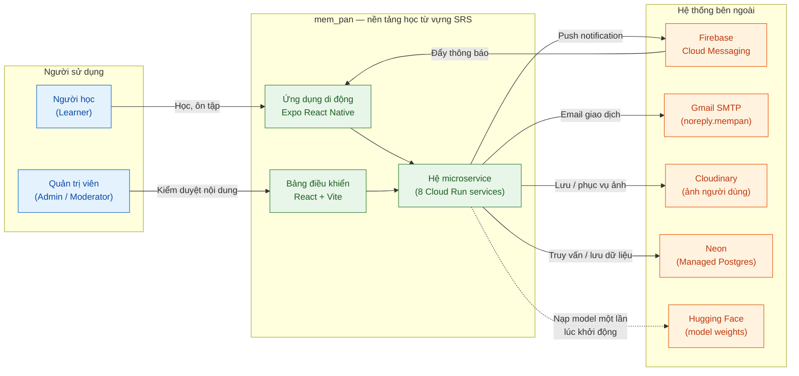
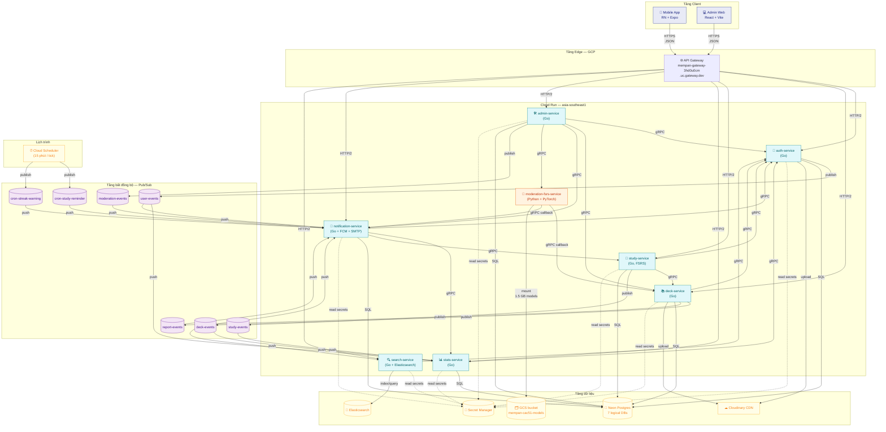
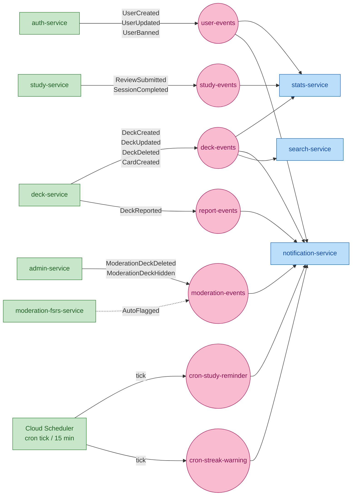
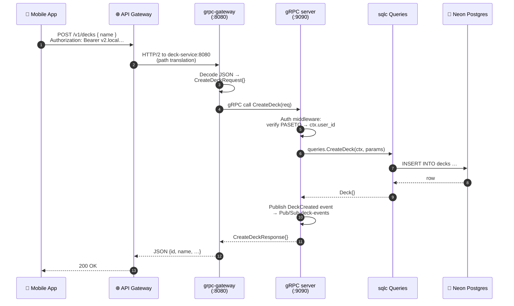
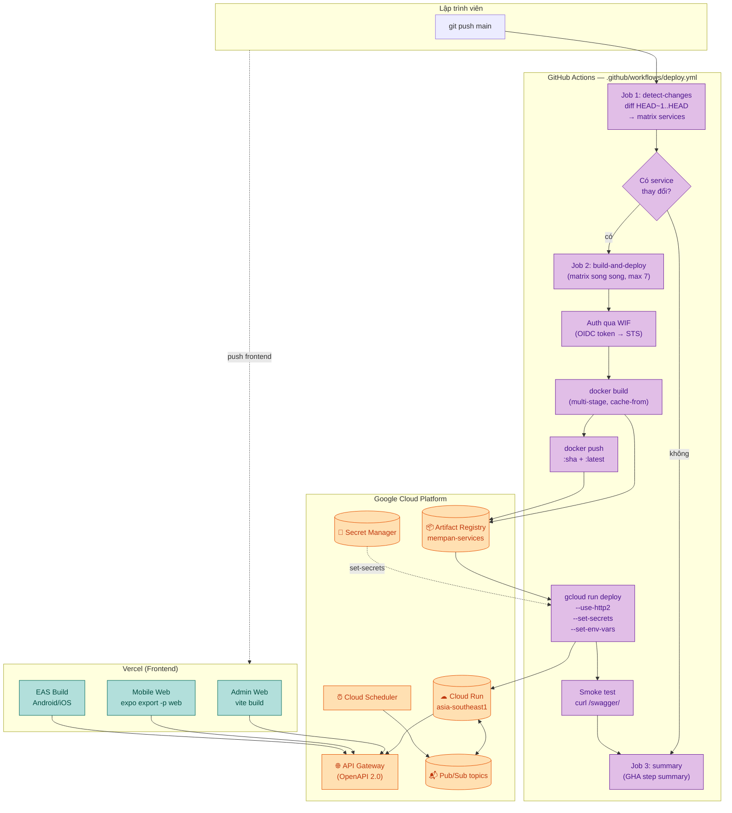
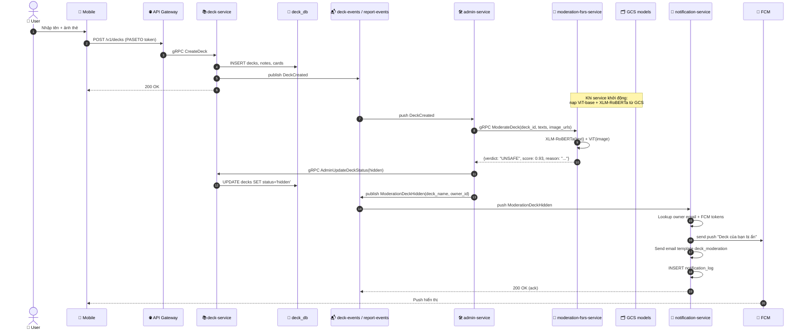
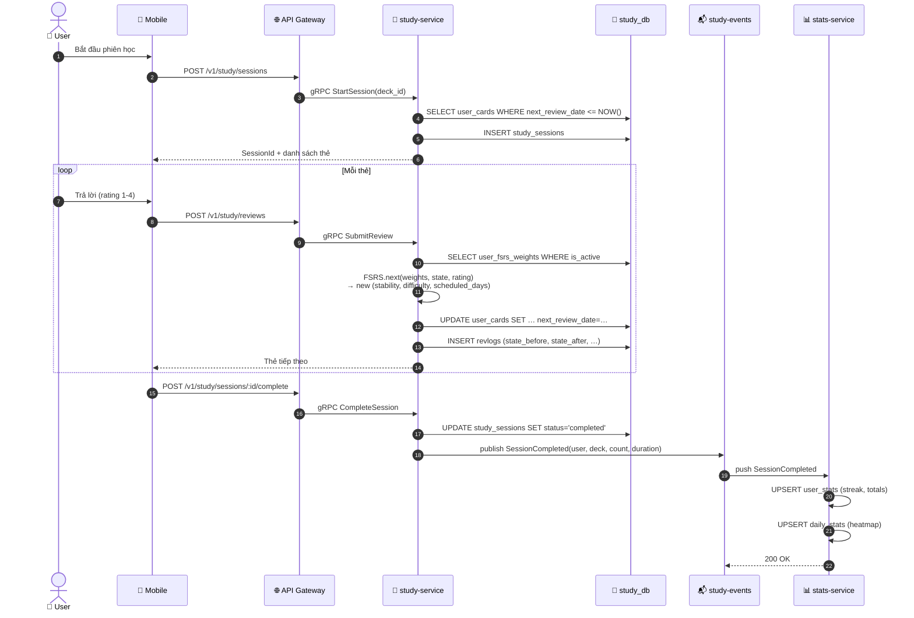

# Báo cáo công nghệ và quy trình triển khai — Dự án mem_pan

> **Phạm vi tài liệu:** Tài liệu này mô tả chi tiết toàn bộ tập hợp công nghệ (technology stack) được sử dụng để xây dựng hệ thống **mem_pan** — một nền tảng học từ vựng bằng phương pháp Lặp lại Ngắt quãng (Spaced Repetition) — bao gồm cả ứng dụng phía người dùng (mobile/web), các microservice phía máy chủ, cơ sở dữ liệu và quy trình triển khai liên tục (CI/CD) lên Google Cloud Platform.
>
> Tài liệu nhằm phục vụ hai mục đích: (1) làm chương "Công nghệ & Triển khai" trong báo cáo đồ án tốt nghiệp, và (2) làm tài liệu kỹ thuật nội bộ giúp lập trình viên mới gia nhập dự án có thể hình dung tổng thể hệ thống trong vòng một giờ đọc.
>
> Mọi thông tin trong báo cáo đều được trích xuất trực tiếp từ mã nguồn dự án (tệp `go.mod`, `package.json`, `Dockerfile`, `.github/workflows/deploy.yml`, `deploy/api-gateway/openapi.yaml`, các tệp `*.sql` migration, v.v.), không bao gồm công nghệ không thực sự tồn tại trong dự án.

---

## Mục lục

1. [Tổng quan kiến trúc hệ thống](#1-tổng-quan-kiến-trúc-hệ-thống)
   - 1.1. Triết lý thiết kế
   - 1.2. Sơ đồ ngữ cảnh (Context)
   - 1.3. Sơ đồ thành phần (Container/Microservices)
   - 1.4. Sơ đồ luồng sự kiện (Event Flow)
   - 1.5. Tóm tắt vai trò các dịch vụ
2. [Phân tích chi tiết từng công nghệ — Tầng Frontend](#2-phân-tích-chi-tiết-từng-công-nghệ--tầng-frontend)
   - 2.1. Ứng dụng di động (React Native + Expo)
   - 2.2. Bảng điều khiển quản trị (React + Vite)
3. [Phân tích chi tiết từng công nghệ — Tầng Backend](#3-phân-tích-chi-tiết-từng-công-nghệ--tầng-backend)
   - 3.1. Ngôn ngữ chính — Go (Golang)
   - 3.2. Giao tiếp đồng bộ — gRPC + Protocol Buffers + grpc-gateway
   - 3.3. Giao tiếp bất đồng bộ — Google Cloud Pub/Sub
   - 3.4. Truy cập dữ liệu — sqlc + pgx + golang-migrate
   - 3.5. Xác thực & phân quyền — PASETO
   - 3.6. Dịch vụ Machine Learning — Python + PyTorch + Transformers
   - 3.7. Thông báo và truyền thông — FCM, SMTP
   - 3.8. Lưu trữ ảnh — Cloudinary
   - 3.9. Kiểm thử — testify, mock, Testcontainers
4. [Phân tích chi tiết từng công nghệ — Tầng Cơ sở dữ liệu](#4-phân-tích-chi-tiết-từng-công-nghệ--tầng-cơ-sở-dữ-liệu)
   - 4.1. PostgreSQL trên Neon
   - 4.2. Mô hình dữ liệu theo bounded context
   - 4.3. Google Cloud Storage
5. [Quy trình triển khai (Deployment)](#5-quy-trình-triển-khai-deployment)
   - 5.1. Sơ đồ tổng thể đường ống CI/CD
   - 5.2. Chín bước triển khai chi tiết
6. [Kịch bản luồng nghiệp vụ tiêu biểu](#6-kịch-bản-luồng-nghiệp-vụ-tiêu-biểu)
7. [Kết luận](#7-kết-luận)

---

## 1. Tổng quan kiến trúc hệ thống

### 1.1. Triết lý thiết kế

Kiến trúc của **mem_pan** được xây dựng trên bốn nguyên tắc nhất quán, mỗi nguyên tắc đều tác động trực tiếp đến lựa chọn công nghệ được phân tích ở các chương sau:

| Nguyên tắc | Diễn giải | Tác động lên lựa chọn công nghệ |
|---|---|---|
| **Microservices theo bounded context** | Mỗi miền nghiệp vụ (xác thực, deck, học bài, thống kê,…) được tách thành một dịch vụ độc lập, có cơ sở dữ liệu riêng, có thể triển khai riêng. | Dẫn đến 8 dịch vụ riêng biệt, mỗi dịch vụ tự quản lý migration. |
| **Hướng sự kiện (Event-driven)** | Các dịch vụ không gọi đồng bộ chéo nhau cho các tác dụng phụ — thay vào đó phát hành sự kiện và để dịch vụ quan tâm tự lắng nghe. | Sử dụng Google Cloud Pub/Sub với 7 topic chuẩn hoá. |
| **Hợp đồng-trước (Contract-first)** | Hợp đồng API được định nghĩa trước trong tệp `.proto` rồi mới sinh code; mọi thay đổi schema bắt buộc đi qua sửa file proto. | Toàn bộ giao tiếp dùng Protocol Buffers, sinh code cả Go và Python. |
| **Ưu tiên dịch vụ được quản lý sẵn** | Tránh tự vận hành hạ tầng (database, message broker, scheduler) trong phạm vi đồ án; tận dụng managed services của GCP và Neon. | Cloud Run, Pub/Sub, Secret Manager, Cloud Scheduler, API Gateway, Neon Postgres. |

### 1.2. Sơ đồ ngữ cảnh (Context Diagram)

Sơ đồ sau mô tả hệ thống **mem_pan** dưới góc nhìn cao nhất: ai sử dụng hệ thống và hệ thống tương tác với những hệ thống bên ngoài nào.



### 1.3. Sơ đồ thành phần (Container / Microservices Diagram)

Sơ đồ phía dưới phóng to vào bên trong "hộp đen" backend, cho thấy 8 microservice, các đường truyền giao tiếp (gRPC đồng bộ và Pub/Sub bất đồng bộ), cùng các hạ tầng phụ trợ trên GCP.



### 1.4. Sơ đồ luồng sự kiện (Event Flow)

Để làm rõ mô hình publisher/subscriber, sơ đồ sau liệt kê tất cả các topic Pub/Sub và các subscription đang được khai báo trong `deploy/pubsub-setup/init.sh`. Một topic có thể có nhiều subscriber (mô hình fan-out).



### 1.5. Tóm tắt vai trò các dịch vụ

| Dịch vụ | Ngôn ngữ | Trách nhiệm chính | Bảng dữ liệu chính |
|---|---|---|---|
| `auth-service` | Go | Đăng ký, đăng nhập, refresh token, xác minh email, đổi mật khẩu, hồ sơ người dùng. | `users`, `refresh_tokens`, `verification_tokens` |
| `deck-service` | Go | CRUD folder/deck/note/card; clone deck công khai; báo cáo nội dung. | `folders`, `decks`, `notes`, `cards`, `folder_decks` |
| `study-service` | Go | Quản lý phiên học, áp dụng thuật toán FSRS để lập lịch ôn tập, lưu lịch sử ôn tập. | `user_cards`, `study_sessions`, `session_cards`, `revlogs`, `user_fsrs_weights` |
| `stats-service` | Go | Tổng hợp thống kê người dùng (streak, heatmap, tiến độ deck) bằng cách consume sự kiện. | `user_stats`, `daily_stats`, `deck_stats`, `deck_progress_snapshots` |
| `admin-service` | Go | Backend cho admin web: kiểm duyệt deck, xử lý report, quản lý user, gọi moderation-service. | `admin_actions`, `reports_index` |
| `notification-service` | Go | Đăng ký FCM token; gửi push, gửi email template; xử lý cron nhắc học. | `fcm_tokens`, `notification_log`, `email_templates` |
| `search-service` | Go | Đồng bộ deck/folder/card/user sang Elasticsearch; phục vụ tìm kiếm toàn văn. | (không dùng SQL; chỉ Elasticsearch) |
| `moderation-fsrs-service` | Python | (1) Suy luận ViT-base + XLM-RoBERTa để kiểm duyệt deck; (2) huấn luyện lại trọng số FSRS theo từng người dùng. | (stateless, đọc/ghi qua callback gRPC) |

---

## 2. Phân tích chi tiết từng công nghệ — Tầng Frontend

### 2.1. Ứng dụng di động (React Native + Expo)

#### 2.1.1. Công nghệ

| Hạng mục | Phiên bản / Thư viện |
|---|---|
| Framework | **React Native 0.81** + **Expo SDK 54** |
| Ngôn ngữ | TypeScript 5.9 |
| Định tuyến | `expo-router 6` (file-based) |
| State quản lý | React hooks + `@react-native-async-storage/async-storage 2.2` |
| Push notification | `@react-native-firebase/messaging 24` + `@notifee/react-native 9` |
| Phân tích hành vi | `@react-native-firebase/analytics 24` |
| Đa phương tiện | `expo-image`, `expo-av`, `expo-image-picker`, `expo-document-picker`, `expo-file-system` |
| Đồ hoạ / cử chỉ | `react-native-reanimated 4`, `react-native-gesture-handler`, `react-native-worklets` |
| Nhập liệu | `papaparse` (CSV), `xlsx` (Excel), `pdfjs-dist` (PDF) |
| Kiểm thử | Jest 30 + `jest-expo` + `@testing-library/react-native` |
| Phân phối | **EAS Build** (Android/iOS), **Vercel** (bản web `expo export -p web`) |

#### 2.1.2. Lý do sử dụng

1. **Đa nền tảng từ một mã nguồn duy nhất.** React Native cho phép biên dịch chung mã TypeScript ra cả Android (Java/Kotlin runtime), iOS (Objective-C/Swift runtime) và web (qua `react-native-web`). Với phạm vi đồ án có một lập trình viên/tác giả, lựa chọn này tiết kiệm gấp ba lần công sức so với việc viết riêng cho từng nền tảng.
2. **Expo che giấu độ phức tạp gốc.** Expo cung cấp module gốc đã biên dịch sẵn (image picker, file system, notifications…) và công cụ **EAS Build** chạy trên đám mây, giúp tác giả không cần cài đặt Android Studio / Xcode để tạo file `.apk`/`.aab`/`.ipa`. Đây là lợi thế quyết định trong điều kiện máy phát triển là macOS không có sẵn license Apple Developer.
3. **expo-router tận dụng quy ước Next.js.** Mỗi tệp trong thư mục `app/` là một route; các route layout (`_layout.tsx`) bao bọc nhóm route con. Cách tổ chức này giúp cấu trúc điều hướng tự giải thích, không cần tệp cấu hình route tập trung dễ rối khi dự án mở rộng.
4. **TypeScript đảm bảo nhất quán contract với backend.** Vì backend sử dụng Protocol Buffers, các kiểu dữ liệu request/response có thể được dịch sang interface TypeScript một cách máy móc, tránh lệch định nghĩa giữa client và server.

#### 2.1.3. Cách áp dụng thực tế

Mã nguồn nằm tại `mem_pan_app/mem_pan_mb/` với cấu trúc:

```
app/                  # Các màn hình theo expo-router
components/           # Component tái sử dụng (Card, Button, …)
hooks/                # Custom hooks (useAuth, useStudySession, …)
services/             # Lớp gọi API (axios instance, endpoint wrappers)
types/                # Định nghĩa TypeScript cho payload backend
utils/                # Hàm tiện ích (date format, parser)
assets/               # Ảnh, font
scripts/set-api-url.sh # Tự động chèn URL backend trước khi build
```

- **Đăng ký FCM token.** Khi người dùng đăng nhập lần đầu, ứng dụng yêu cầu quyền thông báo qua `messaging().requestPermission()`, lấy token bằng `messaging().getToken()`, rồi POST lên `notification-service` (`/v1/notifications/devices`). Trên server, token được lưu vào bảng `fcm_tokens` cùng tên thiết bị.
- **Nhận push khi app đóng.** `@notifee/react-native` đảm nhiệm hiển thị thông báo có heading/body tuỳ biến cả khi tiến trình app đã chết — điều mà module gốc của FCM trên Android không làm tốt.
- **Import flashcard từ tệp.** Người dùng có thể chọn tệp `.csv`, `.xlsx`, hoặc `.pdf`. Ứng dụng tự nhận diện separator (`,` hoặc `\t`), bỏ qua dòng trống, xử lý BOM cho CSV; với PDF, sử dụng `pdfjs-dist` để trích xuất các bảng hai cột theo định dạng Quizlet. Toàn bộ logic chạy hoàn toàn phía client để tiết kiệm băng thông và bảo mật dữ liệu.
- **Hiệu ứng lật thẻ.** Áp dụng `react-native-reanimated 4` với worklet chạy trực tiếp trên UI thread, đảm bảo animation 60fps không bị giật khi JavaScript thread bận xử lý logic FSRS.
- **Bản web triển khai trên Vercel.** Tệp `vercel.json` định nghĩa `buildCommand: npm run vercel-build` (alias `expo export -p web`) và rewrite mọi đường dẫn về `/index.html` để SPA hoạt động đúng.

### 2.2. Bảng điều khiển quản trị (React + Vite)

#### 2.2.1. Công nghệ

| Hạng mục | Phiên bản / Thư viện |
|---|---|
| Framework | React 19.2 |
| Bundler | **Vite 8** |
| Ngôn ngữ | TypeScript 6 |
| Server state | `@tanstack/react-query 5.100` |
| Client state | `zustand 5` |
| Định tuyến | `react-router-dom 7` |
| HTTP client | `axios 1.16` |
| UI primitive | `@radix-ui/react-dialog`, `lucide-react` (icons) |
| Lint | ESLint 10 + `typescript-eslint` |
| Triển khai | **Vercel** (rewrite SPA) |

#### 2.2.2. Lý do sử dụng

1. **Vite thay thế Webpack truyền thống.** Trong môi trường phát triển, Vite phục vụ module qua ESM gốc của trình duyệt, không cần đóng gói toàn bộ ứng dụng trước khi xem. Hệ quả là thời gian khởi động dev server và HMR (Hot Module Replacement) chỉ tính bằng mili-giây, hỗ trợ vòng lặp lập trình rất nhanh cho giao diện quản trị có nhiều biểu mẫu.
2. **TanStack Query xử lý phức tạp phía server state.** Thay vì tự viết useEffect + useState để fetch dữ liệu, TanStack Query khai báo `useQuery(key, fetcher)` và tự lo: cache theo key, refetch khi window focus, mutation kèm invalidate. Cách này giảm 60–70% mã nguồn liên quan đến dữ liệu so với phương pháp truyền thống.
3. **Zustand cho client state đơn giản.** Trạng thái UI (modal mở/đóng, sidebar collapse) và session (user info, token) được lưu trong store Zustand với API tối giản `create((set) => ...)`. Không cần Provider lồng nhau, không cần action/reducer như Redux — phù hợp với độ phức tạp tương ứng đồ án.
4. **Radix UI miễn phí về accessibility.** Các primitive như `Dialog`, `DropdownMenu` của Radix đã đảm bảo focus trap, ARIA attribute, keyboard navigation — tác giả chỉ cần phụ trách phần thiết kế trực quan, không cần học sâu về tiêu chuẩn WAI-ARIA.

#### 2.2.3. Cách áp dụng thực tế

Mã nguồn nằm tại `mem_pan_app/mem_pan_admin/admin-web/`.

- **Axios interceptor đính kèm PASETO token.** Khi đăng nhập admin, token được lưu vào Zustand store và localStorage; mọi request đi qua interceptor tự thêm header `Authorization: Bearer v2.local.<token>`.
- **Query key chuẩn hoá.** Theo quy ước, mọi key gồm `['<entity>', '<action>', params]`. Ví dụ `['decks','list',{status:'pending'}]`. Quy ước này cho phép invalidate có chọn lọc khi mutation xảy ra.
- **Định tuyến phân quyền.** `react-router-dom 7` được dùng với loader/action; route quản trị bọc trong `RequireRole role="admin"` đọc role từ store và redirect nếu không đủ quyền.
- **Triển khai Vercel.** `vercel.json` rewrite `/(.*) → /index.html` để SPA hoạt động khi người dùng refresh ở route con. Build chạy `tsc -b && vite build` xuất static site vào `dist/`.

> **Liên kết Frontend ↔ Backend.** Cả hai ứng dụng client **không gọi trực tiếp** đến từng Cloud Run service. Chúng chỉ biết đúng **một URL** — endpoint của Google API Gateway: `https://mempan-gateway-3hd0u0cm.uc.gateway.dev`. Gateway này đứng trước 7 dịch vụ Go, phân tuyến theo tiền tố đường dẫn (`/v1/auth/*`, `/v1/decks/*`, `/v1/study/*`,…) dựa trên đặc tả OpenAPI 2.0 tại `deploy/api-gateway/openapi.yaml`. Lợi ích kép: (1) client chỉ cần cấu hình một biến môi trường `API_BASE_URL`; (2) cấu trúc nội bộ có thể tái cấu trúc tự do mà không phá vỡ client.

---

## 3. Phân tích chi tiết từng công nghệ — Tầng Backend

### 3.1. Ngôn ngữ chính — Go (Golang)

#### 3.1.1. Công nghệ

- **Go 1.26** cho 7 dịch vụ nghiệp vụ chính (`auth`, `deck`, `study`, `stats`, `admin`, `notification`, `search`).
- Tổ chức **đa module với Go workspace** (`go.work`): mỗi service là một module độc lập (`go.mod` riêng), nhưng có thể `replace` các module dùng chung (`pkg/logger`, `pkg/middleware`) thông qua `go.work` mà không cần đẩy lên proxy.

#### 3.1.2. Lý do sử dụng

1. **Khởi động siêu nhanh — tối ưu cho Cloud Run.** Go biên dịch ra binary tĩnh (statically-linked), không phụ thuộc runtime/JVM. Cold start chỉ vài chục mili-giây, đặc biệt quan trọng với Cloud Run vì hạ tầng này **scale-to-zero**: khi không có request, instance bị thu hồi để tiết kiệm chi phí; request đầu tiên sau khoảng nghỉ phải chịu cold start. Go giảm thiểu độ trễ này.
2. **Concurrency rẻ với goroutine.** Một goroutine chỉ tốn vài KB RAM, rẻ hơn 100 lần so với OS thread. Phù hợp với khối lượng I/O-bound (gọi DB, Pub/Sub) đặc trưng của microservice.
3. **Tooling tích hợp.** `go test`, `go mod`, `go vet`, `gofmt` là một bộ chuẩn quốc gia, không cần lựa chọn (như JS phải chọn npm/yarn/pnpm, eslint/prettier, jest/vitest…).
4. **Container hoá tối giản.** Image production cuối cùng chỉ ~20MB (alpine + binary tĩnh), tải về và khởi động cực nhanh.

#### 3.1.3. Cách áp dụng thực tế

Cấu trúc thư mục đồng nhất cho mỗi dịch vụ Go (ví dụ `services/auth-service/`):

```
cmd/server/main.go        # Entry point
internal/
  domain/                 # Entity, value object, business logic thuần
  repository/             # Interface lưu trữ
  db/sqlc/                # Mã do sqlc sinh ra
  service/                # Use case (orchestration)
  gapi/                   # gRPC handler (gRPC-API)
  publisher/              # Publish Pub/Sub
  token/                  # PASETO maker
  cache/                  # In-memory cache adapter (nếu có)
  mock/                   # Mock do gomock sinh ra
config/                   # Đọc biến môi trường
db/
  migration/*.sql         # golang-migrate
  query/*.sql             # sqlc input
  sqlc.yaml
pb/                       # Protobuf-generated Go code
proto/                    # File .proto cục bộ của service
Dockerfile
```

Dockerfile dùng kỹ thuật **multi-stage build** tối giản:

```dockerfile
FROM golang:1.26.2-alpine AS builder
WORKDIR /workspace
COPY . .
WORKDIR /workspace/services/auth-service
RUN CGO_ENABLED=0 GOOS=linux go build -trimpath -o /bin/server ./cmd/server

FROM alpine:3.20
RUN apk add --no-cache ca-certificates tzdata
COPY --from=builder /bin/server /server
EXPOSE 8080 9090
ENTRYPOINT ["/server"]
```

- `CGO_ENABLED=0`: tắt cgo để binary hoàn toàn tĩnh, không phụ thuộc libc.
- `-trimpath`: loại bỏ đường dẫn build host khỏi binary (giảm leak metadata, tăng reproducibility).
- Stage cuối chỉ chứa `ca-certificates` (cho HTTPS outbound) và `tzdata` (xử lý timezone cho cron reminder).

Mỗi container expose hai cổng: `:8080` (HTTP/REST do grpc-gateway phục vụ) và `:9090` (gRPC nội bộ).

### 3.2. Giao tiếp đồng bộ — gRPC + Protocol Buffers + grpc-gateway

#### 3.2.1. Công nghệ

- `google.golang.org/grpc 1.81`
- `google.golang.org/protobuf 1.36`
- `github.com/grpc-ecosystem/grpc-gateway/v2 2.29`
- `google.golang.org/genproto/googleapis/api` (Google API annotations)

#### 3.2.2. Lý do sử dụng

1. **Protocol Buffers là IDL trung lập ngôn ngữ.** Một tệp `.proto` sinh ra mã cho cả Go và Python (cho moderation-service). Điều này quan trọng vì hai bên không thể nào lệch schema; bất kỳ thay đổi nào ở phía hợp đồng đều phải đi qua sửa `.proto` và codegen lại.
2. **gRPC truyền nhị phân trên HTTP/2.** So với JSON-over-REST, payload nhị phân nhỏ hơn 30–50%, parse nhanh hơn, hỗ trợ streaming nguyên thuỷ. Lý tưởng cho giao tiếp **nội bộ giữa các service** (vốn không cần human-readable).
3. **grpc-gateway sinh REST gateway tự động.** Tránh phải viết tay hai bộ handler (HTTP và gRPC). Lập trình viên chỉ viết handler gRPC; gateway tự đọc annotation `google.api.http` trong `.proto` để dựng REST endpoint tương đương. Ngoài ra còn sinh tài liệu Swagger/OpenAPI miễn phí.

#### 3.2.3. Cách áp dụng thực tế

Thư mục `proto/` ở thư mục gốc dự án chứa contract chia theo bounded context:

```
proto/
  auth/v1/         auth_service.proto, user_service.proto
  deck/v1/         card_service.proto, deck_service.proto, folder_service.proto
  study/v1/        study_service.proto, fsrs_service.proto
  stats/v1/        stats_service.proto
  admin/v1/        admin_service.proto
  event/v1/        user_events.proto, deck_events.proto, study_events.proto, admin_events.proto
```

Script `scripts/proto-gen.sh` chạy `protoc` (cùng các plugin `protoc-gen-go`, `protoc-gen-go-grpc`, `protoc-gen-grpc-gateway`, `protoc-gen-openapiv2`) để sinh ra:

- `*.pb.go` — struct message
- `*_grpc.pb.go` — server interface, client stub
- `*.pb.gw.go` — REST reverse-proxy
- `*.swagger.json` — đặc tả Swagger

Trong main, mỗi service khởi động **đồng thời hai server**:

```go
// gRPC server cho service-to-service
go runGRPCServer(":9090", svc)
// REST server cho client (qua API Gateway)
go runGatewayServer(":8080", grpcEndpoint)
```

#### 3.2.4. Sơ đồ luồng request từ client đến database



### 3.3. Giao tiếp bất đồng bộ — Google Cloud Pub/Sub

#### 3.3.1. Công nghệ

- `cloud.google.com/go/pubsub` (Go SDK)
- 7 topic: `user-events`, `deck-events`, `study-events`, `report-events`, `moderation-events`, `cron-study-reminder`, `cron-streak-warning`.
- Mô hình **push subscription**: GCP tự đẩy message bằng HTTP POST đến endpoint do mỗi consumer cung cấp (`/internal/pubsub?token=…`).

#### 3.3.2. Lý do sử dụng

1. **Tách rời publisher khỏi subscriber.** Khi `admin-service` xoá deck vì vi phạm, nó chỉ phát hành `ModerationDeckDeleted` vào topic `moderation-events`. Cả `notification-service` (gửi email/FCM cho chủ deck) lẫn `search-service` (xoá document khỏi Elasticsearch index) có thể tự đăng ký mà không cần `admin-service` biết đến.
2. **Khả năng phục hồi.** Nếu consumer trả về lỗi (status code ngoài 2xx), Pub/Sub tự retry với exponential backoff theo `ackDeadlineSeconds=60`. Sau số lần retry tối đa, message được chuyển vào dead-letter topic để xử lý thủ công.
3. **Mô hình push tận dụng tốt Cloud Run.** Khi không có message, không cần consumer chạy nền tốn tài nguyên — Cloud Run scale về 0. Khi Pub/Sub đẩy message HTTP, Cloud Run tự đánh thức instance.

#### 3.3.3. Cách áp dụng thực tế

- **Cấu hình topic và subscription** được khai báo trong `deploy/pubsub-setup/init.sh` (cho môi trường local dùng emulator) và `deploy/terraform/` (cho production). Mỗi subscription chỉ ra endpoint cụ thể, ví dụ:

  ```
  topic: deck-events
  subscription: notification-deck-events-sub
  pushEndpoint: https://notification-service-…/internal/pubsub?token=$PUBSUB_PUSH_SECRET
  ```

- **Xác thực push request.** Có hai lớp:
  - Lớp 1 — query token: URL push chứa `?token=$PUBSUB_PUSH_SECRET`, secret lưu trong Secret Manager. Đây là rào cản đầu tiên chống spam.
  - Lớp 2 — OIDC Bearer token (môi trường production): GCP đính kèm `Authorization: Bearer <id_token>` được ký bởi service account; service xác thực token này qua thư viện `firebase.google.com/go/v4/auth` hoặc `google.golang.org/api/idtoken`.
- **Ack/Nack đúng cách.** Đây là bài học từ commit `13c21a0`: nếu handler gặp lỗi không thể retry (ví dụ user không còn tồn tại để gửi email), handler **vẫn trả 200 OK** để Pub/Sub ack — tránh vòng lặp retry vô tận. Chỉ trả lỗi 5xx khi lỗi thực sự là tạm thời (database tạm down).
- **Cron qua Pub/Sub.** Cloud Scheduler không gọi trực tiếp HTTP service — thay vào đó publish một message rỗng vào topic `cron-study-reminder` mỗi 15 phút. Cách này có hai lợi điểm: (1) decouple giữa scheduler và consumer; (2) nếu consumer đang scale-to-zero, message vẫn được giữ trong Pub/Sub buffer và đẩy khi consumer sẵn sàng.

### 3.4. Truy cập dữ liệu — sqlc + pgx + golang-migrate

#### 3.4.1. Công nghệ

| Thành phần | Vai trò |
|---|---|
| `sqlc` | Codegen từ SQL → Go (type-safe). |
| `github.com/jackc/pgx/v5` | Driver PostgreSQL native cho Go. |
| `github.com/golang-migrate/migrate/v4` | Quản lý schema migration. |

#### 3.4.2. Lý do sử dụng

1. **sqlc đảo ngược triết lý ORM.** Lập trình viên viết SQL thuần trong file `.sql`, công cụ sinh ra hàm Go có kiểu mạnh tương ứng. Lợi ích:
   - Giữ trọn vẹn sức mạnh SQL (window function, CTE, JSONB indexing,…) — điều mà ORM truyền thống thường thiếu.
   - Lỗi tên cột/sai kiểu phát hiện tại bước biên dịch chứ không phải runtime.
   - Không có lớp magic ẩn — dev review query thấy chính xác SQL chạy trên DB.
2. **pgx nhanh và đầy đủ hơn `database/sql`.** Hỗ trợ native cho mọi kiểu của Postgres (UUID, JSONB, INET, ENUM, array), có connection pool tích hợp (`pgxpool`), hiệu năng cao hơn 30–40% so với driver `lib/pq` cũ.
3. **golang-migrate là chuẩn de-facto.** Mỗi migration gồm cặp file `up`/`down`, version tăng dần, có lệnh CLI để áp dụng/lùi lại — đủ tính năng cho phạm vi dự án.

#### 3.4.3. Cách áp dụng thực tế

- **Cấu hình `sqlc.yaml`** (cấp dự án):

  ```yaml
  version: "2"
  sql:
    - engine: "postgresql"
      queries: "db/query"
      schema:  "db/migration"
      gen:
        go:
          package: "sqlc"
          out: "db/sqlc"
          sql_package: "database/sql"
          emit_json_tags: true
          emit_interface: true
          emit_empty_slices: true
  ```

- **Quy trình viết một query mới:**
  1. Thêm file SQL ở `db/query/decks.sql` với annotation:
     ```sql
     -- name: CreateDeck :one
     INSERT INTO decks (user_id, name, description, is_public)
     VALUES ($1, $2, $3, $4) RETURNING *;
     ```
  2. Chạy `./scripts/sqlc-gen.sh` → sinh ra hàm `CreateDeck(ctx, params) (Deck, error)` trong package `sqlc`.
  3. Service layer gọi hàm này — không cần viết thủ công.

- **Migration `golang-migrate`:** Mỗi service có thư mục `db/migration/` chứa các cặp file đánh số:
  ```
  000001_init.up.sql        000001_init.down.sql
  000002_add_note_language.up.sql   000002_add_note_language.down.sql
  ```
  Lệnh `make migrateup` chạy tất cả các bản chưa áp dụng theo thứ tự version.

- **Cảnh báo vận hành với Neon.** `golang-migrate` cần advisory lock của Postgres để tránh hai instance migrate đồng thời. Tuy nhiên endpoint **pooler** của Neon (có hậu tố `-pooler` trong hostname) sử dụng PgBouncer ở chế độ *transaction pooling* — không hỗ trợ session-level advisory lock. Do đó:
  - **Migrate:** dùng *direct endpoint* (ví dụ `ep-spring-union-aos8717l.c-2.ap-southeast-1.aws.neon.tech`, không có `-pooler`).
  - **Runtime:** dùng *pooler endpoint* để tận dụng connection pooling.

  Nếu vi phạm quy ước này, lệnh migrate sẽ block vĩnh viễn hoặc đặt `dirty=true` trên bảng `schema_migrations`, cần `migrate force <version>` để khôi phục.

### 3.5. Xác thực & phân quyền — PASETO

#### 3.5.1. Công nghệ

- `github.com/o1egl/paseto` (PASETO v1)
- `github.com/aead/chacha20poly1305` (AEAD đối xứng)
- `github.com/golang-jwt/jwt/v5` (chỉ dùng để verify token bên ngoài, ví dụ OIDC từ Pub/Sub push)

#### 3.5.2. Lý do sử dụng

**PASETO (Platform-Agnostic Security Tokens)** là chuẩn token được thiết kế để khắc phục các lớp lỗi lịch sử của JWT:

| Vấn đề của JWT | Cách PASETO giải quyết |
|---|---|
| Tham số `alg` do client gửi có thể bị ép thành `none`. | PASETO ấn định cứng version + purpose trong header (ví dụ `v2.local`), không có khái niệm "thuật toán tuỳ ý". |
| Có nhiều thuật toán cũ không an toàn (RS256 padding oracle,…). | PASETO mỗi version chỉ chọn một thuật toán hiện đại đã được kiểm chứng (XChaCha20-Poly1305 cho local, Ed25519 cho public). |
| Header/payload dễ bị thao túng do là Base64Url. | Local mode mã hoá toàn bộ payload (không chỉ ký), trả về chuỗi không thể đọc được nếu không có khoá. |

Vì mem_pan là single-tenant (chỉ server của dự án phát hành và xác thực token), local mode (đối xứng) là đủ và đơn giản hơn public mode (bất đối xứng).

#### 3.5.3. Cách áp dụng thực tế

- **Sinh token** trong `auth-service/internal/token/`:

  ```go
  maker, _ := token.NewPasetoMaker(symmetricKey) // 32 bytes
  accessToken, payload, err := maker.CreateToken(userID, "access", 15*time.Minute)
  ```

- **Cấu hình thời hạn token** (xem `app.env`):
  - Access token: `15m`
  - Refresh token: `168h` (7 ngày), lưu hash trong bảng `refresh_tokens` để có thể revoke
  - Verification token (xác minh email): `24h`
  - Reset token (đặt lại mật khẩu): `1h`

- **Middleware xác thực.** Mỗi service Go cài đặt interceptor gRPC đọc header `Authorization: Bearer v2.local.…`, decode, inject `user_id` và `role` vào context. Handler downstream chỉ cần `ctx.Value("user_id")` — không bao giờ tự xác thực lại.

- **Bảng `refresh_tokens`** (trong `auth_db`):
  ```sql
  CREATE TABLE refresh_tokens (
      token_id    UUID PRIMARY KEY DEFAULT gen_random_uuid(),
      user_id     UUID NOT NULL REFERENCES users ON DELETE CASCADE,
      token_hash  TEXT NOT NULL UNIQUE,
      user_agent  TEXT,
      ip_address  INET,
      expires_at  TIMESTAMPTZ NOT NULL,
      revoked_at  TIMESTAMPTZ,
      created_at  TIMESTAMPTZ NOT NULL DEFAULT CURRENT_TIMESTAMP
  );
  ```
  Lưu hash chứ không lưu token gốc — nếu DB bị rò rỉ, attacker không thể tái sử dụng token. Cột `user_agent` và `ip_address` cho phép người dùng xem danh sách thiết bị đang đăng nhập và revoke chọn lọc.

### 3.6. Dịch vụ Machine Learning — Python + PyTorch + Transformers

#### 3.6.1. Công nghệ

| Thành phần | Phiên bản | Vai trò |
|---|---|---|
| Python | 3.11 | Runtime |
| `torch` | 2.7.1+cpu | Tensor framework (CPU only) |
| `transformers` (Hugging Face) | 4.46.3 | Pipeline nạp model pretrained |
| `tokenizers` | 0.20.3 | Tokenizer nhanh (Rust binding) |
| `sentencepiece` | 0.2.0 | Tokenizer cho XLM-RoBERTa |
| `safetensors` | 0.4.5 | Định dạng load model an toàn (không dùng pickle) |
| `pillow` | 11.0 | Decode ảnh |
| `grpcio` + `grpcio-health-checking` | 1.68 | gRPC server + health probe |
| `aiohttp` | 3.10 | Endpoint HTTP cho Pub/Sub push, healthz, metrics |
| `fsrs-optimizer` | 5.5.0 | Tối ưu trọng số FSRS |
| `pandas` | 2.2.3 | Tiền xử lý dữ liệu huấn luyện |
| `prometheus-client` | 0.21 | Xuất metric |

#### 3.6.2. Lý do sử dụng

1. **Hệ sinh thái ML của Python là chuẩn de-facto.** Hai mô hình được dùng đều có sẵn pre-trained checkpoint trên Hugging Face Hub:
   - **ViT-base-patch16-224** (~343 MB): Vision Transformer fine-tune để phân loại ảnh thẻ học theo các nhãn (safe / suggestive / unsafe).
   - **XLM-RoBERTa** (~1.1 GB): mô hình ngôn ngữ đa ngữ (hỗ trợ Tiếng Việt và 100+ ngôn ngữ khác), fine-tune để phát hiện nội dung văn bản không phù hợp.
   Viết lại bằng Go là không thực tế vì hệ sinh thái Go cho ML chưa trưởng thành.
2. **FSRS Optimizer cá nhân hoá thuật toán.** FSRS (Free Spaced Repetition Scheduler) là thuật toán SRS thế hệ mới, vượt trội so với SM-2 cổ điển. Mỗi người dùng có một bộ trọng số (21 tham số) riêng. Khi đủ dữ liệu (>= 1000 review), service huấn luyện lại trọng số tối ưu cho cá nhân từ lịch sử ôn tập.
3. **Dùng `torch+cpu` thay vì CUDA.** Cloud Run không có GPU. Chuyển sang wheel CPU-only giảm kích thước image từ ~2.5 GB xuống ~200 MB (đỡ chi phí storage và thời gian pull), với độ trễ suy luận vẫn chấp nhận được cho kiểm duyệt batch nhỏ.

#### 3.6.3. Cách áp dụng thực tế

Đặc tả chi tiết tại `doc/MODERATION_SERVICE_SPEC.md`. Hai dịch vụ gRPC được expose:

```protobuf
service ModerationService {
  rpc ModerateDeck(ModerateDeckRequest) returns (ModerateDeckResponse);
}

service FsrsOptimizationService {
  rpc OptimizeWeights(OptimizeWeightsRequest) returns (OptimizeWeightsResponse);
}
```

- **5 quy tắc bất biến (rules)** mà service phải tuân thủ — trích từ README:

  | # | Quy tắc | Vị trí |
  |---|---|---|
  | 1 | Threshold đọc từ disk, không hardcode | `app/config.py` |
  | 2 | Model load đúng một lần lúc khởi động | `app/main.py::build_registry()` trước `server.start()` |
  | 3 | Pin chính xác wheel CPU của torch | `Dockerfile` `--index-url …/whl/cpu` |
  | 4 | Văn bản rỗng / ảnh hỏng → trả CLEAN (không crash) | `text_moderator.py::predict`, `image_moderator.py::_decode` |
  | 5 | Fallback preprocessor mặc định | `image_moderator.py::_load_processor` |

- **Mount model từ GCS.** Mô hình được lưu tại bucket `gs://mempan-cac51-models/` (tổng ~1.5 GB):
  ```
  gs://mempan-cac51-models/
    ├── flashcard_image_moderator/   (343 MB — ViT-base)
    └── flashcard_text_moderator/    (1.1 GB — XLM-RoBERTa)
  ```
  Cloud Run mount bucket này bằng tính năng **GCS FUSE**, model được đọc lười (lazy) lần đầu rồi cache trong RAM của container suốt vòng đời instance.

- **Endpoint vận hành.** Ngoài gRPC `:50051`, service còn expose HTTP:
  - `/healthz` — readiness probe.
  - `/metrics` — Prometheus exposition.
  - `/pubsub/push` — endpoint nhận message từ topic `report-events` để tự kiểm duyệt khi có report mới.

- **Thread/process pool.** Vì suy luận PyTorch là CPU-bound và giữ GIL, service dùng:
  - `GRPC_MAX_WORKERS=8` — thread pool gRPC để offload inference đồng bộ.
  - `FSRS_POOL_WORKERS=2` — **process pool** cho fsrs-optimizer (process thật mới né được GIL).

### 3.7. Thông báo và truyền thông — FCM, SMTP

#### 3.7.1. Công nghệ

- `firebase.google.com/go/v4 4.14` — Firebase Admin SDK (gửi FCM).
- `github.com/jordan-wright/email 4.0` — gửi email SMTP có template HTML.
- Bảng `email_templates` (trong `notif_db`) lưu template động theo `template_key`.

#### 3.7.2. Lý do sử dụng

1. **FCM là dịch vụ push chuẩn cho mobile.** Cross-platform (Android/iOS/Web), miễn phí ở quy mô dự án, tích hợp tự nhiên với `@react-native-firebase/messaging` đã dùng phía client.
2. **SMTP qua Gmail cho luồng email giao dịch.** Số lượng email (verification, password reset, deck-deleted) ở quy mô đồ án không lớn, không cần dịch vụ chuyên dụng như SendGrid. Gmail SMTP với app password đủ dùng, miễn phí trong giới hạn 500 mail/ngày.

#### 3.7.3. Cách áp dụng thực tế

- **Xác thực Firebase Admin SDK qua ADC** (Application Default Credentials). Cloud Run runtime tự cung cấp service account identity — Firebase Admin SDK gọi tới metadata server lấy access token, **không cần lưu file `service-account.json`** trong container. Đây là cải tiến quan trọng so với cách làm cũ (commit `46e1d38` đã loại bỏ file `mempan-cac51-firebase-adminsdk-*.json`).

- **Bảng `fcm_tokens`** (cho phép một user có nhiều thiết bị):
  ```sql
  CREATE TABLE fcm_tokens (
      id          UUID PRIMARY KEY DEFAULT gen_random_uuid(),
      user_id     UUID NOT NULL,
      token       TEXT NOT NULL,
      device_name TEXT NOT NULL DEFAULT '',
      created_at  TIMESTAMPTZ NOT NULL DEFAULT NOW(),
      updated_at  TIMESTAMPTZ NOT NULL DEFAULT NOW(),
      CONSTRAINT fcm_tokens_token_key UNIQUE (token)
  );
  ```

- **Bảng `notification_log`** lưu mọi lần gửi (push hoặc email) cho mục đích kiểm toán và debug — cột `status` ghi `sent` / `failed`, cột `error_message` lưu chi tiết lỗi nếu có.

- **Cron nhắc học (Study Reminder).** Cloud Scheduler kích hoạt mỗi 15 phút → publish vào `cron-study-reminder` → notification-service consume:
  1. Truy vấn `study-service` lấy danh sách user có thẻ đến hạn.
  2. Với mỗi user, render template `study_reminder` (subject + body chứa `due_count`, `streak`).
  3. Gửi FCM cho tất cả thiết bị đã đăng ký.
  4. Ghi `notification_log`.

  Sơ đồ:

  ```mermaid
  sequenceDiagram
      participant CS as ⏰ Cloud Scheduler
      participant PS as 📬 Pub/Sub<br/>cron-study-reminder
      participant NOTI as 🔔 notification-service
      participant STUDY as 🎯 study-service
      participant FCM as 📲 Firebase FCM
      participant Device as 📱 Device

      Note over CS: Mỗi 15 phút
      CS->>PS: publish tick {}
      PS->>NOTI: POST /internal/pubsub<br/>?token=…
      NOTI->>NOTI: Verify OIDC + token
      NOTI->>STUDY: gRPC ListUsersDueNow()
      STUDY-->>NOTI: [{user_id, due_count, streak}, …]
      loop For each due user
          NOTI->>NOTI: Render template study_reminder
          NOTI->>FCM: send(token, payload)
          FCM-->>Device: Push notification
          NOTI->>NOTI: INSERT notification_log
      end
      NOTI-->>PS: 200 OK (ack)
  ```

### 3.8. Lưu trữ ảnh — Cloudinary

#### 3.8.1. Công nghệ

- `github.com/cloudinary/cloudinary-go/v2 2.15`

#### 3.8.2. Lý do sử dụng

Cloudinary cung cấp ba tính năng then chốt mà tự xây sẽ tốn nhiều công:
1. **Signed upload trực tiếp từ client.** Server chỉ ký một URL upload có thời hạn ngắn; client POST ảnh thẳng lên Cloudinary, không qua backend → tiết kiệm băng thông và RAM của Cloud Run.
2. **Biến đổi động qua URL.** Ví dụ thêm `/w_300,h_300,c_fill,q_auto,f_auto/` vào URL để được ảnh 300×300 nén tối ưu mà không cần lưu nhiều phiên bản.
3. **CDN toàn cầu miễn phí ở mức free tier.**

#### 3.8.3. Cách áp dụng thực tế

- `auth-service` ký URL upload cho avatar người dùng (`CLOUDINARY_URL` lưu trong Secret Manager).
- `deck-service` ký URL upload cho ảnh thẻ học. Ảnh được client upload trực tiếp; chỉ **URL kết quả** được lưu vào cột `image_url` của bảng `notes` trong PostgreSQL.
- Quy ước URL preset:
  - Avatar: `users/<uuid>/avatar`
  - Ảnh thẻ: `decks/<deck_id>/notes/<note_id>`

### 3.9. Kiểm thử — testify, mock, Testcontainers

#### 3.9.1. Công nghệ

- `github.com/stretchr/testify` — assertion library.
- `go.uber.org/mock` (kế nhiệm `golang/mock`) — codegen mock từ interface Go.
- `github.com/testcontainers/testcontainers-go` + module `postgres` — khởi tạo container PostgreSQL thật cho test tích hợp.

#### 3.9.2. Lý do sử dụng

1. **`testify/assert`** thay thế cú pháp `if got != want { t.Errorf(…) }` rườm rà bằng `assert.Equal(t, want, got)` — code test ngắn và dễ đọc hơn.
2. **`go.uber.org/mock`** sinh mock từ interface (kiểu strict). Khi viết unit test cho `service` layer, ta mock `Repository` interface — test không phụ thuộc DB thật.
3. **`testcontainers-go`** khởi tạo container Postgres thật cho test tích hợp. Lý do bắt buộc dùng Postgres thật (không phải SQLite mock):
   - Code production dùng nhiều tính năng đặc thù Postgres (`JSONB`, `ENUM`, `gen_random_uuid()`, partial index,…).
   - SQLite không có những tính năng này → test giả sẽ pass nhưng production fail.

#### 3.9.3. Cách áp dụng thực tế

- Mỗi service có thư mục `internal/<layer>/*_test.go`.
- Lệnh `make test` chạy cả unit + integration; CI chạy cùng lệnh.
- Ví dụ `notification-service`: integration test khởi container Postgres → migrate up → seed → gọi handler → verify DB state → tear down. Mỗi test case dùng database riêng (random suffix) để chạy song song an toàn.

---

## 4. Phân tích chi tiết từng công nghệ — Tầng Cơ sở dữ liệu

### 4.1. PostgreSQL trên Neon

#### 4.1.1. Công nghệ

- **Neon** — managed Postgres serverless, tương thích 100% với PostgreSQL 16 chuẩn.
- Region: `ap-southeast-1` (Singapore) — gần Cloud Run `asia-southeast1`.

#### 4.1.2. Lý do sử dụng

1. **Kiến trúc tách compute–storage.** Storage layer dùng object store nội bộ; compute layer (Postgres process) có thể tự ngủ khi không có truy vấn và đánh thức trong vài giây. Mô hình tính phí theo mức sử dụng phù hợp tuyệt đối với dự án có lưu lượng thấp.
2. **Database branching giống Git.** Có thể tạo nhánh DB từ một snapshot (zero-copy), thí nghiệm migration trên nhánh, rồi merge — rất hữu ích để test migration mà không sợ phá production.
3. **Không lock-in.** Vì là Postgres chuẩn, có thể `pg_dump` và migrate sang DB tự host nếu cần.

#### 4.1.3. Cách áp dụng thực tế

- Mỗi service có một **database logic riêng** trong cùng cluster Neon: `auth_db`, `deck_db`, `study_db`, `stats_db`, `admin_db`, `notif_db`. Mô hình "database-per-service" duy trì biên giới bounded context — service A không thể vô tình `JOIN` bảng của service B vì khác database.
- Connection string lưu trong Secret Manager với tên `<service>-db-url` (ví dụ `auth-db-url`, `deck-db-url`).
- Như đã đề cập ở 3.4.3, **migrate dùng direct endpoint**, runtime dùng pooler endpoint.

### 4.2. Mô hình dữ liệu theo bounded context

Để minh hoạ độ phức tạp dữ liệu của hệ thống, sơ đồ ERD sau tổng hợp các bảng quan trọng nhất từ 6 database. (Mũi tên đứt nét biểu thị tham chiếu **logical** xuyên service — không có foreign key vật lý vì khác database.)

```mermaid
erDiagram
    USERS ||--o{ REFRESH_TOKENS : "có"
    USERS ||--o{ VERIFICATION_TOKENS : "có"
    USERS ||--o{ FOLDERS : "sở hữu"
    USERS ||--o{ DECKS : "sở hữu"
    USERS ||--o{ NOTES : "tạo"
    USERS ||--o{ USER_CARDS : "ôn"
    USERS ||--|| USER_STATS : "thống kê"
    USERS ||--o{ DAILY_STATS : ""
    USERS ||--o{ FCM_TOKENS : "đăng ký"
    USERS ||--o{ USER_FSRS_WEIGHTS : "có"

    FOLDERS ||--o{ FOLDER_DECKS : ""
    DECKS   ||--o{ FOLDER_DECKS : ""
    DECKS   ||--o{ CARDS : "chứa"
    NOTES   ||--o{ CARDS : "biểu diễn"

    CARDS ||--o{ USER_CARDS : "tiến độ"
    USER_CARDS ||--o{ REVLOGS : "lịch sử"
    STUDY_SESSIONS ||--o{ SESSION_CARDS : ""
    USER_CARDS ||--o{ SESSION_CARDS : ""

    DECKS ||--|| DECK_STATS : ""

    USERS {
      UUID user_id PK
      varchar username UK
      varchar email UK
      text password_hash
      varchar full_name
      text avatar_url
      user_role role
      bool is_banned
      bool email_verified
      timestamptz created_at
    }

    DECKS {
      UUID deck_id PK
      UUID user_id
      varchar name
      bool is_public
      content_status status
      jsonb settings
      int card_count
      UUID cloned_from
    }

    NOTES {
      UUID note_id PK
      UUID user_id
      text content_front
      text content_back
      text image_url
    }

    CARDS {
      UUID card_id PK
      UUID deck_id FK
      UUID note_id FK
      int position
    }

    USER_CARDS {
      UUID user_card_id PK
      UUID user_id
      UUID card_id
      UUID deck_id
      card_state state
      float stability
      float difficulty
      int reps
      int lapses
      int scheduled_days
      timestamptz next_review_date
    }

    REVLOGS {
      UUID log_id PK
      UUID user_card_id FK
      smallint rating
      int duration_ms
      card_state state_before
      card_state state_after
      float stability_before
      float stability_after
      timestamptz review_time
    }

    USER_FSRS_WEIGHTS {
      UUID user_id PK
      int version PK
      "float[]" weights
      bool is_active
      int trained_on_reviews
    }

    USER_STATS {
      UUID user_id PK
      int total_reviews
      int current_streak
      int longest_streak
      date last_studied_date
    }

    FCM_TOKENS {
      UUID id PK
      UUID user_id
      text token UK
      text device_name
    }
```

**Một số quyết định thiết kế đáng chú ý:**

- **Tách `notes` khỏi `cards`.** Một `note` (cặp mặt trước/sau) có thể xuất hiện trong nhiều `card` (khi clone deck) — tránh nhân bản nội dung. `cards` chỉ là "thẻ trong deck cụ thể", trỏ tới `note`.
- **`settings` của deck là `JSONB`.** Cho phép thêm tuỳ chỉnh học bài (quiz_type, strict_typing, partial_correct, …) mà không cần migration mỗi lần.
- **`user_cards.next_review_date` có partial index** `WHERE state != 'new'`. Lý do: query lấy thẻ đến hạn chỉ quan tâm thẻ đã từng ôn; index một phần tiết kiệm dung lượng và tăng tốc truy vấn.
- **`user_fsrs_weights` lưu mảng `double precision[]` 21 phần tử** — chính là 21 trọng số của thuật toán FSRS, mặc định khởi tạo bằng giá trị benchmark cộng đồng. Sau khi optimizer huấn luyện lại, version mới được insert và `is_active=TRUE` (cũ bị set FALSE). Unique partial index `WHERE is_active = TRUE` đảm bảo mỗi user có đúng một bộ trọng số đang dùng.
- **`revlogs` lưu trạng thái cả trước và sau ôn** (`stability_before`, `stability_after`, …) — dữ liệu này là input cho FSRS optimizer khi huấn luyện lại trọng số.

### 4.3. Google Cloud Storage

- **Bucket:** `gs://mempan-cac51-models/`.
- **Vai trò:** lưu mô hình ML (~1.5 GB), mount vào `moderation-fsrs-service` qua **GCS FUSE** khi container khởi động.
- **Lý do tách khỏi image Docker:** image Docker bị giới hạn pull theo dung lượng (cold start chậm nếu đóng gói model 1.5 GB); ngoài ra cập nhật model không cần build lại image.

---

## 5. Quy trình triển khai (Deployment)

### 5.1. Sơ đồ tổng thể đường ống CI/CD



### 5.2. Chín bước triển khai chi tiết

#### Bước 1 — Khởi tạo hạ tầng GCP (một lần)

Toàn bộ hạ tầng GCP được khai báo bằng **Terraform** trong `deploy/terraform/`. Lần chạy đầu tiên tạo ra:

| Tài nguyên | Định danh / giá trị |
|---|---|
| GCP project | `mempan-cac51` (project number `272885252422`) |
| Region chính | `asia-southeast1` (Jakarta) |
| Region API Gateway | `us-central1` (yêu cầu của Google) |
| Artifact Registry | repository `mempan-services` |
| Service account runtime | `mempan-runtime@mempan-cac51.iam.gserviceaccount.com` |
| Service account CI | `github-deployer@mempan-cac51.iam.gserviceaccount.com` |
| Workload Identity Pool | `github-pool` với provider `github-provider` |
| Pub/Sub topics | 7 topic (xem 3.3) |
| Pub/Sub subscriptions | ~14 subscription push tới các Cloud Run service |
| Cloud Scheduler job | `cron-study-reminder-tick` (15 phút), `cron-streak-warning-tick` |
| GCS bucket | `mempan-cac51-models` |

#### Bước 2 — Xác thực CI ↔ GCP qua Workload Identity Federation

**Tại sao không dùng JSON key:**
- Service account key dạng `.json` là credential dài hạn — nếu rò rỉ qua log/commit nhầm, kẻ tấn công có thể giữ quyền truy cập vĩnh viễn cho đến khi rotate.
- WIF dựa trên OIDC: GitHub Actions ký một token chứng minh "tôi là job thuộc repo X, branch main, commit Y". GCP STS đổi token này lấy access token tạm thời (1 giờ).

**Cấu hình GitHub Secret:**
- `GCP_WIF_PROVIDER` = `projects/272885252422/locations/global/workloadIdentityPools/github-pool/providers/github-provider`
- `GCP_WIF_SERVICE_ACCOUNT` = `github-deployer@mempan-cac51.iam.gserviceaccount.com`

Cả hai giá trị này không nhạy cảm — chỉ là tên định danh, không phải khoá bí mật.

**Quyền của `github-deployer`:**
- `roles/artifactregistry.writer` (push image)
- `roles/run.admin` (deploy Cloud Run)
- `roles/iam.serviceAccountUser` trên `mempan-runtime` (cấp service account cho service mới)
- `roles/secretmanager.secretAccessor` (đọc secret để mount vào Cloud Run khi deploy)

#### Bước 3 — Phát hiện thay đổi (Change Detection)

Job `detect-changes` chạy logic sau:

1. Nếu trigger là `workflow_dispatch` (chạy thủ công) → đọc input `service` (`all` hoặc một tên cụ thể).
2. Nếu trigger là `push`:
   - Diff `git diff --name-only <before>..<sha>`.
   - Nếu có thay đổi ở `go.work`, `go.work.sum`, `pkg/`, `proto/`, hoặc chính `deploy.yml` → **shared change** → rebuild **tất cả 7 service**.
   - Nếu không → lấy danh sách service có thay đổi trong `services/<svc>/`.
3. Xuất biến `services` dạng JSON array (ví dụ `["auth-service","deck-service"]`) cho job kế tiếp.

Logic này giảm thời gian deploy đáng kể: một commit chỉ sửa `auth-service/internal/service/login.go` chỉ build lại 1 service thay vì 7.

#### Bước 4 — Build & Push image (matrix song song)

Job `build-and-deploy` chạy với chiến lược matrix:
- `max-parallel: 7` — tối đa 7 service build đồng thời.
- `fail-fast: false` — một service lỗi không huỷ các service khác.

Mỗi leg của matrix thực hiện:

1. `actions/checkout@v4`
2. `google-github-actions/auth@v2` với WIF → lấy access token.
3. `google-github-actions/setup-gcloud@v2`
4. `gcloud auth configure-docker asia-southeast1-docker.pkg.dev`
5. `docker/setup-buildx-action@v3`
6. Build với **Docker Buildx** (`docker/build-push-action@v6`):
   - `platforms: linux/amd64`
   - `tags: <service>:<sha7>` + `<service>:latest`
   - `cache-from: type=registry,ref=…:latest` — pull cache từ registry để tăng tốc build lần sau
   - `cache-to: type=inline` — embed cache metadata vào image
7. Push lên Artifact Registry.

#### Bước 5 — Cấu hình runtime per-service

Trước khi `gcloud run deploy`, workflow tự sinh hai biến cho từng service:
- `secrets`: danh sách `ENV_VAR=secret-name:version` (để Cloud Run mount secret thành biến môi trường).
- `env_vars`: danh sách `KEY=VALUE` các biến không nhạy cảm.

Ví dụ cho `notification-service`:

```
secrets:
  DATABASE_URL=notif-db-url:latest
  PASETO_SYMMETRIC_KEY=paseto-symmetric-key:latest
  SMTP_PASSWORD=smtp-password:latest
  PUBSUB_PUSH_SECRET=pubsub-push-token:latest

env_vars:
  HTTP_SERVER_ADDRESS=:8080
  GRPC_SERVER_ADDRESS=:9090
  PUBSUB_PROJECT_ID=mempan-cac51
  AUTH_SERVICE_ADDRESS=auth-service-…run.app:443
  STATS_SERVICE_ADDRESS=stats-service-…run.app:443
  STUDY_SERVICE_ADDRESS=study-service-…run.app:443
  SMTP_HOST=smtp.gmail.com
  SMTP_PORT=587
  SMTP_USERNAME=noreply.mempan@gmail.com
  FCM_PROJECT_ID=mempan-cac51
```

Cấu hình tách secret/env này giúp **xoay (rotate) secret mà không cần redeploy**: chỉ cần thêm version mới vào Secret Manager, Cloud Run sẽ tự đọc version `latest` ở lần khởi động instance kế tiếp.

#### Bước 6 — Deploy lên Cloud Run

```bash
gcloud run deploy <service> \
  --image=asia-southeast1-docker.pkg.dev/mempan-cac51/mempan-services/<service>:<sha> \
  --region=asia-southeast1 \
  --platform=managed \
  --service-account=mempan-runtime@mempan-cac51.iam.gserviceaccount.com \
  --use-http2 \
  --allow-unauthenticated \
  --port=8080 \
  --memory=512Mi \
  --cpu=1 \
  --min-instances=0 \
  --max-instances=3 \
  --timeout=300 \
  --set-secrets="$secrets" \
  --set-env-vars="$env_vars" \
  --quiet
```

**Giải thích các flag quan trọng:**

| Flag | Ý nghĩa |
|---|---|
| `--use-http2` | Bật HTTP/2 end-to-end, **bắt buộc** để gRPC hoạt động khi gọi service-to-service. |
| `--allow-unauthenticated` | Cho phép request không cần IAM token — vì xác thực ứng dụng đã làm bằng PASETO ở tầng app. |
| `--min-instances=0` | Cho phép scale-to-zero để tiết kiệm chi phí. |
| `--max-instances=3` | Giới hạn để tránh chi phí phình to nếu có spike traffic ngoài dự kiến (phạm vi đồ án). |
| `--timeout=300` | Request timeout 5 phút (cần cho FSRS optimization request). |
| `--memory=512Mi` | Đủ cho Go service; moderation-service ghi đè thành 2 GB do load model. |
| `--service-account` | Cấp danh tính runtime — service mượn để truy cập Secret Manager, Pub/Sub, GCS, Cloudinary,… |

Cloud Run sau đó tạo **revision mới**, kiểm tra readiness, chuyển 100% traffic, và **giữ revision cũ** (để rollback nhanh).

#### Bước 7 — Smoke test sau deploy

Workflow gọi `curl` đến `<url>/swagger/` với timeout 30 giây. Chỉ cần có HTTP code (200/401/404) cũng coi là pass — chỉ thất bại khi connection timeout, nghĩa là container không khởi động được.

#### Bước 8 — Cập nhật API Gateway (khi proto thay đổi)

Nếu thay đổi liên quan đến API contract:

```bash
gcloud api-gateway api-configs create config-$(date +%s) \
  --api=mempan-api \
  --openapi-spec=deploy/api-gateway/openapi.yaml

gcloud api-gateway gateways update mempan-gateway \
  --api=mempan-api \
  --api-config=config-<timestamp> \
  --location=us-central1
```

Quá trình **zero-downtime**: gateway giữ config cũ phục vụ request đang chạy cho đến khi config mới sẵn sàng.

#### Bước 9 — Triển khai frontend lên Vercel

Hai frontend được triển khai **độc lập** với backend, mỗi project là một Vercel project riêng:

| Frontend | Build command | Output | Route handling |
|---|---|---|---|
| Admin Web (`mem_pan_admin/admin-web/`) | `tsc -b && vite build` | `dist/` | Rewrite `/(.*) → /index.html` (SPA) |
| Mobile Web (`mem_pan_mb/`) | `npm run vercel-build` (`expo export -p web`) | `dist/` | Rewrite `/(.*) → /index.html` (SPA) |
| Mobile native | `eas build --profile production` | `.aab` / `.ipa` | Phân phối qua Google Play / TestFlight |

Vercel auto-deploy khi push branch tương ứng. Mỗi PR cũng tạo **preview URL** riêng để stakeholder review trước khi merge.

#### Bước bổ sung — Phát triển cục bộ

Để chạy toàn stack trên máy local mà không cần GCP:

```bash
# 1. Khởi tạo infra (Postgres + Pub/Sub emulator)
docker compose -f deploy/docker-compose.infra.yml up -d

# 2. Khởi tạo topic & subscription
deploy/pubsub-setup/init.sh

# 3. Chạy 7 service Go + 1 service Python
docker compose -f deploy/docker-compose.yml up

# 4. Reset toàn bộ data khi cần
./scripts/reset-data.sh
```

Mobile app trỏ tới `http://<lan-ip>:8000` (script `set-api-url.sh` tự dò IP LAN trước khi `expo start`).

---

## 6. Kịch bản luồng nghiệp vụ tiêu biểu

Để minh hoạ cách các công nghệ kết hợp với nhau trong một luồng end-to-end, dưới đây là hai sequence diagram cho các tình huống quan trọng nhất.

### 6.1. Người dùng tạo deck và bị kiểm duyệt tự động



### 6.2. Người dùng học bài và FSRS cập nhật lịch ôn



---

## 7. Kết luận

Lựa chọn công nghệ của **mem_pan** không phải là một danh sách rời rạc mà là một tập hợp các quyết định gắn kết, tất cả phục vụ ba mục tiêu xuyên suốt:

1. **Tận dụng tối đa dịch vụ được quản lý** (Cloud Run, Neon, Pub/Sub, API Gateway, Secret Manager, Cloudinary, Firebase) để tập trung công sức vào nghiệp vụ thay vì vận hành hạ tầng — phù hợp với quy mô và thời lượng của một đồ án tốt nghiệp.
2. **Tuân thủ chuẩn mở và hợp đồng-trước** (Protocol Buffers, OpenAPI, gRPC, PostgreSQL, OIDC) để mọi thành phần có thể được thay thế hoặc di chuyển nhà cung cấp mà không bị khoá vào một vendor cụ thể.
3. **Tách trách nhiệm theo bounded context** (mỗi service một database, mỗi sự kiện một topic) để hệ thống có thể tiến hoá từng phần độc lập — quan trọng cả về mặt kỹ thuật (deploy riêng) lẫn nhận thức (đọc hiểu một bounded context không cần hiểu toàn hệ thống).

Quy trình CI/CD dựa trên GitHub Actions + Workload Identity Federation + Cloud Run + Vercel cho phép một commit duy nhất có thể an toàn đẩy ra production trong vòng 3–5 phút, có khả năng rollback tức thời (vì mỗi revision được giữ lại theo git-sha), và không yêu cầu lưu trữ bất kỳ credential dài hạn nào trong CI — đáp ứng các tiêu chí thực hành tốt (best practices) của kỹ thuật phần mềm hiện đại.

---

*Tài liệu lập ngày 2026-05-25. Tham chiếu chéo: `doc/architecture.md`, `doc/dev-guide.md`, `doc/MODERATION_SERVICE_SPEC.md`, `doc/event-catalog.md`, `deploy/CICD_CLOUD_RUN_PLAN.md`, `.github/workflows/deploy.yml`, `deploy/api-gateway/openapi.yaml`, `deploy/pubsub-setup/init.sh`.*
