# Tài liệu Biểu đồ UML — Dự án mem_pan

> **Phạm vi tài liệu:** Tài liệu này tập hợp các biểu đồ UML cốt lõi nhằm mô tả hệ thống **mem_pan** ở bốn góc nhìn bổ sung lẫn nhau:
>
> 1. **Use Case Diagram** — toàn cảnh chức năng theo từng nhóm tác nhân.
> 2. **Class Diagram** — cấu trúc tĩnh của mã nguồn, phản ánh tư duy hướng đối tượng (OOP) và phân tầng theo Clean Architecture.
> 3. **Activity Diagram** — luồng nghiệp vụ chi tiết của các tính năng trọng yếu.
> 4. **Sequence Diagram** — thứ tự trao đổi thông điệp giữa các đối tượng trong các kịch bản tiêu biểu.
>
> Mọi tên lớp, interface, phương thức và bảng dữ liệu được trích xuất trực tiếp từ mã nguồn Go của dự án (`services/<name>/internal/`).
>
> Tài liệu được trình bày bằng cú pháp Mermaid; render trực tiếp trên GitHub, VS Code (Markdown Preview Mermaid Support) hoặc các trình xem Markdown hiện đại khác.

---

## Mục lục

1. [Quy ước tài liệu](#1-quy-ước-tài-liệu)
2. [Biểu đồ Use Case](#2-biểu-đồ-use-case)
   - 2.1. Toàn cảnh hệ thống
   - 2.2. Phân rã chức năng theo bounded context
3. [Biểu đồ Lớp (Class Diagram)](#3-biểu-đồ-lớp-class-diagram)
   - 3.1. Tổng quan kiến trúc phân tầng
   - 3.2. auth-service — Xác thực và quản lý người dùng
   - 3.3. deck-service — Quản lý bộ thẻ
   - 3.4. study-service — Lập lịch ôn tập theo FSRS
   - 3.5. notification-service — Thông báo đa kênh
4. [Biểu đồ Hoạt động (Activity Diagram)](#4-biểu-đồ-hoạt-động-activity-diagram)
   - 4.1. Đăng ký tài khoản và xác minh email
   - 4.2. Đăng nhập với refresh token
   - 4.3. Phiên học bài (Study Session)
   - 4.4. Tạo deck với kiểm duyệt tự động
   - 4.5. Cron nhắc học (fan-out FCM)
5. [Biểu đồ Tuần tự (Sequence Diagram)](#5-biểu-đồ-tuần-tự-sequence-diagram)
   - 5.1. Đăng ký + xác minh email
   - 5.2. Đăng nhập + Refresh access token
   - 5.3. Một lượt ôn thẻ và cập nhật FSRS
   - 5.4. Import flashcard từ tệp CSV/PDF
   - 5.5. Kiểm duyệt nội dung tự động (ViT + XLM-RoBERTa)

---

## 1. Quy ước tài liệu

| Ký hiệu | Ý nghĩa |
|---|---|
| `«interface»` | Lớp giao tiếp (interface trong Go). |
| `+` | Phương thức public (xuất khẩu trong Go — chữ cái viết hoa). |
| `-` | Trường private (chữ thường trong Go). |
| Mũi tên `..>` | Phụ thuộc (dependency). |
| Mũi tên `--|>` | Triển khai interface (implements / realization). |
| Mũi tên `o--` | Quan hệ aggregation (chứa, nhưng vòng đời độc lập). |
| Mũi tên `*--` | Quan hệ composition (chứa, vòng đời gắn chặt). |

Tài liệu áp dụng kiến trúc phân tầng:

```
gapi (handler gRPC)  ──>  service (use case)  ──>  repository (interface)  ──>  sqlc (data layer)
                                │
                                └──>  publisher / mailer / fcm  ──>  hạ tầng ngoài
```

---

## 2. Biểu đồ Use Case

### 2.1. Toàn cảnh hệ thống

Hệ thống có hai nhóm **Actor người dùng** (Learner, Admin/Moderator) và bốn nhóm **Actor hệ thống bên ngoài** (Cloud Scheduler, FCM, SMTP, Cloudinary/GCS). Sơ đồ sau biểu diễn toàn bộ Use Case mà mỗi Actor có thể tương tác.

```mermaid
%%{init: {'theme':'base', 'themeVariables': { 'fontSize':'13px'}}}%%
graph LR
    L([👤 Learner<br/>Người học]):::actor
    A([👮 Admin /<br/>Moderator]):::actor
    CS([⏰ Cloud<br/>Scheduler]):::sysactor
    FCM([📲 Firebase<br/>FCM]):::sysactor
    SMTP([✉ SMTP<br/>Gmail]):::sysactor
    CDN([☁ Cloudinary<br/>/ GCS]):::sysactor

    subgraph SYS["🟦 Hệ thống mem_pan"]
        direction TB

        subgraph AUTH_UC["Auth"]
            UC1((Đăng ký<br/>tài khoản))
            UC2((Xác minh<br/>email))
            UC3((Đăng nhập))
            UC4((Refresh<br/>token))
            UC5((Đăng xuất))
            UC6((Quên / đặt lại<br/>mật khẩu))
            UC7((Sửa hồ sơ<br/>+ avatar))
        end

        subgraph DECK_UC["Deck & Card"]
            UC10((Tạo folder /<br/>deck / card))
            UC11((Sửa /<br/>xoá deck))
            UC12((Import<br/>CSV / PDF / XLSX))
            UC13((Khám phá<br/>deck công khai))
            UC14((Clone deck<br/>công khai))
            UC15((Tìm kiếm<br/>full-text))
            UC16((Báo cáo<br/>vi phạm))
        end

        subgraph STUDY_UC["Study"]
            UC20((Bắt đầu<br/>phiên học))
            UC21((Submit<br/>review thẻ))
            UC22((Tiếp tục phiên<br/>đang dở))
            UC23((Xem thẻ<br/>đến hạn))
            UC24((Cá nhân hoá<br/>trọng số FSRS))
        end

        subgraph STATS_UC["Stats"]
            UC30((Xem streak +<br/>heatmap))
            UC31((Tiến độ<br/>từng deck))
            UC32((Bảng xếp hạng))
        end

        subgraph NOTI_UC["Notification"]
            UC40((Đăng ký<br/>FCM token))
            UC41((Nhận push<br/>nhắc học))
            UC42((Nhận email<br/>giao dịch))
        end

        subgraph ADMIN_UC["Admin / Moderation"]
            UC50((Duyệt /<br/>xử lý report))
            UC51((Ẩn / xoá<br/>deck vi phạm))
            UC52((Cấm /<br/>bỏ cấm user))
            UC53((Xem thống kê<br/>nền tảng))
            UC54((Kiểm duyệt<br/>nội dung tự động))
        end
    end

    L --> UC1 & UC2 & UC3 & UC4 & UC5 & UC6 & UC7
    L --> UC10 & UC11 & UC12 & UC13 & UC14 & UC15 & UC16
    L --> UC20 & UC21 & UC22 & UC23
    L --> UC30 & UC31 & UC32
    L --> UC40

    A --> UC3 & UC4
    A --> UC50 & UC51 & UC52 & UC53

    CS -. trigger 15p .-> UC41
    CS -. trigger .-> UC24

    UC2 -. include .-> SMTP
    UC6 -. include .-> SMTP
    UC42 -. include .-> SMTP
    UC41 -. include .-> FCM
    UC51 -. include .-> FCM

    UC7 -. include .-> CDN
    UC10 -. include .-> CDN
    UC12 -. include .-> CDN

    UC54 -. extend .-> UC10
    UC54 -. extend .-> UC16

    classDef actor fill:#FFE082,stroke:#F57F17,color:#000;
    classDef sysactor fill:#B0BEC5,stroke:#37474F,color:#000;
```

### 2.2. Phân rã chức năng theo bounded context

Bảng sau liệt kê chi tiết các use case quan trọng, kèm dịch vụ chịu trách nhiệm xử lý và endpoint gRPC tương ứng.

| Bounded context | Use case | Actor chính | Service xử lý | RPC chính |
|---|---|---|---|---|
| Auth | Đăng ký | Learner | auth-service | `Register` |
| Auth | Xác minh email | Learner | auth-service | `VerifyEmail` |
| Auth | Đăng nhập | Learner / Admin | auth-service | `Login` |
| Auth | Refresh token | Learner / Admin | auth-service | `RefreshToken` |
| Auth | Quên mật khẩu | Learner | auth-service | `ForgotPassword`, `ResetPassword` |
| Auth | Sửa hồ sơ | Learner | auth-service | `UpdateProfile`, `UploadAvatar` |
| Deck | Quản lý folder/deck/card | Learner | deck-service | `CreateDeck`, `UpdateDeck`, `DeleteDeck`, … |
| Deck | Import từ file | Learner | (client) + deck-service | `BulkCreateCards` |
| Deck | Khám phá deck công khai | Learner | search-service | `SearchDecks` |
| Deck | Clone deck | Learner | deck-service | `CloneDeck` |
| Deck | Báo cáo vi phạm | Learner | deck-service | `ReportDeck` |
| Study | Bắt đầu phiên học | Learner | study-service | `StartSession` |
| Study | Submit review | Learner | study-service | `SubmitReview` |
| Study | Tiếp tục phiên | Learner | study-service | `ResumeSession` |
| Study | Optimize FSRS | Cloud Scheduler | study-service + moderation-fsrs-service | `OptimizeWeights` |
| Stats | Streak + heatmap | Learner | stats-service | `GetUserStats`, `GetDailyHeatmap` |
| Notification | Đăng ký FCM | Learner | notification-service | `RegisterDevice` |
| Notification | Nhận push nhắc học | Learner | notification-service | (qua Pub/Sub `cron-study-reminder`) |
| Admin | Duyệt report | Moderator | admin-service | `ListReports`, `ResolveReport` |
| Admin | Ẩn/xoá deck | Moderator | admin-service → deck-service | `AdminUpdateDeckStatus` |
| Admin | Cấm user | Admin | admin-service → auth-service | `BanUser`, `UnbanUser` |
| Admin | Kiểm duyệt tự động | (system) | moderation-fsrs-service | `ModerateDeck` |

---

## 3. Biểu đồ Lớp (Class Diagram)

### 3.1. Tổng quan kiến trúc phân tầng

Tất cả các service Go đều tuân thủ cùng một cấu trúc gói (package) gồm năm tầng. Sơ đồ sau minh hoạ trách nhiệm và phụ thuộc giữa các tầng:

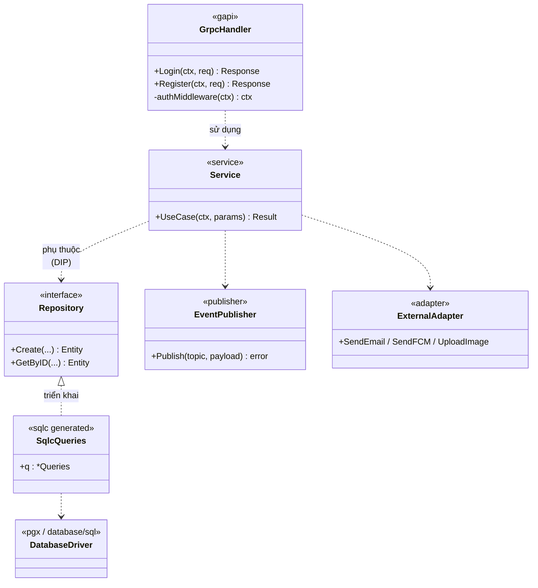

**Nguyên tắc OOP áp dụng:**

- **Dependency Inversion (DIP).** Tầng `Service` phụ thuộc vào **interface** `Repository`, không phụ thuộc vào lớp cụ thể `sqlcRepository`. Điều này cho phép viết unit test với mock thay vì DB thật.
- **Single Responsibility (SRP).** Mỗi `Service` chỉ phụ trách một bounded context; mỗi `Repository` chỉ phụ trách một aggregate root.
- **Open/Closed (OCP).** Thêm publisher mới (ví dụ Kafka) chỉ cần triển khai interface `EventPublisher`, không sửa `AuthService`.
- **Composition over Inheritance.** Go không có kế thừa lớp; mọi quan hệ là composition (struct chứa struct/interface).

### 3.2. auth-service — Xác thực và quản lý người dùng

Đây là service có cấu trúc OOP đầy đủ nhất, đáng dùng làm ví dụ tham chiếu.

```mermaid
classDiagram
    direction LR

    %% ============== INTERFACES ==============
    class Maker {
        <<interface>>
        +CreateToken(userID, username, role, duration, type) (string, Payload, error)
        +VerifyToken(token, type) (Payload, error)
    }

    class UserRepository {
        <<interface>>
        +CreateUser(ctx, params) User
        +GetUserByID(ctx, id) User
        +GetUserByEmail(ctx, email) User
        +GetUserByUsername(ctx, username) User
        +UpdateUser(ctx, params) User
        +UpdatePassword(ctx, params) error
        +MarkEmailVerified(ctx, id) error
        +BanUser(ctx, params) error
        +UnbanUser(ctx, id) error
        +ListUsers(ctx, params) User[]
    }

    class RefreshTokenRepository {
        <<interface>>
        +CreateSession(ctx, params) RefreshToken
        +GetSessionByHash(ctx, hash) RefreshToken
        +RevokeSession(ctx, id) error
        +DeleteExpiredSessions(ctx) error
    }

    class VerificationTokenRepository {
        <<interface>>
        +CreateToken(ctx, params) VerificationToken
        +GetToken(ctx, hash, type) VerificationToken
        +MarkUsed(ctx, id) error
    }

    class EventPublisher {
        <<interface>>
        +PublishUserCreated(ctx, user) error
        +PublishUserBanned(ctx, id, reason) error
        +Close() error
    }

    class AuthService {
        <<interface>>
        +Register(ctx, params) User
        +Login(ctx, params) AuthResponse
        +RefreshToken(ctx, refresh) AuthTokens
        +Logout(ctx, refresh) error
        +SendEmailVerification(ctx, userID) error
        +VerifyEmail(ctx, rawToken) error
        +ForgotPassword(ctx, email) error
        +ResetPassword(ctx, rawToken, newPwd) error
    }

    %% ============== IMPLEMENTATIONS ==============
    class PasetoMaker {
        -paseto : *paseto.V2
        -symmetricKey : []byte
        +NewPasetoMaker(key) Maker
    }

    class authService {
        -userRepo : UserRepository
        -refreshTokenRepo : RefreshTokenRepository
        -verifyTokenRepo : VerificationTokenRepository
        -tokenMaker : Maker
        -publisher : EventPublisher
        -accessDur : Duration
        -refreshDur : Duration
        -verifyTokenDur : Duration
        -resetTokenDur : Duration
        -hashToken(raw) string
        -generateSecureToken() string
        -bcryptHash(password) string
    }

    class userRepository {
        -q : *db.Queries
    }
    class sessionRepository {
        -q : *db.Queries
    }
    class verificationTokenRepository {
        -q : *db.Queries
    }
    class pubsubPublisher {
        -client : *pubsub.Client
        -topic : *pubsub.Topic
    }

    class AuthGrpcHandler {
        <<gapi>>
        -authService : AuthService
        -tokenMaker : Maker
        +Login(ctx, req) LoginResponse
        +Register(ctx, req) RegisterResponse
        +RefreshToken(ctx, req) RefreshResponse
        +VerifyEmail(ctx, req) VerifyResponse
    }

    %% ============== DOMAIN ENTITIES ==============
    class User {
        +UserID : UUID
        +Username : string
        +Email : string
        +PasswordHash : string
        +Role : user_role
        +IsBanned : bool
        +EmailVerified : bool
        +CreatedAt : Time
    }
    class RefreshToken {
        +TokenID : UUID
        +UserID : UUID
        +TokenHash : string
        +UserAgent : string
        +IPAddress : INET
        +ExpiresAt : Time
        +RevokedAt : Time
    }
    class VerificationToken {
        +TokenID : UUID
        +UserID : UUID
        +TokenHash : string
        +Type : enum
        +ExpiresAt : Time
        +UsedAt : Time
    }
    class Payload {
        +TokenID : UUID
        +UserID : UUID
        +Username : string
        +Role : string
        +Type : TokenType
        +IssuedAt : Time
        +ExpiredAt : Time
        +Valid(expectedType) error
    }
    class AuthResponse {
        +Tokens : AuthTokens
        +User : User
    }
    class AuthTokens {
        +AccessToken : string
        +AccessTokenExpiresAt : Time
        +RefreshToken : string
        +RefreshTokenExpiresAt : Time
        +TokenID : UUID
    }

    %% ============== RELATIONSHIPS ==============
    AuthService <|.. authService : implements
    Maker <|.. PasetoMaker : implements
    UserRepository <|.. userRepository : implements
    RefreshTokenRepository <|.. sessionRepository : implements
    VerificationTokenRepository <|.. verificationTokenRepository : implements
    EventPublisher <|.. pubsubPublisher : implements

    authService o-- UserRepository
    authService o-- RefreshTokenRepository
    authService o-- VerificationTokenRepository
    authService o-- Maker
    authService o-- EventPublisher

    AuthGrpcHandler o-- AuthService
    AuthGrpcHandler o-- Maker

    AuthService ..> User
    AuthService ..> RefreshToken
    AuthService ..> VerificationToken
    AuthService ..> AuthResponse
    AuthResponse *-- AuthTokens
    AuthResponse *-- User
    Maker ..> Payload
    PasetoMaker ..> Payload
```

**Điểm nhấn thiết kế:**

- `Maker` là interface — mã thực tế có duy nhất `PasetoMaker`, nhưng việc tách interface cho phép swap sang `JwtMaker` hay `MockMaker` mà không sửa `authService`.
- `authService` lưu **9 dependency** (5 collaborator + 4 cấu hình thời lượng) qua constructor `NewAuthService(...)`. Đây là pattern **Constructor Injection** điển hình.
- `PasetoMaker.CreateToken` mã hoá `Payload` bằng XChaCha20-Poly1305 với `symmetricKey` 32 byte — không phải chỉ ký như JWT, nên token là **đối xứng + bí mật + xác thực** (AEAD).
- `userRepository.CreateUser` bắt riêng lỗi unique constraint của Postgres (`SQLSTATE 23505`) và ánh xạ thành `domain.ErrEmailAlreadyExists` / `domain.ErrUsernameAlreadyExists` — biên giới rõ ràng giữa lỗi hạ tầng và lỗi nghiệp vụ.

### 3.3. deck-service — Quản lý bộ thẻ

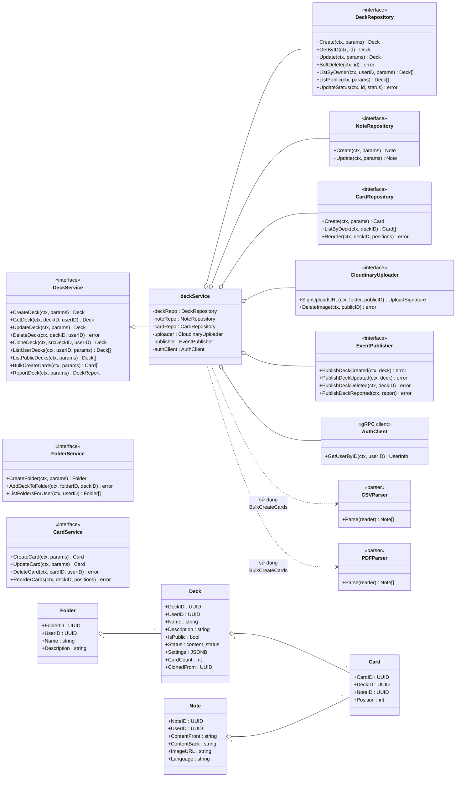

### 3.4. study-service — Lập lịch ôn tập theo FSRS

```mermaid
classDiagram
    direction TB

    class StudyService {
        <<interface>>
        +StartSession(ctx, userID, deckID) Session
        +ResumeSession(ctx, sessionID) Session
        +SubmitReview(ctx, params) ReviewResult
        +CompleteSession(ctx, sessionID) Session
        +ListDueCards(ctx, userID) UserCard[]
        +UpdateDeckSettings(ctx, params) DeckSettings
    }

    class FsrsService {
        <<interface>>
        +OptimizeForUser(ctx, userID) FsrsWeights
        +GetActiveWeights(ctx, userID) FsrsWeights
    }

    class UserCardRepository {
        <<interface>>
        +UpsertCard(ctx, params) UserCard
        +GetByUserAndCard(ctx, userID, cardID, deckID) UserCard
        +ListDue(ctx, userID, limit) UserCard[]
        +UpdateAfterReview(ctx, params) UserCard
    }
    class SessionRepository {
        <<interface>>
        +Create(ctx, params) Session
        +GetByID(ctx, id) Session
        +UpdateProgress(ctx, id, completedIdx) error
        +Complete(ctx, id) error
    }
    class RevlogRepository {
        <<interface>>
        +Append(ctx, params) Revlog
        +ListByUser(ctx, userID, since) Revlog[]
    }
    class FsrsWeightsRepository {
        <<interface>>
        +GetActive(ctx, userID) FsrsWeights
        +Insert(ctx, params) FsrsWeights
        +DeactivatePrevious(ctx, userID) error
    }

    class FsrsScheduler {
        <<package fsrs>>
        +UserCardToFSRS(uc) gofsrs.Card
        +Schedule(params, card, rating, now) ScheduleResult
        +DefaultParams() Parameters
        +ParamsFromWeights(w) Parameters
    }

    class GradingEngine {
        <<package grading>>
        +Grade(userAnswer, correctAnswer, settings) Rating
    }

    class EventPublisher {
        <<interface>>
        +PublishReviewSubmitted(ctx, params) error
        +PublishSessionCompleted(ctx, params) error
    }
    class DeckClient {
        <<gRPC client>>
        +GetDeck(ctx, deckID) DeckInfo
        +ListCardsInDeck(ctx, deckID) Card[]
    }
    class ModerationClient {
        <<gRPC client>>
        +OptimizeWeights(ctx, userID, revlogs) Weights
    }

    class studyService {
        -userCardRepo : UserCardRepository
        -sessionRepo : SessionRepository
        -revlogRepo : RevlogRepository
        -weightsRepo : FsrsWeightsRepository
        -scheduler : FsrsScheduler
        -grader : GradingEngine
        -publisher : EventPublisher
        -deckClient : DeckClient
    }

    class fsrsService {
        -weightsRepo : FsrsWeightsRepository
        -revlogRepo : RevlogRepository
        -modClient : ModerationClient
    }

    class UserCard {
        +UserCardID : UUID
        +UserID : UUID
        +CardID : UUID
        +DeckID : UUID
        +State : card_state
        +Stability : float
        +Difficulty : float
        +Reps : int
        +Lapses : int
        +ScheduledDays : int
        +TAvg : float
        +NextReviewDate : Time
        +LastReviewDate : Time
    }
    class Session {
        +SessionID : UUID
        +UserID : UUID
        +DeckID : UUID
        +Status : session_status
        +TotalCards : int
        +CompletedCards : int
        +LastCompletedIndex : int
        +StartedAt : Time
        +FinishedAt : Time
    }
    class Revlog {
        +LogID : UUID
        +UserCardID : UUID
        +Rating : int
        +DurationMs : int
        +StateBefore : card_state
        +StabilityBefore : float
        +StateAfter : card_state
        +StabilityAfter : float
        +ReviewTime : Time
    }
    class FsrsWeights {
        +UserID : UUID
        +Version : int
        +Weights : float[21]
        +IsActive : bool
        +TrainedOnReviews : int
        +TrainingLoss : float
    }

    StudyService <|.. studyService
    FsrsService <|.. fsrsService
    studyService o-- UserCardRepository
    studyService o-- SessionRepository
    studyService o-- RevlogRepository
    studyService o-- FsrsWeightsRepository
    studyService o-- FsrsScheduler
    studyService o-- GradingEngine
    studyService o-- EventPublisher
    studyService o-- DeckClient

    fsrsService o-- FsrsWeightsRepository
    fsrsService o-- RevlogRepository
    fsrsService o-- ModerationClient

    UserCard "1" o-- "*" Revlog
    Session "1" o-- "*" Revlog
    FsrsScheduler ..> UserCard
    FsrsScheduler ..> Revlog
```

**Điểm nhấn `fsrs` package:**

- `FsrsScheduler` là một package thuần hàm (functional core) — không giữ state, không gọi I/O. Đây là pattern **Functional Core / Imperative Shell**: logic toán học của FSRS được cô lập, dễ test, không phụ thuộc DB hay network.
- `studyService` đóng vai trò **Imperative Shell**: lấy `UserCard` từ DB → chuyển sang struct của thư viện `go-fsrs` → gọi `Schedule(...)` → ghi kết quả về DB.

### 3.5. notification-service — Thông báo đa kênh

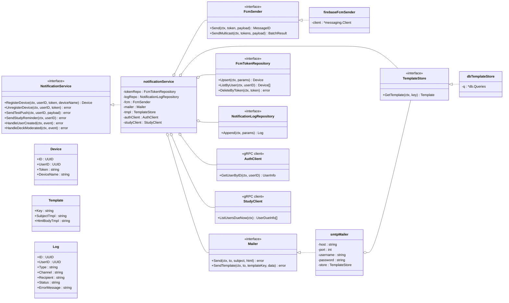

---

## 4. Biểu đồ Hoạt động (Activity Diagram)

Mermaid không có cú pháp UML Activity Diagram cổ điển, nên các sơ đồ dưới đây dùng `flowchart` với điểm bắt đầu (`Start`), nút quyết định (kim cương), nhánh song song (parallel gateway) và điểm kết thúc (`End`) tuân theo bố cục UML chuẩn.

### 4.1. Đăng ký tài khoản và xác minh email

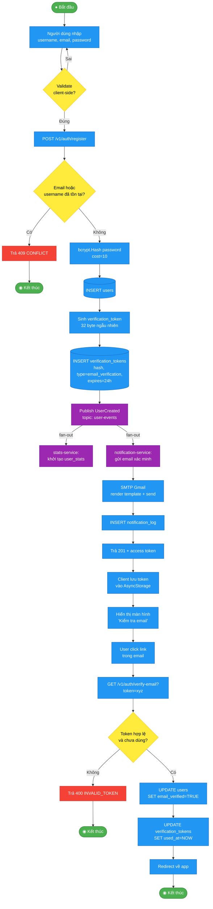

### 4.2. Đăng nhập với refresh token

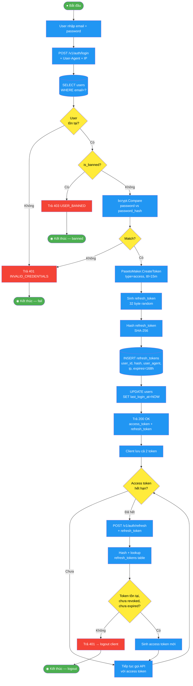

### 4.3. Phiên học bài (Study Session)

```mermaid
flowchart TD
    Start([● User mở deck]) --> A[POST /v1/study/sessions<br/>{deck_id}]
    A --> B[(SELECT user_cards<br/>WHERE user_id, deck_id<br/>AND next_review_date <= NOW)]
    B --> C{Có thẻ<br/>đến hạn?}
    C -- Không --> D[Lấy new_cards_per_day<br/>thẻ mới từ deck]
    D --> E
    C -- Có --> E[INSERT study_sessions]
    E --> F[INSERT session_cards<br/>position 0..N-1]
    F --> G[Trả SessionID +<br/>thẻ đầu tiên]

    G --> H[Client hiển thị mặt trước]
    H --> I[User chờ rồi flip]
    I --> J[Client hiển thị mặt sau<br/>+ 4 nút Again/Hard/Good/Easy]
    J --> K[User chọn rating 1-4]

    K --> L[POST /v1/study/reviews<br/>{session_id, card_id, rating, duration_ms}]

    L --> M[(SELECT user_fsrs_weights<br/>WHERE user_id AND is_active)]
    M --> N{Có weights<br/>cá nhân?}
    N -- Không --> O[Dùng DefaultParams]
    N -- Có --> P[ParamsFromWeights]
    O --> Q
    P --> Q[UserCardToFSRS<br/>chuyển struct sang go-fsrs]
    Q --> R[fsrs.Schedule<br/>params, card, rating, now]
    R --> S[(UPDATE user_cards<br/>stability, difficulty,<br/>state, next_review_date)]
    S --> T[(INSERT revlogs<br/>state_before/after, …)]
    T --> U[UPDATE session_cards<br/>SET reviewed_at, rating]

    U --> V{Còn thẻ<br/>chưa ôn?}
    V -- Còn --> W[Trả thẻ kế tiếp]
    W --> H

    V -- Hết --> X[POST /v1/study/sessions/:id/complete]
    X --> Y[UPDATE study_sessions<br/>SET status='completed',<br/>finished_at=NOW]
    Y --> Z[Publish SessionCompleted<br/>topic: study-events]

    Z -.->|fan-out| AA[stats-service:<br/>cập nhật streak, daily_stats]
    Z -.->|fan-out| AB[notification-service:<br/>(không action, chỉ log)]

    AA --> End([◉ Hoàn thành])
    AB --> End

    classDef start fill:#4CAF50,color:#fff;
    classDef decision fill:#FFEB3B,color:#000;
    classDef action fill:#2196F3,color:#fff;
    classDef fsrs fill:#FF9800,color:#fff;
    classDef event fill:#9C27B0,color:#fff;
    class Start,End start
    class C,N,V decision
    class M,Q,R,O,P fsrs
    class Z,AA,AB event
```

### 4.4. Tạo deck với kiểm duyệt tự động

Luồng này minh hoạ ưu điểm của event-driven: client trả về 201 ngay sau khi insert, kiểm duyệt diễn ra async.

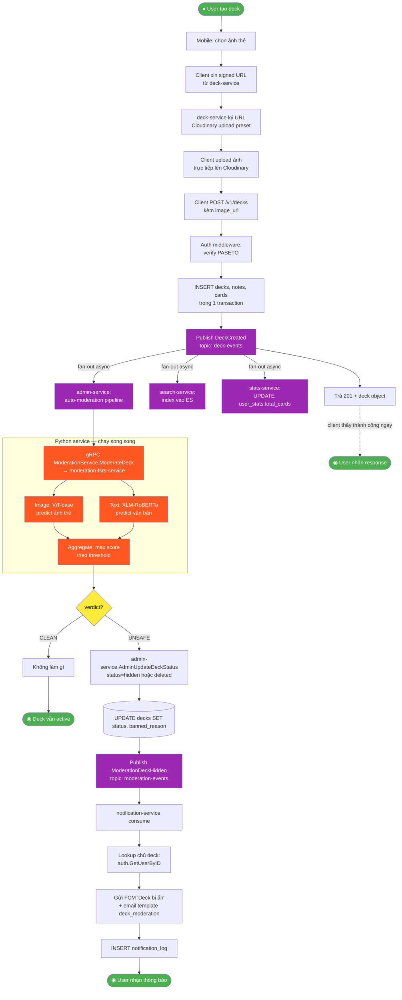

### 4.5. Cron nhắc học (fan-out FCM)

```mermaid
flowchart TD
    Start([● Cloud Scheduler<br/>mỗi 15 phút]) --> A[Publish tick {}<br/>topic: cron-study-reminder]
    A --> B[Pub/Sub push<br/>POST /internal/pubsub?token=...]

    B --> C{Verify<br/>OIDC + secret?}
    C -- Sai --> D[Trả 401<br/>Pub/Sub không retry]
    D --> EndF([◉ Drop message])

    C -- Đúng --> E[gRPC StudyService.ListUsersDueNow]
    E --> F[(SELECT DISTINCT user_id<br/>FROM user_cards<br/>WHERE next_review_date <= NOW<br/>GROUP BY user_id)]
    F --> G[Trả [{user_id, due_count, streak}, ...]]

    G --> H{Mỗi user}
    H --> I[Lookup fcm_tokens<br/>của user]
    I --> J{Có token<br/>nào không?}
    J -- Không --> K[Skip user]
    K --> H
    J -- Có --> L[Render template study_reminder<br/>title, body, due_count, streak]
    L --> M[FCM SendMulticast<br/>tới N device]
    M --> N{Có token<br/>nào fail?}
    N -- Có --> O[Xoá token invalid<br/>tránh spam lần sau]
    N -- Không --> P
    O --> P[INSERT notification_log<br/>status=sent / failed]
    P --> H

    H -- Hết user --> Q[Trả 200 OK<br/>Pub/Sub ack]
    Q --> EndS([◉ Done])

    classDef start fill:#4CAF50,color:#fff;
    classDef decision fill:#FFEB3B,color:#000;
    classDef action fill:#2196F3,color:#fff;
    classDef cron fill:#FF9800,color:#fff;
    class Start,EndF,EndS start
    class C,J,N,H decision
    class A,B,E,L,M cron
```

---

## 5. Biểu đồ Tuần tự (Sequence Diagram)

### 5.1. Đăng ký + xác minh email

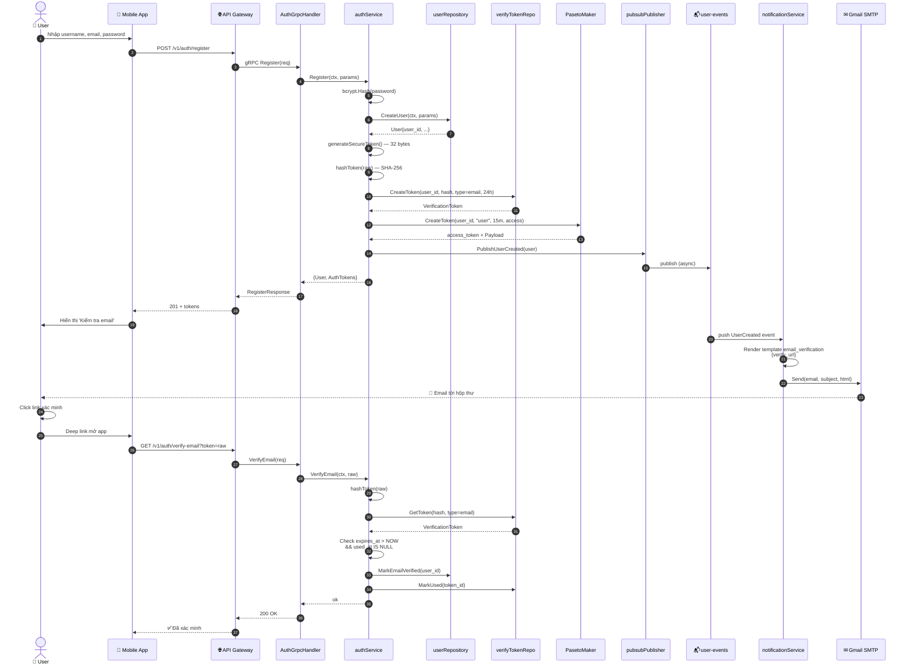

### 5.2. Đăng nhập + Refresh access token

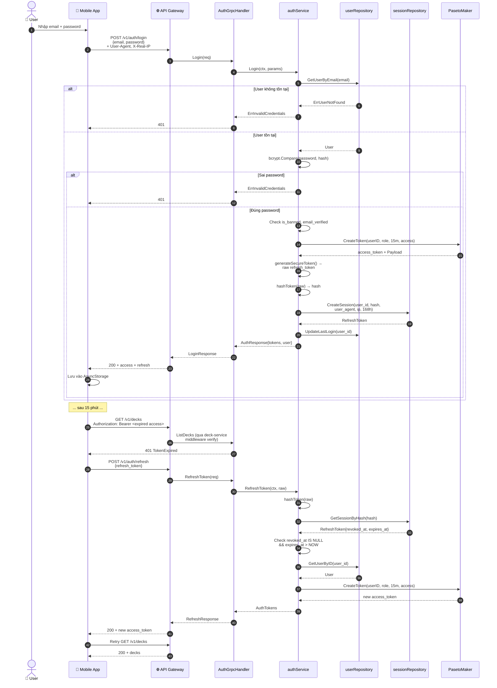

### 5.3. Một lượt ôn thẻ và cập nhật FSRS

Kịch bản phức tạp nhất trong hệ thống — kết hợp lookup weights, tính toán FSRS thuần hàm, ghi nhật ký review và publish event.

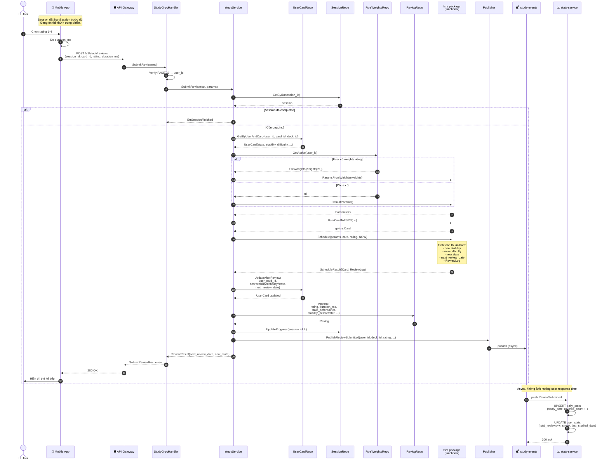

### 5.4. Import flashcard từ tệp CSV/PDF

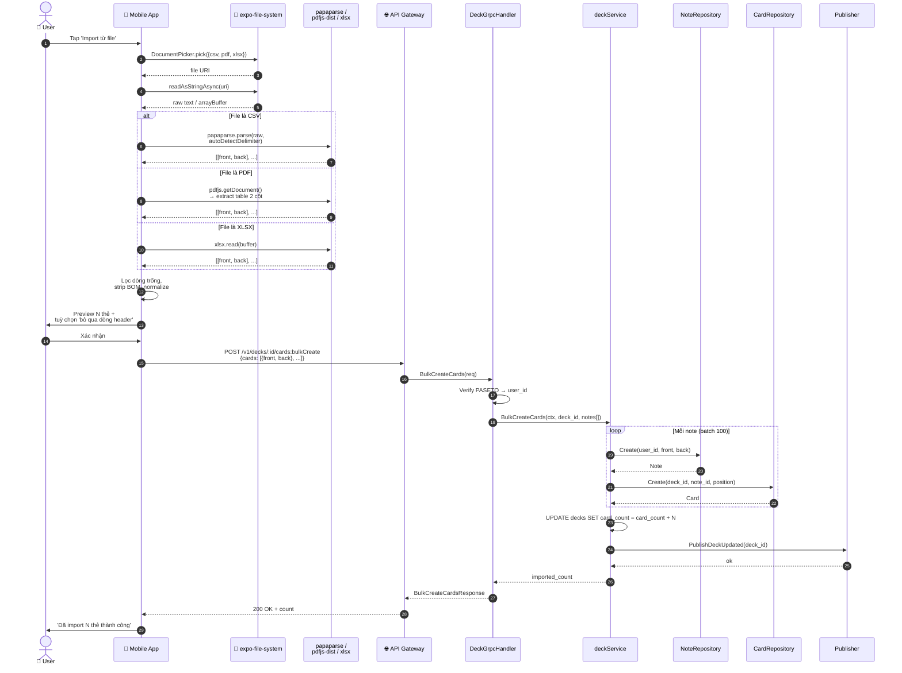

### 5.5. Kiểm duyệt nội dung tự động (ViT + XLM-RoBERTa)

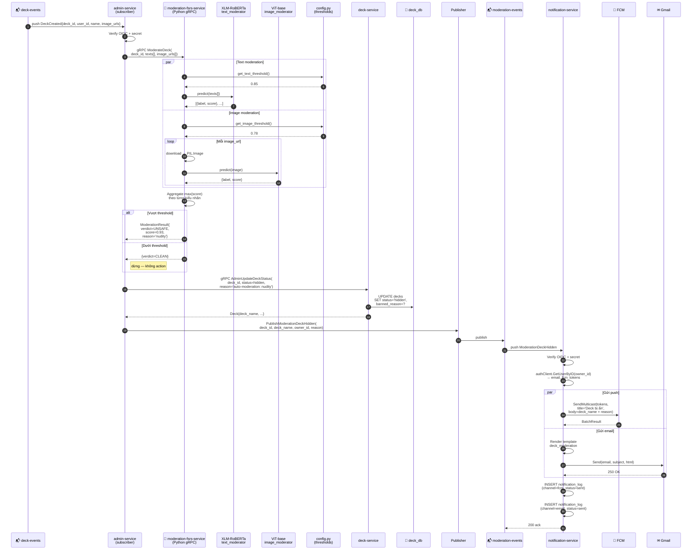

---

## Phụ lục — Cách render biểu đồ

- **GitHub:** mở file `.md` này, Mermaid được render trực tiếp trong giao diện web.
- **VS Code:** cài extension `Markdown Preview Mermaid Support` (`bierner.markdown-mermaid`), bấm `Cmd+Shift+V`.
- **Xuất hình ảnh:** dán code Mermaid vào [mermaid.live](https://mermaid.live), xuất `.png` / `.svg` để chèn vào báo cáo Word/PDF.
- **Xuất hàng loạt:** dùng CLI `@mermaid-js/mermaid-cli` (`npx mmdc -i uml-diagrams.md -o out.pdf`) để chuyển toàn bộ tài liệu sang PDF.

---

*Tài liệu lập ngày 2026-05-25. Tham chiếu chéo: `doc/tech-stack-report.md`, `doc/architecture.md`, `doc/dev-guide.md`, `services/<svc>/internal/` (mã nguồn từng service).*
